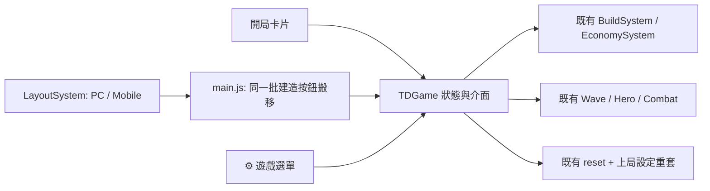
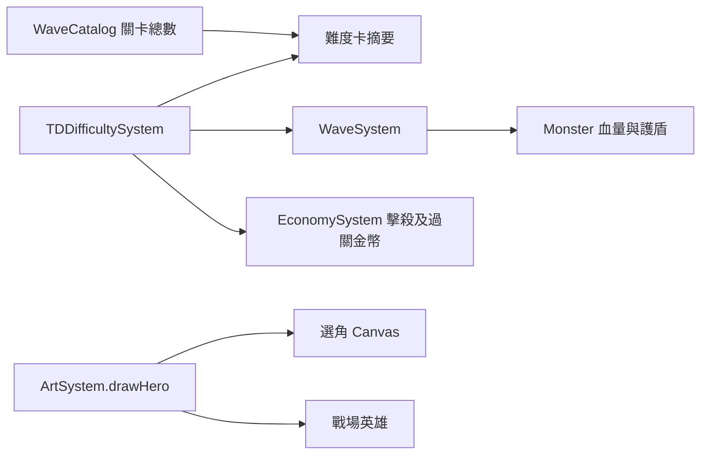

# 系統架構

## v0.44.0 UI/UX 資料流



開局為全視窗選擇層，戰鬥為 PC 寬戰場＋右指揮欄或既有 Mobile 底部面板；兩者共用 `TDGame`、建造資料和數值。Canvas 保持 720×720 邏輯座標，只改 CSS 顯示尺寸與周邊版型，不擴地圖、不拉伸座標。桌機 Drawer 只移動既有建造 DOM，不另建 BuildSystem。無資料庫／外部 API／新網路服務。

## v0.43.0 守軍指揮與選角容錯

`CommandSystem → CombatUnit.issueCommand → 導航／駐守點`；無手動命令時 `CombatUnit → TargetSelector → 既有攻擊／Projectile`。有效目標保留鎖定，死亡、越界或路徑失敗才重選；追擊超界則走原 `NavigationSystem` 返回駐守點。英雄與建築仍保留各自現行索敵，沒有第二套戰鬥引擎。圖片改回 `ArtSystem.load → Image.src／onload → coreStatus → 選角進場`，不經 v0.41.0 的按需佇列作首次載入，也不繞過完整圖片門檻。靜態前端，無資料庫或伺服器 API。

## v0.42.0 資源與控場資料流

`config.buildings → FactionSystem.available → BuildSystem.queue/place → Building.upgradeCost（依建造價）→ EconomySystem.spend → TDGame 選取價格`。攻擊走原有 `Building.update → TowerSkillSystem.fire → Projectile.hit → Monster.applySlow/takeDamage`；`Projectile` 先讀取敵人原有強緩速狀態，再套新緩速與 `bonusVsSlowed`，避免一顆子彈自我觸發連攜。`TDDifficultySystem.veteran → WaveSystem.spawnInterval / Monster.healthRate` 只改第三難，不更動其他難度。`ArtSystem` 沿用冰塔圖集並加王國冰徽；無資料庫、HTTP API 或存檔 schema 變更。

## v0.41.0 大絕與圖片生命週期

`F／觸控按鈕 → TDGame.castUltimate → HeroUltimateSystem → Projectile.hit → 命中／擊殺／經濟與回饋`；大絕設定集中一個模組，原 Q／W／E、商店、怪物與塔不用重寫。`選角／畫面繪製 → ArtSystem 按需請求（4 並行、失敗重試）→ coreStatus 確認地圖＋首波怪物＋所選英雄 → 進戰場`；`Service Worker` 僅預存 HTML／CSS／JS／圖示，戰場圖片使用時快取。無資料庫與新伺服器。

## v0.40.1 透明換裝修復

`ShopSystem 購買弓 → hero.equipment.spear → ArtSystem.drawHero(v4 真透明底圖) → drawClassWeapon(武器層)`。只替換美術來源與 Service Worker 快取，戰鬥傷害、裝備持有與存檔結構不變。

## v0.40.0 軍團與敵軍擴編

`FactionSystem.FACTIONS → config.units → BuildSystem → CombatUnit → ArtSystem.combatUnits`。新六兵僅擴資料與圖像路由，移動、攻擊、升級、軍械、商店互斥沿用既有系統。敵軍路徑為 `WaveCatalog → WaveSystem → Monster.TYPES → EnemyCombatSystem/ArtSystem.enemyActions`，三個新職責透過既有怪物攻擊角色運作。`td.html/td.css` 提供建造與傭兵呈現；`sw.js` 快取八張新增 PNG。無資料庫、外部 API 或持久資料 schema 改動。

## v0.39.0 裝備、召喚與手機資料流

`ShopSystem → hero.equipment → EquipmentSystem.weapon/projectileOptions → Hero Attack → Projectile → Monster`；特殊武器只組合既有連鎖與濺射，不另建傷害系統。視覺走 `EquipmentSystem.weapon → ArtSystem 無武器底圖 + class-weapons-atlas`。召喚走 `Hero/TowerSkillSystem → Summon(form) → ArtSystem.drawSummon → 4×4 atlas`。傭兵走 `FactionSystem.available/allows → canHire → TDGame.updateUi → BuildSystem.queueMercenary`。手機版則由 `LayoutSystem → body[data-layout]` 與 `main.js → body[data-mobile-panel]` 控制，與遊戲迴圈完全分離。

## v0.38.0（2026-09-12）

所有難度皆為 30 關，城門數字表示耐久。選角 Canvas 與戰場共用 ArtSystem.drawHero，圖片載入後持續重繪預覽。難度摘要由 TDDifficultySystem 與 WaveCatalog 即時產生。



沿用現有 src/td/systems、entities、tests、docs 結構；沒有新增資料庫或外部服務。

## v0.36.0 兵種擴充資料流

新守軍不新增 System：`FactionSystem → BuildSystem.queue/placeQueued → CombatUnit → ArtSystem.combatUnits`。數值、陣營清單、實體生命週期與圖像註冊互相分離，因此 knight／treant／golem 自動沿用移動導航、選取、升級、負傷恢復、軍械與出售。敵軍仍走 `WaveCatalog → Monster → EnemyTrait/EnemyCombat → ArtSystem.enemyActions`；本版只替既有職責補獨立視覺，未改寫波次狀態機。

## v0.35.0 英雄與十三塔資料流

`Hero.classType → ArtSystem` 現在使用專屬英雄圖集，`CombatUnit.type → ArtSystem.combatUnits` 則維持普通守軍圖集，從素材層根治英雄與招募單位同外觀。新塔仍走 `FactionSystem → BuildSystem → Building → TowerSkillSystem／TowerEvolutionSystem → ArtSystem`，沒有新增第二套建造或經濟系統。`faction-towers-v2.png` 僅提供三欄塔族、三列 Lv.1／3／5 模型。

## v0.34.0 三十波資料流

現有 `WaveCatalog → WaveSystem → TDGame` 關係不變。新增內容只擴充資料列；`WaveSystem` 依 `catalog.total()` 自動處理第 30 波完成，`TDGame` 只協調結算與 UI。`Monster` 使用分段生命曲線，`EnemyCombatSystem` 依 Boss 波次選擇既有敵種作為第二階段援軍。Loot、Economy、BattleReport、Difficulty、Armory 與建造模組都沒有複製或重寫。

## v0.33.0 負傷恢復資料流

`TDDifficultySystem.unitRecovery → TDGame.applyDifficulty() → BuildSystem.setUnitRecovery() → CombatUnit.takeDamage()/updateRecovery()`。一般難度的負傷實體仍留在 `BuildSystem.items`，但不出現在 `combatUnits()`，因此不會索敵、擋怪或被敵軍選為目標；倒數完成後保留同一實體歸隊。只有永久陣亡或玩家遣散才經 `onRemove → ArmorySystem.releaseTarget()`，避免誤清養成與唯一軍械。沒有新增資料庫、API 或大型 System。

## 設計原則

- 純 HTML / CSS / JavaScript，無執行期依賴。
- 各實體只管理自身狀態；碰撞、生成、武器與流程由 systems 負責。
- `Game` 負責協調，不承載特定武器或敵人規則。
- 實體只保留碰撞與狀態；繪圖委派給目前的 Skin Pack，皮膚不影響傷害與平衡。
- `Spawner` 只決定威脅與敵人組合，`SkillSystem` 只管理果實及技能，不把規則塞入 Game loop。
- `GameState` 統一處理 Combo、分數倍率與最高紀錄，避免 Enemy 或 UI 自行計分。
- `DifficultySystem` 提供資料驅動的模式設定，`Spawner`、`Enemy`、`SkillSystem` 與 `ChallengeSystem` 只讀取目前模式。
- `ChallengeSystem` 只處理事件狀態機與獎勵生成，不直接改寫敵人或玩家規則。
- `BattlefieldRenderer` 只負責背景層次與環境氣氛；不建立敵人、修改速度或參與碰撞。
- `Effects` 使用有上限生命週期的粒子、衝擊波與震動強度，所有物件會在到期後移除。
- `StageDirector` 管理波次、倒數、防線耐久、詞綴、Boss 進出與固定獎勵，不直接生成一般敵機。
- `SupportSystem` 管理分身／戰寵等級、位置、射擊及繪製，使用既有 `Bullet` 與碰撞流程。
- 不需要資料庫；局內狀態於重開時重設，偏好與紀錄只存於瀏覽器。
- `TowerFrontier` 是獨立命名空間；塔防不讀寫 `SkyStrike` 的玩家、波次或碰撞狀態，避免雙模式互相污染。
- `ArtSystem` 非同步載入塔防背景、建築圖集、4×4 單位動作圖集與守護城堡；`CombatUnit` 只提供動畫狀態與影格，不知道實際檔名。
- `ProfessionSystem` 管理單局職業鎖定與職業說明，不直接修改怪物或經濟；職業戰鬥差異由資料驅動的塔設定處理。
- `NavigationSystem` 只建立導航格、建築障礙與 A* 路徑；`CommandSystem` 將 UI 指令轉成單位訂單，兩者不負責傷害或經濟。
- `LayoutSystem` 管理塔防介面偏好、700px 自動判斷與 `data-layout` 狀態；CSS 只依狀態排版，不接觸遊戲物件。
- `WaveCatalog` 只保存關卡資料；`WaveSystem` 只管理波次生命週期；`EconomySystem` 是塔防金幣、木材與功勳的唯一收支入口。

## 資料夾

```text
index.html
td.html / td.css   英雄塔防獨立入口與響應式 UI
styles.css
src/
  entities/    Player, Enemy, Bullet, Boss, PowerUp
  skins/       SkinRegistry 與內建外觀包
  systems/     Weapon, Collision, Spawner, DifficultySystem, SkillSystem,
               ChallengeSystem, StageDirector, SupportSystem,
               BattlefieldRenderer, GameState, Effects
                InputController（滑鼠絕對定位／觸控相對拖曳）
  utils/       數學工具
  Game.js      遊戲協調與迴圈
  main.js      UI 啟動入口
  td/
    entities/  Monster, Projectile, CombatUnit, Building, Hero
    systems/   ArtSystem, ProfessionSystem, PathSystem, LayoutSystem,
               NavigationSystem, CommandSystem, WaveCatalog, WaveSystem,
               EconomySystem, BuildSystem, EnemyCombatSystem
    TDGame.js  塔防流程協調、UI 與 Canvas 繪製
tests/         Node 內建測試
docs/          操作、維運、API 與 QA 文件
manifest.webmanifest / sw.js   PWA 與離線快取
.github/workflows/pages.yml    Pages 驗證與部署
```

## 模組關係

```text
main → Game → GameState
             ├─ DifficultySystem → Spawner/Enemy/SkillSystem/ChallengeSystem
             ├─ Player ← Weapon → Bullet
             ├─ Spawner → Enemy
             │             └─ EnemyBullet
             ├─ SkillSystem → PowerUp → Weapon/Player/Enemy
             ├─ ChallengeSystem → PowerUp(Dragonfruit)
             ├─ StageDirector → Affix/Defense → Spawner/Enemy/Boss
             │                └─ Boss / PowerUp(Support Core)
             ├─ SupportSystem → Bullet
             ├─ BattlefieldRenderer → Skin Pack colors
             ├─ GameState → Combo/Multiplier/High Score
             ├─ Collision(Player, Bullet, Enemy, EnemyBullet, PowerUp)
             ├─ SkinRegistry → Player/Bullet/Enemy renderers
             └─ Effects
```

後續武器以策略物件擴充 `Weapon`，敵機以行為類別或策略擴充 `Enemy`；Boss 與 PowerUp 已保留獨立實體邊界，無需改寫玩家或碰撞核心。

100 波不是 100 份硬編碼腳本。`StageDirector` 依波次計算章節、戰區、一般波時長、詞綴、Boss 類型與支援獎勵；`modifiers()` 將生命、速度、射速與雙生機率交給生成／敵人流程，`onEnemyEscaped()` 集中處理防線損傷。後續可加入章節設定物件，覆蓋特定波次的背景、敵人權重、事件或 Boss 行為。

Skin Registry 讓每個品牌／主題包保持獨立。外觀 renderer 只能讀取實體位置、旋轉、動畫時間與外觀變體，不修改 HP、碰撞箱、速度或傷害。背景與粒子共用系統讀取目前皮膚色票，因此新皮膚不必重寫完整特效管線。

## 塔防資料流

```text
td/main → TDGame → WaveSystem → WaveCatalog
                 │          └→ Monster → Path
                 ├─ ProfessionSystem → 單局職業鎖定
                 ├─ BuildSystem → CombatUnit（可移動）/ Building（固定）→ Projectile
                 ├─ CommandSystem → NavigationSystem(A*) → CombatUnit Order
                 ├─ LayoutSystem → body[data-layout] → Desktop/Mobile CSS
                 ├─ Hero → Projectile / Nova / Intercept / Respawn
                 ├─ EnemyCombatSystem → Hero / CombatUnit damage / Boss phase
                 ├─ ArtSystem → Background / Atlases / Keep
                 ├─ EconomySystem → Build / Upgrade / Sell / Kill / Wave Reward
                 └─ Base Health → Leak → Victory / Game Over
```

`WaveCatalog` 提供不可變的 30 波設計資料；`WaveSystem` 依序執行 `preparing → spawning → clearing → reward`，結算事件只發出一次，再自動進入下一次準備。`Monster` 自行沿節點移動；`CommandSystem` 透過 `NavigationSystem` 將目的地轉為避障路徑，`CombatUnit` 執行訂單，`Building` 固定索敵；`TDGame` 只協調事件與 UI，收支交由 `EconomySystem`。

角色圖集固定為 4 欄×4 列，列順序是待機、行走、攻擊、受擊／死亡；建築圖集固定為弩塔、寒霜塔、火砲塔三欄。背景採 720×720 座標，更換素材時需同步驗證裁切、Alpha、道路與禁建距離。

## v0.17.0 英雄與指揮介面

英雄資料流：頭像／F1 → TDGame.selectHero → Hero.selected／setTarget → Hero 動作狀態 → ArtSystem.drawHero；蓄力完成 → 原 Projectile 傷害流程。升級 → 原等級與經濟 → ArtSystem.drawRank。HTML 顯示招募／命令分類，CSS 依 data-panel／data-selection 顯示相關操作；桌面戰場左側、指令右側，手機直向排列。

## v0.18.0 英雄技能與種族塔

既有職業、波次、導航及經濟保留，新增低耦合技能／商店／召喚模組，無新資料庫。

```text
UI → TDGame → Hero → Projectile
             ├→ ShopSystem → EconomySystem + Hero.equipment
             └→ Building → TowerSkillSystem → Projectile / Summon
Projectile → TDGame.onKill → EconomySystem + owner.registerKill
ArtSystem → 既有圖集 / faction-towers-v1.png 三階塔圖
```

## v0.19.0 英雄流派與傭兵館

沿用原本遊戲循環，新增流派資料與地面技能，不重建戰鬥架構。

```text
開場流派 → ProfessionSystem + Hero.chooseClass → HeroRoster
商店傭兵 → BuildSystem.queueMercenary → placeQueued → CombatUnit
CombatUnit → NavigationSystem / CommandSystem / 既有升級回收
HeroRoster → Projectile / fields / Summon → 既有擊殺結算
ArtSystem → 原有英雄／獵手／盜賊動作圖集 + 階級裝甲
```

沒有新增資料庫；局內狀態不存檔。

## v0.20.0 敵軍動作第一階段

```text
Monster.update → 實際路程 → 八幀走路 + 左右朝向
Monster.takeDamage → 四幀受擊 / active=false
TDGame.onKill → 一次獎勵 + corpses（上限60）
corpses → updateDeath → 倒地淡出 → 一秒移除
ArtSystem.drawMonster → 三種透明動作圖集
```

純本機視覺與狀態擴充，沿用原有經濟、波次、碰撞與資料保存方式。

## v0.21.0 RTS 指揮介面

```text
td.html HUD 控制 → src/td/main.js DOM 綁定 → TDGame
TDGame.updateUi → Wave／Hero／Economy 狀態 → HUD 與 Cooldown CSS
速度按鈕 → TDGame.setGameSpeed → loop 的 dt 倍率 → 原有 update
LayoutSystem → body[data-layout] → td.css 桌面雙欄／手機直向
```

本階段不新增遊戲領域模組、不改資料庫（仍無資料庫），也不讓 CSS 反向依賴戰鬥邏輯。

## v0.22.0 戰鬥回饋

```text
Projectile／Hero 技能 → Monster.takeDamage → onHit(實際傷害、剋制)
onHit → CombatFeedbackSystem → 傷害字／命中星芒
TDGame.onKill → EconomySystem + Gold／死亡回饋
Monster.health → displayHealth（視覺插值）→ 雙層血條
```

回饋模組不持有經濟或傷害規則，移除它不會改變戰鬥結果。

## v0.23.0 戰鬥生命週期

```text
Monster movement → EnemyCombatSystem → target policy / Boss phase
                                      ├→ Hero.takeDamage → downed → timed respawn
                                      └→ CombatUnit.takeDamage → death → BuildSystem.removeDefeated
EnemyCombatSystem hooks → TDGame → CombatFeedbackSystem / UI
```

一般怪仍只前進；攻擊職責按 `combatRole` 分為攻城、英雄獵殺與 Boss。`EnemyCombatSystem` 只處理敵方目標與攻擊時序，不負責獎勵或建造。英雄自行管理復活，守軍死亡由 `BuildSystem` 安全移除。

## v0.24.0 黃金 15 波

```text
開場難度按鈕 → TDDifficultySystem → TDGame.applyDifficulty
                                    ├→ WaveSystem：整備／生成間隔／Monster 數值
                                    ├→ EconomySystem：擊殺與清波獎勵
                                    └→ TDGame：城門上限與 UI

WaveCatalog → Monster(type) → EnemyTraitSystem
                              ├→ warder：屏障先吸收傷害
                              ├→ healer：定期治療鄰近傷兵
                              └→ commander：鄰近敵軍移速／護甲光環
```

`TDDifficultySystem` 只提供成套倍率，不知道波次內容；`EnemyTraitSystem` 只計算鄰近能力，不處理移動、獎勵或死亡。既有 `WaveSystem`、`EconomySystem` 與 `Monster` 保持資料流單向。專案仍無資料庫與遠端 API，難度是單局狀態。

## v0.27.0 職業武器資料流

```text
Hero.classType + Hero.equipment.spear → EquipmentSystem.weapon / nextWeapon
                                      ├→ ShopSystem：下一階名稱、價格與購買結果
                                      ├→ TDGame.updateUi：英雄卡、商店圖示與稀有度
                                      └→ Hero / HeroRoster：彈道色與純視覺簽名特效
```

`EquipmentSystem` 是只讀配置與繪圖層；裝備等級仍由既有 `Hero.equipment` 保存，金錢仍只由 `EconomySystem` 扣除。沒有加入背包、資料庫或遠端 API，因此可逐步替換成真正的手持武器動畫而不改商店介面。

## v0.28.0 暗影英雄逐幀掛點

```text
Hero.equipment.spear > 0
  → ArtSystem 選擇 rogue-actions-unarmed-v2
  → state + frame 查詢左右手掛點
  → class-weapons-atlas-v1 裁切左右武器
  → 同一角色鏡像座標系繪製
```

只有在無武器底圖與武器圖集都載入完成時才啟用真正換裝；任一素材未完成會繼續使用舊 `rogue-actions-v1.png`，避免短暫空手或畫面缺失。掛點只屬於 `ArtSystem`，不進入戰鬥判定。

## v0.30 玩家軍團資料流

`ProfessionSystem` 決定英雄職業，`FactionSystem` 以同一 ID 提供本族可用的單位與建築；`LootSystem` 只透過 `FactionSystem.unlock()` 增加可用項目，不修改建造器。`BuildSystem` 繼續負責排隊、合法位置、扣款、升級與回收，因此新種族不需要複製經濟或放置邏輯。

`CombatUnit` 統一 7 種可移動守軍的命令、生命週期、Lv.1～5 與熟練度。`Building` 負責固定塔；`TowerSkillSystem` 處理塔種差異，`TowerEvolutionSystem` 於 Lv.3 套用二選一設定修正。`ArtSystem` 依單位狀態、等級、塔階與分支選擇圖格，素材未 ready 時仍回退 Canvas 圖形。

英雄 XP 保存在 `Hero` 實體，不新增全域存檔。`TDGame.onKill()` 只在第一次合法擊殺時同時分派金錢、來源單位熟練與英雄 XP，避免範圍／連鎖攻擊重複結算。

## v0.31 軍械資料流

`LootSystem` 只產生戰利品選項，選取軍械時呼叫 `ArmorySystem.obtain()`；`TDGame` 負責暫停、目標選取與軍械庫 DOM。`Hero`／`CombatUnit` 各自保存三個裝備欄，查詢戰鬥設定時才由 `ArmorySystem.apply()` 建立修正副本，因此不改寫 `config.js` 基礎數值，也不影響其他實體。

`ArtSystem.drawGearPieces()` 從 `equipment-atlas-v1.png` 裁切掛件；狼騎由半獸人及既有戰狼兩套 4×4 動作圖集共用狀態與影格合成。素材未 ready 時仍繪製原單位，裝備數值不依賴美術載入。軍械目前為單局記憶體狀態，沒有資料庫、API 或存檔遷移。

## v0.32 唯一裝備生命週期

`ArmorySystem.assignments` 以裝備 ID 指向單一角色；轉裝先移除舊角色欄位，再配置新目標。角色只保存自己的 `gear` 欄位，戰鬥查詢仍走 `apply()`。`BuildSystem` 僅提供通用 `onRemove` hook，`TDGame.attachArmoryUi()` 才把它連到 `releaseTarget()`，避免建造模組反向依賴軍械庫。

出售與死亡清除共用離場 hook；英雄倒下不觸發，因英雄仍會復活。生命型裝備的穿戴／卸下會重新查詢 config、補上新增上限或把超額生命夾回新上限，避免轉裝後留下幽靈數值。

## v0.32.1 雙入口 PWA

`index.html` 與 `td.html` 保持同一個靜態站台與 Service Worker scope，但各自連到獨立 manifest。這讓兩種模式共用離線資產與更新週期，同時保有不同安裝名稱及啟動頁；圖示輸出由 `scripts/build-app-icons.ps1` 從版本化原圖機械式產生。

v0.32.2 的 CI/CD 仍維持單一 `main → test → Pages` 管線，僅在 Configure Pages 階段允許第一次建立站台，不增加執行期服務或資料庫。
