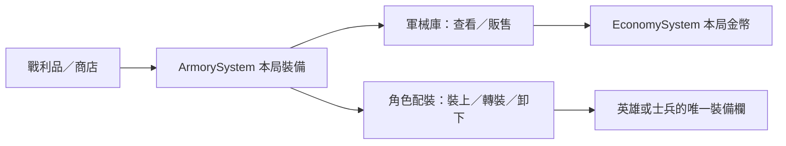

# v0.84.9 軍械庫與角色配裝

軍械庫改為本局裝備清單。每張卡顯示圖示、稀有度、效果及「閒置／裝備中：持有人」；閒置裝備可在確認後販售，裝備中的物品必須先卸下或轉裝。裝備售價為商城原價的 50%（其他戰利品依稀有度基準價的 50%）；販售金幣直接進入本局資源，不改排行榜積分。售出的裝備從本局移除，不能還原，除非讀取出售前的波次存檔。

## 玩家操作

戰場右側或快捷列打開「軍械庫」查看裝備與持有人。選取一名士兵後，點其旁的「裝備」打開小視窗；英雄則在「英雄資訊」中點「英雄裝備」。小視窗只列該角色能用的裝備，標明目前裝備、閒置與其他持有人。選「裝上」、「轉裝」或「卸下」後即更新本局能力；每件裝備仍只由一人持有，士兵回收時裝備仍回庫。塔不能配裝。

## 管理、資料與架構

不需帳號、資料庫、API 或新權限。`ArmorySystem` 擁有裝備副本、唯一歸屬與販售邏輯，`ArmoryUI` 負責軍械庫與角色配裝視窗，`EconomySystem.refundGold` 接收販售金幣。裝備與金幣沿用既有本局／波次存檔；沒有新增欄位或跨局持久化。玩家資料備份依既有「設定 → 匯出備份」操作。

## 安裝、部署與回復

從專案根目錄執行 `npm run serve:test`，開啟 `/td.html`。部署需同時上傳 `td.html`、`td.css`、`src/td/systems/ArmorySystem.js`、新增的 `src/td/systems/ArmoryUI.js`、`sw.js` 及原有遊戲資產；Service Worker 快取名為 `sky-strike-v0.84.9`。更新後關閉舊分頁再開；若仍見舊軍械庫，重新整理以取得新快取。回復上一版時須一起回復上述檔案與 `package.json`、快取版本，並保留玩家檔案備份。既有本局存檔格式不變。

## FAQ 與測試清單

- 看不到「裝備」：請先選取士兵，或展開英雄資訊；防禦塔沒有裝備欄。
- 看不到某件裝備：它與目前角色不相容；可在軍械庫查看全部裝備。
- 無法販售：裝備仍由某位角色持有，先卸下或轉裝。
- 確認軍械庫字級、裝備狀態、閒置販售金額、裝備中拒售、卸下後可售、士兵回收返庫、英雄與士兵配裝、手機版可讀與離線載入。

自動驗證：`npm test`、`npm run check`。瀏覽器驗收需分別測桌面與手機橫向畫面，以及同名裝備多副本的持有人標籤。
