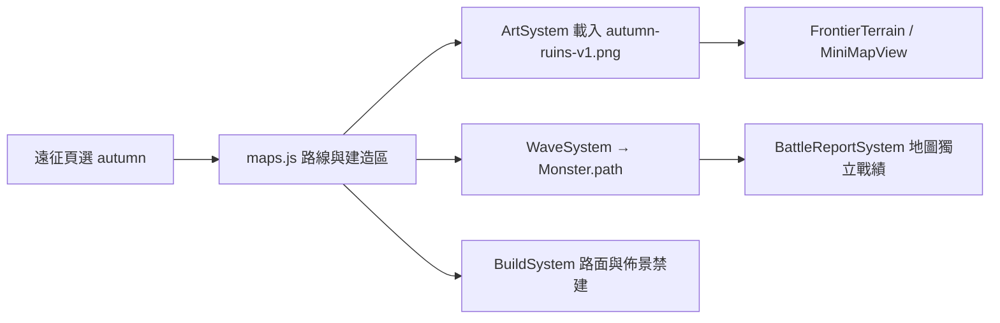

# v0.71.0 暮秋遺跡與整合發布

## 使用方式

遠征頁「目前戰場」新增「暮秋遺跡 · 雙 U 型彎」。這是第三張獨立地圖，使用確認過的窄第一彎版本；新手谷地與雙隘口要塞保留。直接選擇地圖、難度、英雄與軍團開始，無解鎖門檻。

敵軍從左上進場，繞右側水晶祭壇後向左折返，再經左側第二個彎向右通過橋梁抵達城門。上下內圈都有沿路草地可建造，祭壇、石堆、道路與水域禁建。第一內圈比原概念更窄，既有塔的射程可依位置覆蓋兩段道路；沒有新增地形加成。

沿用既有 30 波、四種難度、英雄與軍團。重新挑戰保留本圖，返回遠征可換圖。最高分和最近紀錄沿用地圖獨立戰績系統，自動以 `autumn` 分組，無存檔遷移。

## 架構與素材

維持 `assets/td`、`src/td`、`tests`、`scripts` 結構，沒有新資料庫、HTTP API、權限或執行期套件。地圖 `autumn` 為單路，`routes` 正規化為 `[path]`，共用末段長度為 0。圖片 1536×1024 與世界座標 1:1，鏡頭沿用現有等比例呈現。圖片為使用者確認的 `exec-a7c9a13c-1854-4e3d-ab3e-eee5d6b255c5.png`，正式檔名 `assets/td/autumn-ruins-v1.png`。

美術生成規格：沿用金橙樹林與灰石遺跡，縮小水晶祭壇周圍第一個 U 型內圈，保留道路寬度、第二個彎與最終橋梁。實際座標以最後生成圖重新取樣，沒有沿用原概念圖路線。

## 安裝、更新與部署

1. 安裝 Node.js 18 或以上，取得完整版本。
2. 根目錄執行 `npm test` 與 `npm run check`，再執行 `npm run serve:test`。
3. 開啟 `http://127.0.0.1:4173/td.html?v=0.71.0`。手機使用同一網址，自動進入手機容器。
4. Github 更新採完整可運行版本，包含先前本機完成的移動／介面／軍團／素材功能及相依檔案；不發布本機工作區備份與瀏覽器狀態。
5. 推送 main 會觸發既有 GitHub Pages workflow，再次執行測試並部署。快取名稱 `sky-strike-v0.71.0`。
6. 更新後關閉舊遊戲分頁再開啟；若仍缺少第三張，只清除網站 Cache Storage，保留 localStorage。

## 備份與回復

本次地圖修改前檔案另存於本機 `artifacts/autumn-v0700-backup/`（本輪開始時的暫存命名）。這些備份不隨網站發布；有後續修改時需逐檔比較，不可整包覆蓋。

已发布版本以 Git 提交／版本標籤回復。完整回退應在乾淨副本簽出上一版並重新部署，或對整合發布提交使用 `git revert` 產生新提交，不以 force push 覆蓋歷史。僅關閉第三張時，移除 td.html 的 autumn 選項並設 map.visible=false，更新快取名稱；既有戰績仍保留。

## QA

- 全套單元測試及語法檢查紀錄：`artifacts/test-v0.71.0.txt`、`artifacts/check-v0.71.0.txt`。
- 新增 `tests/td-autumn.test.js`：第三張獨立載入、1×／2×／3× 到達城門、波次敵量、內圈合法塔位、道路與佈景禁建、跨圖路線清除。
- `scripts/qa-autumn.cjs`：PC 選圖、載圖、重開與換圖、手機直橫向入口、完整路線實際怪物畫面、180 隻怪物繪製抽樣與 JS 錯誤檢查。
- 證據：`artifacts/qa-autumn/alignment.png`、`full-route-battle.png`、`phone-landscape.png`、`results.json`。
- 手機驗證是瀏覽器尺寸模擬，不等同實體手機驗證；難度與三軍團通關平衡仍可依玩家回饋調整。

## FAQ

**看不到暮秋遺跡？** 確認更新到完整版本、重新開啟遊戲，再於目前戰場選單選擇。

**怪物會直接從上路跳到下路嗎？** 不會，沿完整單一路徑依序經過兩個彎。

**可以在祭壇上蓋塔嗎？** 不行；部署預覽會標示禁建區並顯示原因。

**第一張與第二張會受影響嗎？** 保留；雙隘口已校正過的道路中心線一併發布。
