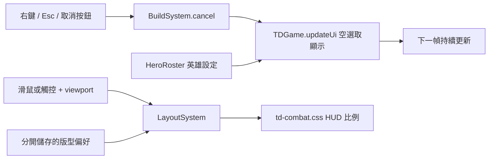

# 戰鬥右鍵與桌機比例修正 v0.83.6

日期：2026-09-21。

## 問題、設計與修正

自由遠征使用大酋長，進入部署預覽後按右鍵取消，`TDGame.updateUi()` 在沒有選取單位／英雄時，錯誤地用英雄 ID 讀取士兵設定。`units.chief` 不存在，讀取 icon 產生例外；下一次遊戲 update 再次出錯，requestAnimationFrame 不再排程，因此整個戰場停住。這不是右鍵本身、顯示卡或英雄尋路問題。

修正空選取狀態的圖示來源為現有 HeroRoster。英雄與士兵設定保持獨立，新增沒有同名士兵的英雄也能正常顯示。右鍵仍保留取消部署／選中英雄移動的原有功能；Esc 與取消按鈕共用相同安全狀態。

截圖同時顯示桌機正在使用手機戰鬥版型（左下搖桿）。目前使用自動模式時，1911 × 900 滑鼠視窗應為桌機；舊版儲存的全域 mobile 偏好可能讓它一直使用手機版。因此 LayoutSystem 現在分別記錄滑鼠與觸控偏好。首次讀取只有舊 mobile 設定、寬度大於 1100 且非粗略指標的桌機時，回到 auto；不刪除舊設定、不改玩家資料。新版若明確手動選手機版，仍會記住這個選擇。

桌機高度至少 700、寬 1200–1699 時，HUD 放大至 110%；寬 1700–2199 放大至 125%。只調整資訊列、波次、英雄資訊、技能、迷你地圖、快捷按鈕與建造入口。小視窗、手機與既有超大螢幕規則保持原有尺寸；戰場 Canvas／鏡頭座標不縮放、不拉伸地圖。地圖全覽模式依原始長寬比顯示，寬螢幕可能留側邊空間，可透過鏡頭按鈕放大。

## 模組與 API

- `src/td/TDGame.js`：使用 `heroClass.icons[0]`，不再依賴同名士兵。
- `src/td/systems/LayoutSystem.js`：新增 `preferenceKey()`；`restore()` 安全處理舊偏好，`select()` 寫入目前輸入類型的偏好並保留相容的舊 key。
- localStorage 新增 `towerFrontierLayout:pointer`、`towerFrontierLayout:touch`，值仍為 auto／desktop／mobile。舊 `towerFrontierLayout` 保留。儲存不可用時使用 auto。
- `td-combat.css`：以 CSS zoom 獨立調整桌機 HUD，沒有修改世界座標、地圖尺寸、攻擊／生命或戰鬥平衡。
- 沿用既有資料夾，無新增資料庫、後端 API、權限或外部套件。

## 操作、安裝、設定與更新

Node.js 18+，專案根目錄使用 `npm run check` 與 `npm test`，以 `npm run serve:test` 開啟本機伺服器（預設 4173，本次既有預覽在 4175）。仍支援直接開啟 td.html，不需新設定。

原本已卡住的分頁不會自動套用磁碟上的程式；需重新整理，確認大廳版號為 v0.83.6，重新進入遠征。原分頁的未保存戰局無法由此修正回溯恢復；已保存玩家進度與測試輪次保留。請勿清除 localStorage。

如需手動調整：遊戲選單 → 設定 → 介面模式 → 自動切換／電腦版。希望桌機使用搖桿時仍可明確選手機版；此手動偏好現在按輸入類型分開保存。

部署更新 `TDGame.js`、`LayoutSystem.js`、`td-combat.css`、主入口與版本檔案，SW 升至 0.83.6。本輪僅本機修改，未執行遠端部署。

## 備份與回復

程式修改前快照：`artifacts/battle-v0836-backup/`；主要檔案雜湊：`artifacts/battle-v0836-release.json`。先匯出玩家資料並保存目前程式，再選擇性回復本次變更。若相同檔案已加入其他工作，僅撤回本次差異，不要整檔覆蓋或 hard reset。新偏好 key 可保留，舊版會忽略它們。

## QA 與已知限制

- 確實重現修正前 `Cannot read properties of undefined (reading 'icon')`，位置為 TDGame.updateUi 的無選取分支；修正後消失。
- `scripts/qa-battle-input.cjs`：獨立 Chrome 測試環境，四英雄 × 右鍵／Esc／取消按鈕共 12 組通過；每組驗證取消後動畫時鐘仍前進，另驗證右鍵移動。Edge 也通過同一流程。
- `scripts/qa-battle-layout.cjs`：1911×900、1440×900、960×450、觸控 844×390、觸控直立 390×844 共五組通過；確認主要面板在畫面內、桌機無搖桿、手機有搖桿、舊偏好復原，以及鏡頭座標來回換算一致。
- `tests/td-battle-layout.test.js`：舊偏好處理、重新手動選擇、觸控／滑鼠隔離、小視窗與儲存拒絕皆通過。
- 相關單元／靜態回歸：51 項通過；`npm run check` 通過。
- 本次全套測試快照：522 項，518 通過，4 失敗。失敗涉及同期新增的 goblin 建築清單（28 vs 21）、goblinEngineer 預覽 bounds 與單位比例設定；非本次修改的檔案，未改動或刪除這些資料來使測試通過。詳見 `artifacts/test-battle-v0836.txt`。
- 使用者原 Chrome 分頁為 file://，瀏覽器工具政策拒絕讀取；未對該分頁繞過限制或重新整理。上述 Chrome 驗證是在隔離測試環境執行本機 HTTP 專案。未執行手機 Safari 實機驗證。

## FAQ

**為何是大酋長比較容易卡？** 他是英雄 ID，不是士兵 ID；舊介面對無選取狀態做了錯誤假設。修正直接使用英雄資料。

**右鍵是否改成其他功能？** 沒有。部署時取消；選中英雄時下達移動指令。

**桌機為何有手機搖桿？** 舊全域版型偏好可被記為 mobile。新版恢復舊偏好的自動判斷，並分開保存滑鼠／觸控設定。

**更新後還看到原本卡住畫面？** 該頁還執行記憶體裡的舊程式，需要重新整理原分頁，無須清除存檔。
