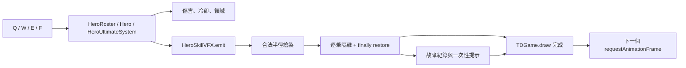

# 戰神・奧魯姆技能凍結：8D 根因分析（開放中）

版本：0.85.70 · 查證日期：2026-09-28 · 狀態：**本機修正與回歸完成；尚未部署正式站或宣稱已完成玩家裝置觀察。**

## D1：問題處理責任與範圍

本次以產品、架構、介面、開發、QA、文件與交付角度追查「選用新英雄戰神・奧魯姆，按技能後整個戰場停止」的問題。範圍限定在戰牛 Q／W／E／F 的施放動畫、Canvas 繪製與動畫影格排程；不更動英雄數值、軍團、商店、玩家存檔或地圖。

本文件是問題 8D，不是修正交付。工作區有其他同步中的變更，未改寫或回退它們。

## D2：問題描述與重現證據

| 項目 | 查證結果 |
| --- | --- |
| 玩家症狀 | 施放新英雄技能後畫面停止，無法繼續戰鬥。 |
| 確定會重現 | Q「破陣天墜」、E「不滅戰意」的特效出生幀。 |
| 本次未重現 | W「戰神震域」、F「戰神裁決」在出生幀通過嚴格 Canvas 契約。這只排除本次負半徑故障，並非聲稱它們沒有其他風險。 |
| 例外 | Q：`IndexSizeError: negative Canvas radius: -14`；E：`IndexSizeError: negative Canvas radius: -9.6`。 |
| 故障路徑 | `HeroSkillVFX.drawEffect` → `HeroSkillVFX.draw` 重新拋出 → `TDGame.draw` → `TDGame.loop`。 |
| 為何畫面凍結 | `TDGame.loop()` 將下一次 `requestAnimationFrame` 放在 `draw()` 之後；未捕捉的繪圖例外使該排程行不會執行。 |

查證使用既有 `tests/helpers/strict-canvas.cjs`，它會拒絕負值或非有限的 `arc`／`ellipse` 半徑，並檢查 Canvas 狀態堆疊。對每一招先正常施放、把特效年齡設為 `0`、再呼叫 `HeroSkillVFX.draw`：

```
Q  FAIL  bull-hammerfall  IndexSizeError: negative Canvas radius: -14
W  PASS  bull-arena       canvas-depth=0
E  FAIL  bull-ascend      IndexSizeError: negative Canvas radius: -9.6
F  PASS  ultimate-bull    canvas-depth=0
```

既有 `node --test tests/td-bull-wargod.test.js` 有 3 項通過，但只驗證技能規則與特效型別，未繪製出生影格；因此它沒有阻止這個缺陷。作為既有防護對照，`node --test tests/td-naga-skill-crash.test.js` 的 21 項通過，證明娜迦已有的嚴格 Canvas／RAF 回歸鏈可作為戰牛的修正範本。

## D3：圍堵與玩家復原

Q／E 的每一個內圈半徑都已限制為至少 `1`，所以原始負半徑不會進入 Canvas。若未來戰牛的單筆施放動畫或震域繪製仍有非預期錯誤，系統只移除失敗的純視覺項目、保留已結算的傷害與冷卻、用 `finally` 還原 Canvas 狀態，並以一次性繁中提示說明動畫已略過而戰鬥繼續。

玩家若仍看到舊版停止畫面，請使用更新頁後關閉舊戰場分頁再開，確認快取為 `sky-strike-v0.85.70`；不需清除網站資料或玩家存檔。

## D4：發生根因、漏檢根因與 5 Why

### 發生根因：內圈固定間距大於出生半徑

Q 的現行公式在 `HeroSkillVFX.js` 為：

```
r = 72 × (0.25 + 0.75 × age / 0.62)
第三圈半徑 = r - 2 × 16
```

在 `age = 0` 時，`r = 18`，第三圈為 `-14`。這段約在前 0.16 秒都可能小於零。

E 的現行公式為：

```
r = 92 × (0.20 + 0.80 × age / 0.82)
第三圈半徑 = r - 2 × 14
```

在 `age = 0` 時，`r = 18.4`，第三圈為 `-9.6`。這段約在前 0.11 秒都可能小於零。原生 Canvas 不接受負半徑，因此拋出 `IndexSizeError`；這與裝置效能、敵人數量、地圖或快取無關。

### 漏檢根因

- 戰牛測試只驗證 Q／W／E／F 的傷害、冷卻與 VFX 型別，沒有走 `HeroSkillVFX.draw`。
- 新英雄沿用了只為娜迦設定的故障隔離條件；`HeroSkillVFX.draw` 對 `bull-*` 例外會在完成 `restore()` 後重新拋出。
- 主迴圈沒有「繪製失敗仍排入下一幀」的戰牛回歸測試。這不是建議讓主迴圈吞掉所有錯誤，而是缺少特效模組自己的受控故障邊界。

| Why | 答案 |
| --- | --- |
| 為何整個戰場停止？ | 繪製例外離開 `TDGame.loop()`，下一個 RAF 未排入。 |
| 為何繪製例外？ | `ctx.ellipse` 收到負的內圈半徑。 |
| 為何半徑為負？ | 出生半徑小於兩個固定內圈間距，沒有下限。 |
| 為何不只略過動畫？ | 目前隔離名單只處理 `naga-*`／`ultimate-naga`，不含戰牛。 |
| 為何上線前未攔住？ | 戰牛測試未對四招執行嚴格 Canvas 出生幀與 RAF 連續性驗證。 |

## D5：永久修正設計與實作

1. 已為戰牛 Q、E 的每個圓環半徑加上 `Math.max(1, ...)`，保留原本的圈數、時間、傷害、冷卻與視覺節奏。
2. 已把戰牛施放動畫納入與娜迦同等的「逐筆特效隔離」：只移除故障的視覺項目、保留已結算的戰鬥效果、用 `finally` 還原 Canvas 狀態、留下可診斷的 `bullVfxFault`，並以一次性繁中提示告知動畫略過但戰鬥繼續。
3. 戰牛地面震域也已加入局部繪製隔離，使用 `bullFieldFault` 保存診斷，避免單一 field 視覺錯誤離開繪圖迴圈。
4. 已新增獨立回歸：四招在出生幀至完整生命週期、30／60／120 FPS × 1／2／3 倍速、故障注入時 Canvas 狀態與下一個 RAF 都必須持續；正常路徑不得產生容錯紀錄。



不建議把 `TDGame.loop()` 改成無條件吞掉所有錯誤；那會掩蓋戰鬥邏輯缺陷。防護應留在純視覺模組，並由正常的半徑修正消除本次根因。

## D6：本次驗證與尚未完成項目

完成：`npm run test:bull` 共 31 項通過，包含四技能 121 個生命週期時間點、Q／E 在 30／60／120 FPS × 1／2／3 倍速的 RAF 連續性、四種特效故障注入、震域故障隔離、既有戰牛規則與快取版號一致性。`node --check` 已通過三個修正模組。

尚未完成：真實瀏覽器／手機裝置驗收、正式部署與玩家裝置觀察；它們不能在本機回歸通過後宣稱完成。

## D7：防止再發生

- 每個新英雄的每一招都必須包含嚴格 Canvas 出生幀、完整生命週期、Canvas 狀態平衡與 RAF 連續性測試。
- 動畫半徑、透明度、時間和座標要在模組邊界驗證為有限且合法；測試 double 不可默默接受原生 Canvas 會拒絕的參數。
- 故障隔離屬於展示層，正常情境出現任何 `*VfxFault` 都必須令回歸失敗。
- 對每個新英雄，將「技能按下 → 更新 → 原生繪製 → 下一幀」列入發布前 QA 清單。

## D8：交付狀態、更新與還原

本機工程結案條件已達成：原版 Q／E 確定失敗、修正版在相同 Canvas 契約和 RAF 路徑通過、正常技能效果未被測試觀察到變動、故障注入不會停止戰場。玩家存檔、資料庫、HTTP API、權限與戰鬥數值均未改動。

此版本的還原應整套同步回退 `HeroSkillVFX.js`、`HeroRoster.js`、`TDGame.js`、測試、入口版號與 Service Worker；不可只回退快取名稱。回退前先匯出玩家資料，回退本身不刪除 localStorage。回退到 0.85.69 會重新帶回 Q／E 當機風險，不應作為本缺陷的長期方案。
