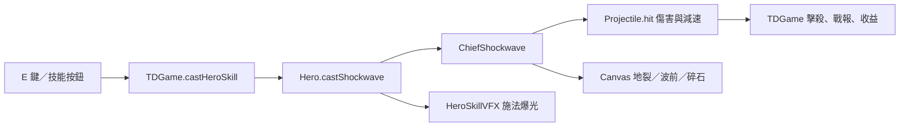

# 大酋長「裂地衝擊波」交付紀錄 — v0.84.3

## 需求與設計

原 E「召喚戰魂」與暮影分身玩法重複，而且顯示成暮影英雄外觀。現在改為大酋長專屬的前進地面衝擊波：按 E 或戰鬥技能按鈕施放，優先朝目前攻擊目標，否則朝前方；沿直線穿透，每個敵人只受一次傷害並短暫減速，不擊退。距離 340、速度 450、半寬 34、基礎傷害 70 × 英雄技能倍率、減速倍率 0.65 維持 1.5 秒、冷卻 22 秒。祖靈契約每級增加 20% 傷害，三級加寬 8；迅捷符文仍縮短冷卻。後續平衡應檢視 30 波高密度敵群的總傷害。

玩家看見施法點的土色爆光、沿行進方向的裂縫、橘色弧形波前及飛散碎石。E 圖示是獨立 SVG，避免沿用舊召喚圖。技能說明、冷卻提示與商城裝備說明均同步更新。其他英雄 E 召喚與大酋長 Q/W/F 不變。

## 架構與資料

`src/td/systems/ChiefShockwave.js` 管理單道波的行進、碰撞與 Canvas 繪製；`Hero.js` 只管理技能可用性和冷卻；`TDGame.js` 管理活動波生命週期。重設或章節檢查點恢復會清除尚未結束的波。沒有資料庫、HTTP API、新權限或存檔欄位；遊戲維持瀏覽器本機資料。

## 安裝、使用與更新

依根目錄 README 安裝 Node.js 18+，在專案執行 `npm run check`、`npm test`，以本機伺服器開啟 `td.html`。正式玩家先按既有故事解鎖規則；管理者測試環境可選大酋長。進入自由遠征後按 E 觀察衝擊波；右鍵取消部署與商城快捷鍵 R 仍依既有操作。部署時一併更新 HTML、CSS、JS、SVG、`sw.js`；關閉舊分頁後重新開啟，確認顯示 v0.84.3，讓 `sky-strike-v0.84.3` 接管離線快取。無設定或存檔遷移。

## 常見問題與管理

- **看不到波／仍看到分身**：確認大酋長已選中、E 冷卻結束，並重新載入完整 v0.84.3 資產；檢查瀏覽器是否仍使用舊 Service Worker 快取。
- **無敵人也能施放？** 可以，波會沿英雄目前面向前進；有已選目標時優先朝目標。
- **其他英雄召喚是否改變？** 沒有。共用 E 按鈕只在大酋長職業路由到裂地波。
- **需要管理後台或資料庫？** 不需要。技能完全在既有本機戰鬥內運作。

## QA 與回復

`tests/td-chief-shockwave.test.js` 檢查 E 路由、不再生成分身、直線穿透、單敵只命中一次、減速、冷卻、目標方向與裝備效果；`tests/td-wild-horde.test.js` 檢查專屬特效。`npm run check` 通過，`npm test` 535/535 通過。`scripts/qa-chief-shockwave.cjs` 在 Chrome 桌機與 844×390 觸控視窗驗證 E 按鈕、新圖示、實際命中與 VFX，截圖在 `artifacts/qa-chief-shockwave-v0841/`。技能效果每幀最多一條活動波及九塊裝飾碎石，不額外讀寫玩家資料。右鍵操作沿用 v0.83.6 回歸測試；本輪未改輸入路徑。

修改前檔案保存在 `artifacts/chief-shockwave-v0841-backup/`。回復時先備份現況，再逐檔比較該資料夾與目前版本，回復本次修改並移除新增的技能模組、SVG、測試與文件；同步恢復版本／快取名稱並完整重新部署。不要對共用工作目錄使用 `git reset --hard`，以免覆蓋其他未提交工作。
