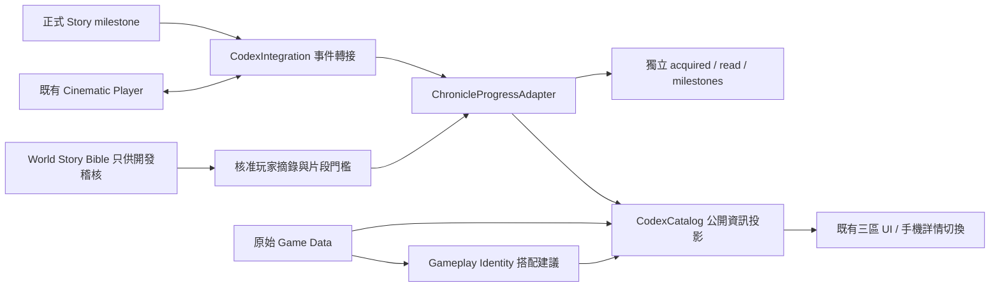

> 歷史版本文件。現行版本請見 [Progression V1／Chronicle UX V1.2](STORY_CODEX_PROGRESSION_V1_UX_V1_2.md)。

# CODEX CONTENT & CHRONICLE V1.1

模組版本 1.1.0；分支封裝版本 0.79.3-codex.2；分支 `feature/codex-chronicle`；上一版 commit `018e500`。本文件為目前圖鑑的內容與整合規格；[V1 文件](CODEX_V1.md) 保留作初版歷史。

## 規劃與範圍

保持既有 PC：左側 Category → 中央 Collection Grid → 右側 Detail。保持 Hero、Faction、Unit、Tower、Enemy、Equipment、Map、Chronicle 八個主分類。手機仍為 Collection → Detail → 返回；沒有縮小桌面三欄塞入手機。

開發次序：Bible 與現有資料稽核 → 玩家可讀摘錄／逐段門檻 → 獨立 Chronicle Adapter → 詳情資訊層级 → 跨分類關聯 → PC／手機 QA → 文件／版本／提交。

唯一世界觀來源是使用者主工作目錄的 `docs/WORLD_STORY_BIBLE_V1.md`。讀取時 SHA-256：

`E209A0BDA0E48AE7DBF92B030D242563503ED31928530BE51DB99D0CA665688C`

本次不改動、複製或在瀏覽器載入 Bible 全文。每段正式摘錄在 `ChronicleSeed.js` 中有 `bibleSections`，沒有另取主目錄示範任務文案當成 Canon。主目錄尚未合併的 StoryCatalog 只有 `chapter1-border` 示範任務，不代表第一章完成，也不足以推導本次史料門檻。

## 新增的 21 筆編年史

初始可閱讀 9 筆；另顯示第一章 8 筆封存標題（可搜尋標題、不可讀內容）；第二章 4 筆不出現在卡片、計數、搜尋或關聯列表。沒有額外建立秘密真相條目。

| 項目 | 內部分類 | 初始狀態 | Bible 節 |
| --- | --- | --- | --- |
| 多族共存的年代 | 世界 | 可讀 | 一 |
| 傭兵制度的起源 | 世界 | 可讀 | 一 |
| 共同城市的建立 | 世界 | 可讀 | 二 |
| 王國 | 文明 | 可讀 | 二、十一 |
| 銀葉 | 文明 | 可讀 | 三、八 |
| 暮影 | 文明 | 可讀 | 五、七 |
| 元素精靈 | 信仰 | 可讀 | 四 |
| 聖靈 | 信仰 | 可讀，明確標示銀葉信仰 | 三 |
| 南方帝國 | 世界 | 只讀公開常識 | 九 |
| 銀葉王子之死 | 事件 | 第一章封存 | 十三、十四 |
| 王國戒嚴 | 事件 | 第一章占位，無事件文本 | Bible 尚未描述 |
| 王國禁衛軍 | 人物紀錄 | 第一章封存 | 十二、十六 |
| 皇族親衛隊 | 人物紀錄 | 第一章封存 | 十二 |
| 銀葉與暮影衝突 | 事件 | 第一章封存 | 十四 |
| 黑魔法禁忌 | 歷史 | 第一章封存，三段漸進史料 | 七 |
| 第一次禁魔 | 歷史 | 第一章封存 | 七 |
| 暮影重新打開禁忌 | 事件 | 第一章封存 | 十五 |
| 西方大陸 | 世界 | 第二章隱藏 | 十八 |
| 荒野部族 | 文明 | 第二章隱藏 | 十八 |
| 南方獸人遺民 | 歷史 | 第二章隱藏 | 十 |
| 獄烈戰爭 | 歷史 | 第二章隱藏；只記錄名稱與有限背景 | 九 |

「王國戒嚴」依本次需求保留名字，但 Bible 沒有事件經過、宣布者、日期或動機，不能補寫；`contentPending:true`、`requires:{blocked:true}`，即使收到一般 unlock 也不會產生敘事。

沒有揭露王子死亡的執行者、首相陰謀、古代種族身份、戰爭完整真相、南方統一原因、兩族遠古關係或聖靈真實機制。聖靈段落只轉述 Bible 中的銀葉信仰。第二章未解鎖時，其文本不會進入玩家投影物件。

## Gameplay Identity 與 Detailed Stats

Unit／Tower 詳情先顯示定位、核心特色、適合的 Build、優勢、弱點與取捨、前期／中期／後期用途。`GameplayIdentity.js` 根據原始能力欄位選擇通用戰術說明，例如 `slow`、`rootPulse`、`splash`、`forgeAura`、`summonAura`、`refractChance`、`priorityTargets`。這些是搭配建議，不是新的世界觀或一套複製的數值表。

後段的「Detailed Stats · 詳細數值」預設收合，展開後才看 ATK、HP、Range、Attack Interval、Cost、木材、護甲等目前來源存在的數值。來源仍是 config／HeroRoster／Monster 的即時資料；升級沿用 CombatUnit／TowerEvolutionSystem，沒有另建 Codex Balance Data。

## Progressive Lore

一筆 Entry 有多個不可重用的 fragment ID，各段各自帶 `sourceType`、`text`、`bibleSections`、`requires`。新增情報是追加 fragment，不取代第一段。已取得／已讀 fragment ID 存在獨立 Chronicle 存檔；重新整理、重複事件、事件先後顛倒都有測試。

「黑魔法禁忌」示例：

1. `taboo`：知道這是古代禁忌；來源「已確認」。
2. `silverleaf-record`：取得銀葉保留的禁魔歷史與記憶差異；來源「銀葉史料」。
3. `shadow-record`：知道暮影高層研究後參與禁魔的經過；來源「暮影記載」。
4. `ancient-document`：只有 pendingFragments 擴充位置，沒有假造文件內容或可觸發的門檻。

新收錄、未讀過的條目顯示 **NEW INFORMATION**；已有已讀記錄又取得新段落，顯示 **ARCHIVE UPDATED**。標籤同時在卡片、詳情標題和史料區顯示。每段有來源與 NEW 標記。玩家按「標記本頁史料已讀」才更新已讀狀態，不因自動選中或篩選就視為已讀。

新增文本時必須使用新的 fragment ID 並保留舊段落。要正式收錄古代文件，需先有核准來源，再加入新 fragment 與明確 Story 事件；不能僅因玩家通關便補寫答案。

## Discovery State

| 顯示層級 | 條件 | 玩家可見 |
| --- | --- | --- |
| UNKNOWN | 無任何發現旗標 | ??? 與未明記錄編號；不要求角色原圖 |
| ENCOUNTERED | encountered | 模糊剪影、曾見身影提示；無名稱、完整能力或 raw source |
| DISCOVERED | discovered | 正式圖片、名稱、基本資料；未知的詳細數值與完整技能不開放 |
| UNLOCKED | 可用內容 unlocked | 可用角色／軍備的完整資訊 |
| FULLY_KNOWN | fullyKnown，或目前編年史段落已全取得 | 完整的已收录資料；不等於世界謎團的唯一真相 |

底層 encountered／discovered／unlocked／fullyKnown 仍獨立保存，不因一般遇見事件就自動變成可用。新增事件為 `fully-known`。原 schema:1 收藏檔能讀取，新旗標缺少時視為 false。

第一章封存標題屬於已知的索引基本資料，因此可以出現在清單，內文另受 Chronicle 門檻限制。其「可閱讀」計數為 false；不會因收到一般 Codex unlocked 而開啟未取得的史料。第二章另外要求對應 Story 門檻，不能靠通用 unlock 繞過隱藏規則。

所有搜尋都在投影後執行，只查已公開名稱、定位與已取得段落。史料分類 Filter 為世界、文明、歷史、事件、信仰、傳說、人物紀錄；另有来源 Filter，沒有增加主分類。

## 史料來源標籤

| Source | 顯示 |
| --- | --- |
| CONFIRMED | 已確認 |
| SILVERLEAF_BELIEF | 銀葉信仰 |
| SILVERLEAF_RECORD | 銀葉史料 |
| SHADOW_RECORD | 暮影記載 |
| KINGDOM_OFFICIAL | 王國官方紀錄 |
| ORC_ORAL_HISTORY | 獸人口述 |
| LEGEND | 傳說 |
| UNKNOWN | 真實性未知 |

標籤是資訊視角，不代表新增實體書籍、證人台詞或文件名稱。來源未出現的類別也保留可篩選；沒有內容時顯示空結果。

## 關聯網路

重用軍團 roster、英雄所屬與裝備相容性；已接 Hero ↔ Faction ↔ Unit／Tower、Faction／Hero ↔ Chronicle、Map ↔ Enemy，以及 Chronicle 互相引用。詳情連結會顯示目標分類，點擊後自動切換分類與選取，並清除不相容的篩選。

Map ↔ Enemy 是由既有全地圖共用波次表形成的 Gameplay 遭遇關係，沒有宣稱這些遠征地圖是 Bible 中的 Story 地點。

Bible 中的公主、水元素尚未與此分支 Hero／Unit 的正式 ID 對應，不能把希爾芙直接宣告成銀葉公主，也不能把一般元素召喚物當成水元素。保留 `relatedConcepts`：`silverleaf-princess`、`water-elemental`、`silverleaf-story-map`。合併後透過 `resolveConcept(concept)` 回傳已確認的真實 Entry ID；不存在的 ID 會被過濾，不會生成虛構卡片。

## ChronicleProgressAdapter / Story Integration

新檔案為 `src/td/codex/ChronicleSeed.js`、`ChronicleProgressAdapter.js`、`GameplayIdentity.js`。沒有修改 Story Core。一般收藏仍用原 `CodexProgressAdapter`；史料保存「里程碑、已取得段落、已讀段落」，schema:1，預設 UI key 為 `<Codex progress.key>:chronicle`，因此可隨 profile 命名空間隔離。



```js
// 即時同頁事件。只接受下表明確里程碑，不推導 chapter complete。
dispatchEvent(new CustomEvent('hero-frontier:story', {
  detail: { type: 'story-milestone', id: 'chapter1.silverleaf-record-found' }
}));

// 跨頁整合：正式 Story / Save 層使用同一 profile key 的 adapter。
const archive = new TowerFrontier.codex.ChronicleProgressAdapter({
  storage: profileStorage,
  key: 'heroFrontierCodexV1:profile-123:chronicle',
  seeds: TowerFrontier.codex.chronicleSeed
});
archive.ingest({ type: 'story-milestone', id: 'chapter1.silverleaf-record-found' });

// 在 CodexView 載入前：
globalThis.HeroFrontierCodexOptions = {
  progress: profileCodexAdapter,
  chronicleProgress: archive,
  resolveConcept: concept => approvedConceptMappings[concept] || [],
  player: existingCinematicPlayer
};
```

API：`ingest(event)`、`view(seed)`、`markRead(entryKey, fragmentIds)`、`snapshot()`、`subscribe(listener)`、`sync()`。markRead 只接受已取得的 fragment，不能提前把未解鎖段落標為已讀。重複里程碑為冪等；不認識的 ID 回傳 false。CustomEvent 不跨頁，正式 save bus 須使用 adapter。

| 待 Story 接線的里程碑 | 開放内容 |
| --- | --- |
| chapter1.prince-death-known | 銀葉王子之死 |
| chapter1.kingdom-guard-met | 王國禁衛軍制度 |
| chapter1.guard-investigation-known | 追加禁衛軍調查片段 |
| chapter1.royal-guard-known | 皇族親衛隊制度 |
| chapter1.conflict-witnessed | 銀葉與暮影衝突 |
| chapter1.black-magic-taboo-known | 黑魔法禁忌第一段與 Entry 基本門檻 |
| chapter1.silverleaf-record-found | 追加銀葉史料 |
| chapter1.shadow-elder-account-heard | 追加暮影記載 |
| chapter1.first-prohibition-known | 第一次禁魔 |
| chapter1.taboo-reopened-witnessed | 暮影重新打開禁忌 |
| chapter2.west-arrived | 西方大陸 |
| chapter2.tribes-met | 荒野部族 |
| chapter2.orc-history-heard | 南方獸人遺民 |
| chapter2.war-name-known | 獄烈戰爭有限記錄 |

這些是本分支的資料契約 ID，尚不是已存在的 Story Core ID。需由該分支在玩家真正獲知資訊時映射／發送。沒有新增玩家用的跳章或解鎖按鈕，也沒有把 `chapter1-border` 當作以上任一線索的取得證據。

## Cinematic Integration

每筆 Seed 均預留 `cinematicId:null` 與 placeholder。沒有臆造影片 ID、影片內容或新播放器。UI 顯示準備中；日後配置 ID 但未看過時，顯示影片鎖定。

正式 Story Player 完成觀看後，對應的 CodexProgressAdapter 接收 `{type:'cinematic-watched', id:'chronicle:<entry-id>'}`。Seed Entry 的重播要求 watched，交由既有 `player.play(cinematicId)` 處理。故事仍需另外發送正確的史料里程碑；看過影片不自動解密所有段落。播放器未接或失敗時顯示可讀提示。V1 host-provided cinematic catalog 的舊介面仍相容。

## 安裝、設定、部署、更新

沿用 V1 靜態頁與 Node.js 18+。在此工作樹 `npm run serve:test`，開啟 `http://127.0.0.1:4173/codex.html`；本次預覽沿用 4327。玩家不需 npm install。第一次開啟即可讀九項，不需設定或開發者 Console。

部署時一併更新 codex.html、codex.css、src/td/codex；沿用既有縮圖。不要將 WORLD_STORY_BIBLE_V1.md 當作前端內容 API。沒有後端 API、資料庫 migration、核心 Save 或 service worker 修改。

新增 canon 前先確認 Bible／核准來源，追加 Seed 段落與穩定 ID，再更新來源對照與測試。新事件由 Story Core 維護者確認；新 Hero／Map 關聯要使用正式 ID。

## 備份、還原與回復

備份 `HeroFrontierCodex.progress.snapshot()` 和 `HeroFrontierCodex.chronicleProgress.snapshot()` 兩份 JSON，並保留各 adapter.key。Chronicle 的 schema:1 包含 milestones 與 entries 的 acquired/read，還原時寫回相同瀏覽器來源、相同 profile key，重新整理。不要混入或覆寫核心遊戲存檔。

損壞或未來 schema 保留原字串並降級為當次記憶體；容量不足亦提示，不清除歷史。先備份再排錯。不同瀏覽器／網域／埠有各自收藏。

程式回復：乾淨工作樹可 `git revert <V1.1交付commit>`，或在另一个工作樹檢出 `018e500`；不要 reset 他人未提交內容。舊 V1 不會讀新的 Chronicle key，請保留它以便再次升級。

## QA 與待驗收

`npm test`、`npm run check`、`npm run check:codex`；聚焦測試 `npm run test:codex`。瀏覽器腳本 `npm run verify:codex` 沿用已安裝 Edge／Playwright（可用 CODEX_NODE_MODULES 指定套件路徑、CODEX_BROWSER_CHANNEL=chrome 切換）。產物在 `artifacts/qa-codex-v1.1/`。

自動驗證 PC 1920×1080、iPhone 橫向比例 844×390（約19.5:9）、667×375 與直向390×844：搜尋、七類 Filter、來源 Filter、史料三階段、新情報／已讀保存、第二章遮罩、四層發現、戰術先於數值、跨類關聯跳轉、圖片載入、無 Console／HTTP 錯誤與無整頁溢出。

實體 iPhone Safari、真實 Dynamic Island／Home Indicator 仍待實機；CSS 保留 safe-area。正式 Story milestone、profile save、影片回報、角色與 Story Map ID 映射待相關分支合併後端到端驗收。
