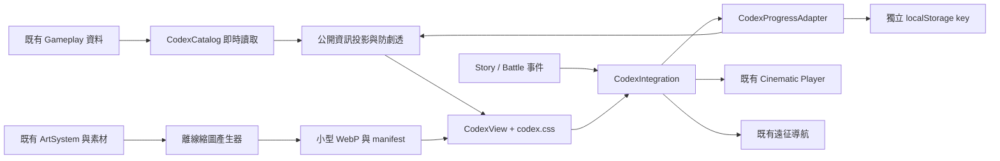

> 歷史版本文件。現行版本請見 [Progression V1／Chronicle UX V1.2](STORY_CODEX_PROGRESSION_V1_UX_V1_2.md)。

# HERO FRONTIER 世界圖鑑 / CODEX V1

> 此文件保留 V1 初版設計與驗證歷史。現行 Chronicle、Discovery、來源及整合契約請依 [V1.1 文件](CODEX_CONTENT_CHRONICLE_V1_1.md)。

模組版本 **1.0.0**；分支封裝版本 **0.79.3-codex.1**。獨立分支 `feature/codex-chronicle`，基底 `7f6fa5c`（已提交的 0.79.2）。不合併 main、不包含主工作目錄的其他未提交功能。

## 產品範圍與開發順序

世界圖鑑提供收藏、Gameplay 查詢、發現狀態、來源可辨識的世界觀閱讀，以及影片回顧整合介面。實作順序為資料稽核 → 目錄轉接 → 獨立進度 → 桌面／手機 UI → 整合介面 → 自動與視覺驗證 → 文件及 Git 交付。

目前提供英雄、軍團、士兵、防禦塔、敵人、裝備、地圖、編年史八類。士兵與塔分開，避免初次使用者混淆。桌面為分類、收藏、詳情三區；1100px 以下改為收藏／詳情切換；手機橫向詳情由立繪與局部捲動內容組成。小於 600px 的直向畫面亦可使用。

圖片參考用於黑金風格、選中卡片、分類及詳情層級；沒有將參考圖上尚不存在的角色、貨幣、軍團或功能偽造為正式資料。

## Repository 稽核與資料來源

| 項目 | 唯一資料來源 | 圖鑑行為 |
| --- | --- | --- |
| 英雄、技能 | HeroRoster、ProfessionSystem、HeroUltimateSystem | 直接讀名稱、定位、技能說明、基礎數值與終極技能 |
| 軍團、兵種關係 | FactionSystem.FACTIONS | 讀現行軍團名稱與 roster；不套用參考圖名稱 |
| 士兵、防禦塔 | config.units / config.buildings | 過濾 enemyOnly，讀戰術用途、攻擊與成本 |
| 進化、難度 | TowerEvolutionSystem、TDDifficultySystem | 重用塔分支與難度條件；不實作解鎖規則 |
| 士兵升級 | CombatUnit.config / evolutionName / upgradeCost / upgrade | 以隔離預覽實體列出各等級名稱、數值與成本；不修改戰局或原始資料 |
| 敵人 | Monster.TYPES、WaveCatalog.WAVES、config.damageMultipliers | 首次可遭遇波次、戰場預告、基礎數值、護甲相性 |
| 裝備 | ArmorySystem.ITEMS / canEquip、EquipmentSystem.WEAPONS | 相容對象由 canEquip 計算；專武依原有英雄歸屬 |
| 地圖 | maps.definitions、BattleReportSystem | 排除 visible:false、路線示意、最高分、成功戰報的通關難度 |
| 美術 | 既有 selectionArt / asset、ArtSystem / SpriteFrameBounds | 產生衍生縮圖，不重畫角色、不改既有素材 |
| 劇情、影片、正式存檔 | 基底沒有可整合的正式目錄 | host options + event / player / progress adapters |

本基底有 3 位英雄與 3 個軍團。主工作目錄存在 0.83.0 等未提交變更，不在此次隔離分支中。新 Gameplay 項目會由各目錄列舉，不需新增角色專屬 UI。新項目的美術縮圖需要重建，未建時以符號回退，不會要求不存在的圖片。

未找到可重用的裝備推薦評分系統，因此直接列出原有軍械庫允許的角色，不另造推薦算法。英雄被動、前中後期建議、世界觀、起源、劇情狀態若無來源，顯示「尚無正式記載」。軍團徽章、英雄配音、影片或獨立全身立繪若無素材，也不偽造。三件制式武器沒有獨立 atlas cell，顯示符號回退。

## 安裝、設定與使用

1. 使用 Node.js 18+；此靜態頁沒有執行期 npm 套件依賴。
2. 在此分支工作目錄執行 `npm run serve:test`，開啟 `http://127.0.0.1:4173/codex.html`。埠已占用時，PowerShell 可先設定 `$env:TD_TEST_PORT='4327'`。
3. 點分類、搜尋名稱或定位、使用最多兩個分類篩選；點卡片閱讀基本資料、故事、技能及關聯內容。
4. 愛心加入／取消收藏。右上問號提供狀態及操作說明。
5. 手機橫向點卡片後，按「返回」或 Esc 回到列表；分類列與詳情內容可個別捲動。
6. 「立繪欣賞」才載入既有原圖。關閉視窗即移除圖片節點。缺圖則顯示符號。
7. 已可用英雄／地圖提供「前往自由遠征」。獨立版前往現有 `td.html` 選擇頁；**不會宣稱已自動預選英雄或地圖**。正式導航可接收 structured payload 預選。

一般玩家不需設定。整合者可在載入 CodexView.js 之前提供 `globalThis.HeroFrontierCodexOptions`。頁面沒有管理登入、伺服器 API 或資料庫，收藏不等於伺服器授權。

## 架構與目錄



- `codex.html` / `codex.css`：獨立入口與版型。
- `src/td/codex/CodexCatalog.js`：統一 Entry、來源關聯、篩選、防劇透。
- `src/td/codex/CodexProgressAdapter.js`：三種獨立狀態、收藏、觀看、儲存錯誤處理。
- `src/td/codex/CodexIntegration.js`：事件、影片播放、導航、戰報轉接。
- `src/td/codex/CodexView.js`：DOM UI，文字使用 textContent，無 HTML 插值。
- `src/td/codex/thumbnails.js` / `assets/td/codex/`：衍生美術，不含 Gameplay 數值。
- `tests/td-codex.test.js`：資料及行為測試；`scripts/verify-codex-browser.cjs`：實際瀏覽器操作。

## Entry 與防劇透契約

Entry 包含 `id`（如 `hero:arcanist`）、`type`、`name`、`art`、`thumbnail`、`defaults`、`unlockRequirement`、`gameplayInfo`、`lore`、`relatedEntries`；投影後新增 `discoveryState` 與 `revealed`。

`encountered`、`discovered`、`unlocked` 是三個獨立旗標，單獨收到其中一項事件不會自動設定其他兩項。`watched`、`favorite` 另存；進度旗標單調累積，收藏可取消。看完影片是明確的複合事件，會將該影片設為遇見、發現、解鎖及看過。

獨立基底中公開可選的英雄、軍團、士兵、塔、地圖以已發現／可用呈現，**不捏造已遇見紀錄**；裝備公開資料但預設未取得；敵人預設剪影。正式 Unlock / Story 分支必須提供 availability 與 metadata，套用自己的初始公開範圍。

`hiddenUntilEncountered` 使用下列列舉，避免 boolean 無法表達三種行為：

| 值 | 遇見前 | 已遇見、未發現 | 已發現或已可用 |
| --- | --- | --- | --- |
| `hidden` | 完全不出現在清單與計數 | 顯示 ??? | 正式資料 |
| `silhouette` | 顯示無名稱剪影 | 顯示 ??? | 正式資料 |
| `name` | 顯示名字與鎖定提示 | 名字與鎖定提示 | 正式資料 |

遮罩先於搜尋、軍團／定位篩選、關聯、縮圖套用。未公開名稱不會被搜尋命中。這是玩家介面的防劇透，不是把隨靜態 JS 部署的資料加密。

## 整合 API（沒有 HTTP API）

```js
// 必須在 CodexView.js 之前設定；資料例子不會自動成為正式世界觀。
globalThis.HeroFrontierCodexOptions = {
  progress: new TowerFrontier.codex.CodexProgressAdapter({
    key: 'heroFrontierCodexV1:profile-123' // 正式 Save 分支應注入玩家專屬 storage/key
  }),
  metadata: {
    'hero:arcanist': {
      defaults: { encountered: false, discovered: false, unlocked: false },
      hiddenUntilEncountered: 'silhouette',
      unlockRequirement: '由正式解鎖資料提供',
      earlyGame: '由策劃核准內容提供',
      lore: [{ sourceType: 'SILVERLEAF_BELIEF', text: '由正式來源提供的記錄' }]
    }
  },
  availability(entry) { return officialUnlockProvider.canUse(entry.id); },
  chronicles: officialStoryCatalog, // 見下方 schema
  player: existingCinematicPlayer, // play(cinematicId) -> Promise<{watched:boolean}>
  navigate({ entryId, hero, map }) { existingNavigation.openExpedition({ hero, map }); }
};
```

`CodexProgressAdapter`：`state(id, defaults)`、`update(id, flags)`、`ingest(event)`、`snapshot()`、`subscribe(fn)`（回傳 unsubscribe）。自訂 adapter 應保留相同介面及 warning/key 屬性。`storage` 需提供 `getItem/setItem`；傳 null 可用無持久化記憶體模式。

既有頁面上的即時事件：

```js
dispatchEvent(new CustomEvent('hero-frontier:codex', {
  detail: { type: 'encountered', id: 'enemy:boss' }
}));
// type: encountered | discovered | unlocked | cinematic-watched
```

跨頁或圖鑑未開啟時：正式 Story/Battle 分支在自己的整合層載入 ProgressAdapter，使用相同 storage/key 呼叫 `ingest`。CustomEvent 本身不跨頁；正式 Save event bus 應轉呼叫 adapter。此分支沒有修改戰鬥迴圈插入事件。

`chronicles` 每筆：`{id, name, kind, text, sourceType, cinematicId?, relatedEntries?, hiddenUntilEncountered?}`。id 不含分類前綴，adapter 事件用 `chronicle:<id>`。kind 可為 `cinematic`、`文件`、`傳說`、`歷史`、`事件`。来源支援 CONFIRMED、SILVERLEAF_BELIEF、SHADOW_RECORD、KINGDOM_OFFICIAL、ORC_ORAL_HISTORY、LEGEND、UNKNOWN；缺失或未知來源顯示「真實性未知」。不對未確認的長壽、族群同源、戰爭真相或古代種族提供答案。

`CodexIntegration.replay(entry)` 檢查 unlocked，呼叫現有 player，只有 `watched:true` 才記錄看過。播放器未接時顯示準備中；失敗提供可讀提示。沒有新增 Video Player、影片預載或虛構片名。

## 合併依賴與限制

1. **Main Lobby / Navigation**：新增 `codex.html` 入口，注入正式返回／遠征導航。目前不修改核心導航。
2. **Unlock Progression**：提供逐項 availability、初始 metadata、正式解鎖條件；難度軍備限制仍由原有系統管轄。Adapter 進度為累積收藏，權威使用權若涉及撤銷，必須由正式 Unlock provider 再驗證，不可把收藏當成授權。
3. **Save Core**：選擇 profile 專屬儲存，接上 migration / save bus。預設獨立 key 只屬於此瀏覽器來源，尚無帳戶同步。
4. **Story / Battle**：在真實 encounter/discover/unlock 時轉發事件；提供已核准 Chronicle 目錄與 lore；未接前不會憑空生成戰鬥收藏紀錄。
5. **Cinematic Player**：提供 `play(id)` 完成回報及 watched 事件；此分支只有介面和空白收藏庫。
6. **資料與美術**：如其他分支加入荒野軍團或新英雄，目錄自動讀取公開資料；核對對應 Profession／Ultimate API，重建縮圖。沒有原始美術時保持回退符號。
7. 合併時依主線最新版本決定 package version；本分支版本以已提交基底為準，不能覆蓋更高的主線 release version。

## 效能、安全、例外

初始頁面只載小型 WebP，不初始化 TDGame 或 ArtSystem，也不要求原圖或影片。83 張縮圖總計約 2.72 MiB；網格採 lazy loading。大型原圖只在明確開啟欣賞時載入。大量未來條目仍會建立卡片 DOM；若達數千條，建議在此獨立 View 層加入視窗化。

不用 innerHTML 插入動態內容。損壞／未來 schema 的存檔不覆寫；空間滿或瀏覽器禁用儲存時降級為當次記憶體並提示。沒有後端、角色權限管理、帳號或付款操作。所有 core 模組保持不變。

## QA 與重建

```powershell
npm test
npm run check
npm run check:codex
npm run test:codex
# 另開終端啟動伺服器，預設 browser QA URL 使用 4327
$env:TD_TEST_PORT='4327'
npm run serve:test
# 原終端：可用 npm install --no-save --package-lock=false playwright，或指定已安裝套件路徑
$env:CODEX_NODE_MODULES='你的 node_modules 絕對路徑'
npm run verify:codex
```

瀏覽器測試預設使用已安裝 Edge。`CODEX_BROWSER_CHANNEL=chrome` 可驗證 Chrome，`CODEX_URL` 可指定其他服務位址。測試套件不是玩家執行期依賴。

縮圖重建需 `sharp`、`@napi-rs/canvas`：在獨立開發環境安裝，或透過 CODEX_NODE_MODULES 指向既有環境，執行 `npm run build:codex-thumbnails`。沿用現有 ArtSystem 的繪製邏輯；只寫入 assets/td/codex 與 manifest。新增美術後請重建並檢查。

瀏覽器 QA 覆蓋 1920×1080、844×390（iPhone 比例）、667×375、390×844；檢查分類、搜尋、收藏持久化、Tabs、原圖、無頁面溢出、未知名稱遮罩、事件更新與地圖路線。截圖與結果保存在 `artifacts/qa-codex-v1/`。這是桌面瀏覽器的尺寸／觸控模擬，**不等同實體 iPhone Safari 測試**；實機安全區與 Safari 驗收仍待裝置確認。

## 部署、更新、備份及回復

部署為靜態網站：沿用原站，同時部署 codex.html、codex.css、src/td/codex、assets/td/codex，以及既有被引用的 src/td、assets。沒有新增 service worker 或改動既有快取；首次造訪需可連線取得檔案。先在 staging 直接開 codex.html，驗證後由 Lobby 分支掛入口。

更新前備份獨立圖鑑 key（或正式 profile key）與 Git commit。在圖鑑頁 DevTools 執行 `copy(JSON.stringify(HeroFrontierCodex.progress.snapshot()))` 保存 JSON；還原前核對 `schema:1` 與 entries，將檔案字串寫回相同來源的 `localStorage.setItem('heroFrontierCodexV1', jsonText)` 後重新整理。不要覆蓋遊戲核心存檔。私人瀏覽／不同埠／不同網域有不同儲存區。

程式回復：在乾淨分支 `git revert <Codex交付commit>` 可撤回此次新增與文件更新；原有遊戲存檔不受影響。需比較上一版本時使用獨立工作樹 `git worktree add ../codex-before 7f6fa5c`，不要對有未提交內容的主目錄執行 reset。回復前先備份圖鑑 key，保留以供重新安裝。
