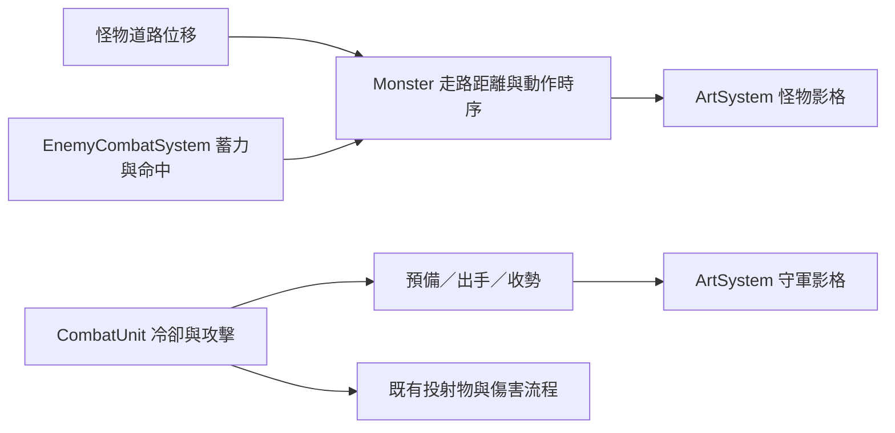

# v0.85.18 怪物與守軍動作時序

## 使用者操作與可見變化

照原方式選角、部署士兵並開波。怪物被隊列擋住時會停下踏步；短暫受擊後會接回原本的走路節奏。會攻擊英雄的怪物依預備、打擊、收勢播放影格。一般守軍在下一次攻擊前預備，投射物產生時顯示出手姿勢，接著收勢。霜原與地精原有的蓄力發射流程保持有效。沒有新增按鈕或設定。

## 架構與 API

`Monster.update()` 仍以實際前進距離選走路影格；停止時顯示穩定姿勢。怪物攻擊視覺時間由 `EnemyCombatSystem` 開始，`Monster` 依該時間選預備、打擊與收勢影格；受擊影格與路程不再共用序號。`CombatUnit.attack()` 仍在既有冷卻點產生投射物，`CombatUnit.animate()` 依剩餘冷卻與攻擊計時選預備、出手、收勢影格。`ArtSystem` 沿用原圖集與腳底定位。沒有新增 HTTP API、資料庫、權限或存檔欄位；新增欄位只存在當局物件記憶體。

## 限制與後續素材方向

現有怪物圖集主要提供側面姿勢並以左右鏡像呈現，向上／下走仍缺獨立方向圖。少數怪物邊移動邊攻擊時仍會有短暫位移；本版保留道路與戰鬥座標，以免改變波次平衡。若實玩仍覺得轉彎或垂直行走不自然，下一步是補方向影格及逐格腳底校正，先用戰鬥錄影確認優先兵種。

## 安裝、更新與部署

依既有安裝手冊取得完整專案，開啟 `td.html` 或使用原本的靜態伺服器。部署時一併發布 `Monster.js`、`EnemyCombatSystem.js`、`CombatUnit.js`、`td.html`、`update.html` 與 `sw.js`。本功能初次收錄於 v0.85.18；目前整合版本與 Service Worker 快取為 v0.85.20。更新後重新載入頁面確認開場版本。無套件、服務或設定變更。

## 備份與回復

更新前照原流程匯出玩家資料。此版不遷移資料；需要回復時將上述程式與版本檔一起還原至 v0.85.17，再重新載入使舊快取啟用。單獨回退其中一個動作模組可能造成畫格時序不一致。

## 驗收清單

- [x] `tests/td-motion-timing.test.js`：怪物停步、受擊接回步態、攻擊四階段、守軍預備／出手／收勢與一次發射。
- [x] 既有怪物隊列、霜原、地精與戰鬥核心測試通過。
- [ ] 實玩檢查 ×1／×2／×3 速度下的彎道、緩速、凍結及密集戰鬥觀感。
- [ ] 若補上下方向素材，檢查各方向的腳底錨點與攻擊命中時刻。

## FAQ

**為何怪物上下走時仍像側身？** 現有圖集主要是側面畫格，本版先修正時序；多方向姿勢需要補素材。

**士兵的攻擊速度有變嗎？** 沒有。一般士兵仍在原本的冷卻點產生投射物；預備與收勢是視覺安排。
