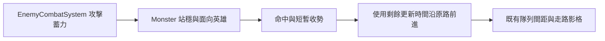

# v0.85.20 怪物攻擊站姿與路徑銜接

## 需求、範圍與開發順序

玩家反映怪物走路與戰鬥有滑動感。本輪先修正具有英雄攻擊能力的怪物在蓄力、命中與收勢期間仍沿路移動的問題，並保留 v0.85.18 的步距動畫。先檢查現有圖集與怪物狀態，再調整移動時序，最後驗證戰鬥及波次回歸。現有圖集主要是左右側面；真正的上下方向姿勢仍需補素材，不能由時序程式產生。

## 使用者操作與介面

操作方式不變。怪物接近英雄並發動攻擊時會短暫站穩、面向英雄，命中後完成收勢才繼續沿路走。玩家可從腳底陰影與攻擊姿勢辨認攻擊是否正在進行。沒有新增按鈕、提示或設定。

## 系統架構、資料與 API

`EnemyCombatSystem` 沿用原蓄力、命中與冷卻時間。`Monster.update()` 取蓄力及剩餘收勢時間中較長者作為站穩時間；若該時間在本次更新中結束，僅使用本次更新剩餘的時間前進，因此 ×1、×2、×3 速度不會因更新步長而額外多停一整格。攻擊開始時的英雄方向保持到站穩結束，之後恢復道路方向。隊列仍使用既有路徑、路程與間距計算。

沒有新增資料夾、資料庫、HTTP API、存檔欄位或權限。新計算只使用 v0.85.18 已有的當局動作欄位。傷害、攻擊冷卻與圖集來源不變；攻擊期間暫停前進會略微延後怪物抵達城門，屬於本輪可見的戰鬥節奏調整。

## 安裝、更新、部署與回復

依 [安裝手冊](INSTALLATION.md) 取得專案，使用既有靜態伺服器開啟 `td.html`。部署時一併發布 `Monster.js`、版本頁與 `sw.js`；目前版本及離線快取為 v0.85.20。更新後重新載入頁面確認版本。無依賴或設定變更。玩家資料依 [備份還原手冊](BACKUP_RESTORE.md) 備份；如需回復，將上述程式與版本檔一起還原至 v0.85.19 並重新載入。舊存檔可沿用。

## 測試清單

- [x] 攻擊蓄力與收勢不前進；動作結束後沿原路前進並恢復道路面向。
- [x] 細步與粗步更新得到相同的站穩後路程。
- [x] `npm run check` 與 `npm test` 通過，包含怪物、霜原及地精回歸。
- [ ] 實玩檢查 ×1／×2／×3 下的轉彎、凍結、密集隊列與 Boss 戰觀感。
- [ ] 補上下方向素材後，逐格檢查腳底錨點和命中時刻。

## FAQ

**為何上下走仍是側身？** 現有怪物圖集沒有獨立的上下方向影格。本輪改善攻擊滑動，不會改變側面素材的視角。

**怪物傷害與攻速有變嗎？** 沒有。攻擊時會短暫停在原地，因此通過英雄附近的時間可能增加。
