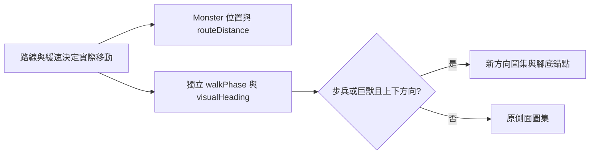

# v0.85.25 怪物方向動作與緩速步伐

## 需求、判斷與範圍

玩家反映怪物行走、交戰不自然，尤其緩速期間看起來像遊戲卡頓。檢查發現原本的走路格數完全由累積路程決定：速度變慢時，畫面會更久停在同一個姿勢，容易形成「掉格」觀感。這是動畫時序上的可重現原因，尚不能據此排除真實 FPS 下降；實際效能須另外在目標裝置量測。

本輪依序處理兩件事：先讓緩速時的視覺步距縮短，再為常見的步兵與巨獸補上下行走、上下攻擊姿勢。其他怪物沿用既有側面圖；沒有調整移速、緩速強度、傷害、路線或波次平衡。

## 玩家操作與視覺表現

正常遊玩即可看到變更，沒有新按鈕。步兵與巨獸在道路往上、往下時使用各自方向的動畫；左右走、死亡及素材尚未載入時使用原側面圖。攻擊時依目標方向呈現上下姿勢，腳底固定在道路座標。緩速會讓步幅變短、格數保持連續；完全停止時維持站姿。

## 架構、素材與資料

`Monster.update()` 的 `walkPhase` 是只供繪圖使用的累積相位；`routeDistance`、`walkDistance`、位置與攻擊時間仍依原有實際移動計算。`visualHeading` 記錄目前路段方向；`EnemyCombatSystem` 開始蓄力時改為面向目標。`ArtSystem.drawDirectionalMonster()` 只在步兵與巨獸的上下角度選用新圖，其餘狀況沿用原圖。

新素材是 `assets/td/enemy-grunt-directions-v1.png` 和 `assets/td/enemy-brute-directions-v1.png`，各 1254×1254、4×4 透明 PNG。四列依序為向下行走、向上行走、向下攻擊、向上攻擊，每格有至少 10px 的透明邊界。`ArtSystem.DIRECTIONAL_MONSTERS` 集中存放素材路徑、可見高度及每列腳底位置，便於日後擴充其他怪物。沒有新增資料夾、資料庫、HTTP API、存檔欄位或權限。

## 安裝、發布、更新與回復

依 [安裝手冊](INSTALLATION.md) 使用 Node.js 18+ 與既有靜態伺服器，無新套件與設定。部署時同時發布兩張 PNG、`Monster.js`、`EnemyCombatSystem.js`、`ArtSystem.js`、`sw.js` 及版本頁；離線快取名稱為 `sky-strike-v0.85.25`。更新後開啟 `td.html` 確認顯示 v0.85.25；如仍看到舊圖，從 `update.html` 更新快取並重新載入。

備份方式沿用 [備份還原手冊](BACKUP_RESTORE.md)。回復時將上述程式、素材、版本頁與 Service Worker 一起還原到 v0.85.24，清除或更新舊快取後重新載入。玩家存檔可沿用，沒有遷移。

## 驗收清單

- [x] 兩張圖集的 32 個影格均有透明邊界，武器與腳不碰格線。
- [x] 上下行走、上下攻擊選到對應影格，繪圖腳底維持在道路錨點。
- [x] 緩速時視覺步距縮短，效果解除後相位連續，真實路程仍由原速度計算。
- [x] 靜態 Canvas 預覽檢查比例與腳底：`tests/td-directional-preview.html`。
- [x] `npm run check`、`npm test` 與 `git diff --check`。
- [ ] 在實際戰鬥逐一確認桌機／手機、×1／×2／×3、霜原緩速與大量怪物時的主觀觀感及 FPS；目前未取得裝置效能數據。

## 常見問題

**為何緩速像卡頓？** 先前走路影格隨路程變少而長時間停格。本版縮短緩速時的視覺步距；若整個畫面仍變慢，需在該裝置觀察 FPS、特效數與畫面負載。

**為何其他怪物仍是側身？** 本輪先補步兵與巨獸的方向素材。其他怪物沿用原圖，新增素材前不能只靠程式旋轉得到完整正背面姿勢。

**這會影響戰鬥數值嗎？** 本輪的相位與方向圖只供繪圖使用，沒有修改緩速、傷害、路線或存檔格式。
