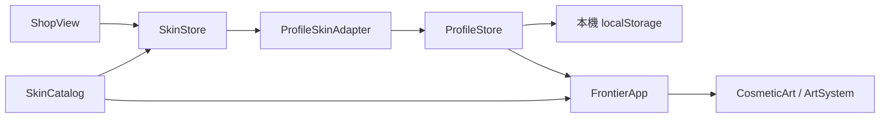

# v0.84.7 外觀上架與玩家存檔

2026-09-22。商城上架霜華之誓、曜陽獅心、緋月狐影、冥骨帝王與日蝕王庭。獸人商品改用 `feature/shop-ui` 的冥骨帝王原稿與四組動作素材，移除誤用的赤燼戰酋預告圖。暮影之翼等未完成品維持未開放。

## 產品範圍與限制

五項外觀使用**遊戲內試用水晶**；目前沒有真實金流、儲值、帳號同步或水晶補充服務。每個新玩家檔案取得 10,000 試用水晶，足以測試購買全部五項（總價 6,800）。購買、收藏與裝備會保存在該玩家檔案，匯出備份時一併包含。管理者與測試輪次各自獨立；開新測試輪次會給新檔案初始水晶。這不是線上交易系統，正式收費前必須另行設計帳號、交易驗證、退款及客服流程。

冥骨帝王擁有待機、移動、攻擊與戰吼畫面；前三位英雄使用既有試裝圖集。技能數值、碰撞、排名積分不受外觀影響。日蝕王庭目前在王國單位與建築上套用黑金配色，選軍團時顯示概念圖；概念圖中的專屬盾兵、弓兵、旗手與特效尚未製作成正式逐格素材，商品詳情清楚標明此範圍。

## 操作與管理

1. 從大廳進入商城，選商品，按「使用試用水晶購買」，確認後再按「裝備外觀」。購買成功與裝備成功是兩個步驟。
2. 回到大廳，從自由遠征選對應英雄或王國軍團；選角圖與戰場畫面反映已裝備外觀。劇情任務也顯示已裝備的對應造型。
3. 可在商城「我的收藏」檢視與卸下；卸下後恢復原版。重新整理後仍保留。目前同一玩家、同一英雄或軍團只能裝備一件造型。
4. 設定中的「匯出完整備份」會包含外觀。管理者如需重置測試資源，可開新測試輪次；不要手動修改正式玩家存檔。

## 架構、資料與 API

- `src/td/shop/` 保持商品定義、購買狀態機與介面；`ProfileSkinAdapter` 在 app 層橋接玩家存檔，不把玩家存檔或戰鬥模組塞入商城核心。
- 購買資料序列化於目前玩家 `data['shop:state']`，形狀為 `{version:1,revision,balance,ownedSkins,equippedSkins}`。既有玩家缺此欄位時首次載入給初始狀態；不覆寫舊進度。
- `ProfileSkinAdapter.load()` 回傳狀態；`commit(next,expectedRevision)` 在 `ProfileStore.change` 中比對 revision 並使用玩家存檔現有的跨分頁檢查。重複購買、餘額不足、切換玩家與舊分頁衝突均拒絕，失敗不扣水晶。
- `FrontierApp.applyCosmetics()` 只接受已擁有、可上架且目標吻合的造型，再傳給 `CosmeticArt`。繪圖層只改畫面，不修改 Hero、CombatUnit、經濟或戰報。
- 無 HTTP API 或資料庫。正式金流不可直接沿用本機試用餘額作為可信餘額。

## 安裝、部署、更新與回復

Node.js 18+。完整部署 `td.html`、`shop.html`、`src/td/app/ProfileSkinAdapter.js`、`src/td/systems/CosmeticArt.js`、`src/td/skin-lab/ChiefPreview.js`、四張 `assets/td/shop/bone-chief-*.png`、既有商城圖集、CSS、`sw.js` 和本版 JS；以 `npm run serve:test` 開啟 `td.html`。`sw.js` 快取升為 `sky-strike-v0.84.7`，更新後重整頁面。更新前先從設定匯出完整備份並保存上一版部署檔。回復時恢復上一版檔案與 `sw.js`，玩家檔案可保留，但舊版不一定能顯示新版購買紀錄；需要回復資料時匯入更新前備份。

## 常見問題與測試清單

- **用真錢買得到嗎？** 目前只有本機試用水晶，沒有付款入口。
- **購買後戰場沒變？** 還要按「裝備外觀」；確認英雄與軍團符合商品目標，必要時重開遊戲讓新素材快取更新。
- **換測試輪次後收藏不見？** 收藏屬於各玩家檔案；切回原輪次或從封存還原。
- **日蝕王庭為何與概念圖不完全一致？** 現階段上架的是王國黑金配色，專屬逐格單位與特效需後續製作。
- **儲存失敗？** 系統不應扣除試用水晶；請先匯出備份、確認瀏覽器儲存空間與其他分頁，再重新開啟商城。

QA：執行 `npm test`、`npm run check`；核對五商品價格合計 6,800、重複購買拒絕、跨輪次隔離、重新載入保留、跨分頁衝突不扣款、鎖定商品不可買。PC 與手機檢查商城長文、購買確認、收藏及選角；戰場檢查四英雄與王國黑金配色、原版回退與素材載入失敗回退。注意繪圖素材以本機瀏覽器檢查，不代表已完成跨裝置實機驗收。

本次 Edge 無頭瀏覽器驗證：桌面 1440×900 和手機橫向 844×390 均完成冥骨帝王選取、購買、裝備、重整後保留，試用水晶由 10,000 變為 8,720；桌面再購買與裝備日蝕王庭，選角圖改為冥骨帝王且戰場讀到王國黑金配色。兩尺寸頁面錯誤皆 0。結果見 [QA JSON](../artifacts/qa-cosmetic-v0847/results.json)；[桌面](../artifacts/qa-cosmetic-v0847/desktop-detail.png)、[手機](../artifacts/qa-cosmetic-v0847/mobile-detail.png)、[冥骨戰場畫面](../artifacts/qa-cosmetic-v0847/bone-chief-battle.png)。

與後續 v0.84.8 劇情地圖整合後，完整 `npm test` 為 **541/541 通過**，`npm run check` 通過；整合輸出見 [測試紀錄](../artifacts/v0848-integrated-tests.txt)。目前遊戲總版本與快取為 v0.84.8，商城外觀功能的交付版本仍為 v0.84.7。
