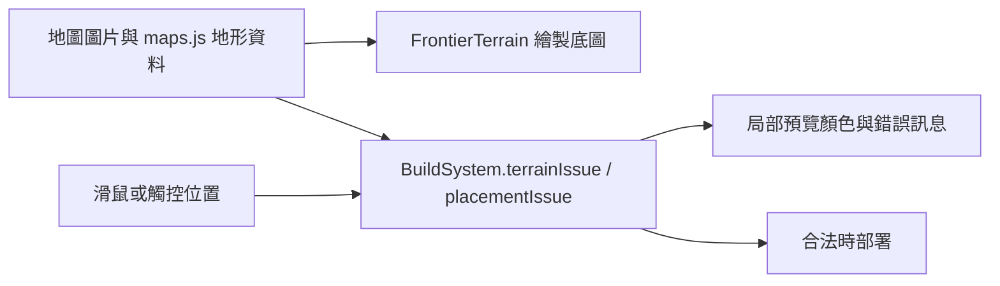

# v0.85.9 地圖部署提示視覺整理

日期：2026-09-23。玩家回報選擇部署時，地圖上出現整片綠點與紅色方框，遮住地景。這些圖形原本由 `FrontierTerrain.drawDeployment` 額外繪製：綠點是每隔 32 世界單位抽樣的可部署地面中心，紅框是禁建多邊形，並非圖片損壞或戰鬥特效。抽樣點也無法保證當下沒有其他單位占位，因此容易讓玩家誤認為每個綠點都必定能放置。

## 需求與做法

玩家應能看清底圖，選卡後知道如何選位置，放置失敗時知道原因。這版移除全圖抽樣點、紅色禁建框與其他全圖部署線條；游標或觸控位置移入戰場後，仍會顯示該位置的單位、射程與綠／紅預覽。點到無效位置時，既有訊息說明是道路、邊界、地形或與單位太近。剛選卡、指標尚未進入戰場時不顯示預設座標的紅色射程圈。重新選卡會清除上一張卡的預覽位置。

這是視覺與提示文案調整。建造地面、道路距離、占位、價格、扣款、敵人路線與霜原平衡數值均沿用 v0.85.8。若未來需要更精確的全圖導覽，可做成玩家主動開啟的圖層；目前以清晰底圖和局部預覽降低畫面負擔。

## 架構、模組與資料

`src/td/systems/FrontierTerrain.js` 只繪製地景；`src/td/systems/BuildSystem.js` 維持原放置判定，增加指標是否進入戰場的狀態並更新地形提示；`src/td/TDGame.js` 既有指標事件與確認流程不變。驗收放在 `tests/td-map.test.js`。資料夾無需重組，沒有資料庫、HTTP API、存檔格式、角色權限或管理設定變更。

## 玩家操作與常見問題

1. 進入戰場，選擇士兵或建築卡片。
2. 在畫面中的草地移動游標，或在觸控裝置點一下戰場，查看所在位置的綠／紅預覽與射程。
3. 綠色位置可部署；紅色位置會提示原因。塔座須完整落在允許的平地內，且須避開道路及其他單位。滑鼠點擊合法位置直接部署；觸控依畫面提示確認。

**為何不見綠點？** v0.85.9 起不再鋪滿全圖；移動到欲部署位置看局部預覽即可。**仍看見紅框或整片綠點？** 關閉舊分頁後重新開啟，確認版本為 v0.85.9，並確認 `sw.js` 與兩個系統 JS 檔均已更新。**為何草地仍不能放？** 可能是道路緩衝、底座跨出平台、地形或占位；依畫面錯誤訊息換位置，無效點擊不扣資源。**為何剛選卡沒看到預覽？** 指標移入戰場後才會出現，避免預設座標的紅圈干擾地圖。

## 安裝、更新、部署與回復

使用 Node.js 18 以上取得完整專案；無新增套件。執行 `npm run check`、`npm test`，再執行 `npm run serve:test`，開啟 `http://127.0.0.1:4173/td.html`。既有使用者更新整份靜態檔後關閉舊分頁再進入；遊戲進度不需轉換。部署須同步 `src/td/systems/FrontierTerrain.js`、`src/td/systems/BuildSystem.js`、`td.html`、`src/td/app/FrontierApp.js`、`sw.js` 及相應文件。離線快取名稱更新為 `sky-strike-v0.85.9`。這版僅完成本機修改，未代替管理者發布網站。

變更前 21 個受影響檔案與 SHA-256 清單存於 `artifacts/deployment-visual-v0859-backup/`。需要回復時，先保存目前工作，依清單比對後，從備份逐一還原本版的檔案，並同步還原版本標示及快取名稱；不要覆蓋其他未提交修改，也不要清除玩家進度。還原後重跑測試並關閉舊分頁再開。

## 驗收清單

- [x] 選卡前後的底圖繪製一致，不再出現全圖綠點與紅框。
- [x] 剛選卡及重新選卡時沒有預設紅圈；指標進入戰場後才顯示局部預覽。
- [x] 道路、邊界、地形和占位仍由 `BuildSystem` 判定，失敗訊息不再叫玩家尋找綠點。
- [x] 戰場瀏覽器實際開啟新手谷地並檢查選卡畫面；初次檢查發現預設紅圈，已修正。
- [x] `node --test tests/td-map.test.js tests/td-story-maps.test.js`：22／22；`npm run check` 通過；`npm test`：585／585 通過。
- [ ] 手機實機觸控和各地圖長局仍可持續人工驗收。

完整自動化結果以 `docs/TEST_CHECKLIST.md` 的 v0.85.9 紀錄為準。
