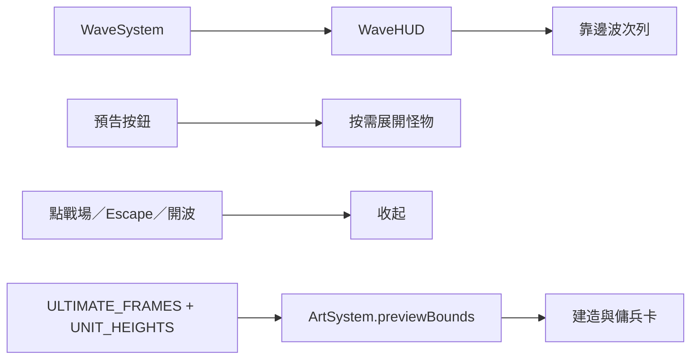

# 0.68.1 波次避讓與終極士兵預覽

## 使用與設計

波次資訊移到左上速度列下方，不再固定在戰場中央。準備時只顯示波數、時間、預告與立即迎戰。點「預告」才展開怪物卡，點「收起」、點戰場或按 Escape 關閉。新波次與開戰也自動關閉。進攻時只留窄版剩餘數量；此區域不接收滑鼠／觸控，玩家可以點穿資訊列操作戰場。開戰短提示也靠左顯示，不攔截操作。

翡翠古龍原本使用舊素材的預量測裁切框，導致新翅膀、頭部不完整。本版將三種終極士兵的卡片裁切範圍，改成依實際待機格、顯示倍率與腳底位置計算。建造與傭兵卡共用此計算，其他既有卡片仍用原預量測資料。

## 架構、管理與 API

WaveHUD.setExpanded(boolean) 同步 data-expanded、aria-expanded 與情報區開合。ArtSystem.previewBounds(kind,type) 回傳 left、top、width、height；終極士兵從目前圖集計算，其他單位使用 PREVIEW_BOUNDS。無新增網路 API、資料庫、權限或存檔格式；遊戲執行不讀 Canvas 像素，保留本機檔案模式相容性。

## 安裝、設定、更新與部署

依 README 原流程安裝和啟動，玩家無須新增設定。發布現有完整專案，特別包含 td-wave.css、WaveHUD.js、ArtSystem.js、package.json、sw.js。版本與快取名稱為 0.68.1。關閉舊遊戲分頁再重新開啟以載入新版，不需刪除記錄。

## 備份還原

卡片修正前 ArtSystem.js、package.json、sw.js 在 artifacts/preview-v0681-backup/。波次改動前 td-wave.css、WaveHUD.js 等在 artifacts/edge-wave-v0681-backup/。還原時將 JS 備份放回 src/td/systems/ 對應位置，其餘放回專案根目錄。若已有後續修改，先比較差異並合併，避免覆寫其他工作；部署還原版時另改快取名稱。

## 測試與 FAQ

- npm test：336 項全數通過；npm run check 通過。
- scripts/qa-wave-layout.cjs：5 種桌面／觸控／旋轉版面，驗證預告操作與戰鬥提示點擊穿透。輸出 artifacts/qa-wave-layout/。
- scripts/qa-ultimate-preview.cjs：3 種終極士兵 × 2 種卡片，確認所有可見來源像素都落在裁切範圍內。輸出 artifacts/qa-ultimate-preview/。
- 瀏覽器檢查需本機 4173 伺服器、Playwright 與 Edge；實機行為仍可由玩家回報。

Q：怪物預告去哪了？ A：點左上「預告」展開。

Q：為什麼戰鬥波次不能點？ A：純狀態顯示刻意不接收輸入，避免阻擋移動和部署。

Q：古龍預覽是動畫嗎？ A：卡片仍是待機縮圖；本次修正裁切完整性，不新增卡片動畫。
