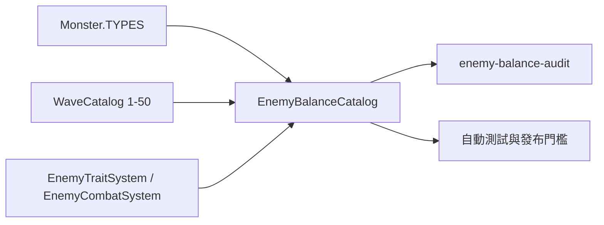

# 怪物與 50 波平衡重整 v0.85.65

## 交付範圍

這一版完成玩家七軍團平衡重整的怪物端對應工作。所有 28 種怪物、普通怪、菁英、支援單位、特性單位與首領，以及第 1–50 波編成，均納入同一份可執行稽核；不是只以血量或獎勵作單點比較。

不新增帳號、後端、資料庫、付費內容或存檔欄位。既有玩家進度保留；戰報以 `whole-game-reset-v08565` 和舊平衡樣本分開。

## 平衡原則與調整

| 層級 | 保留的特色 | 可驗證的反制 |
| --- | --- | --- |
| 數量／高速 | 步兵、獵犬、狼群、拾荒者、霜痕與淤泥小妖可逼迫清場 | 範圍、連鎖、緩速、攔截 |
| 重甲／攻城 | 巨獸、掠奪者、鹽甲與碎顱能壓制英雄 | 魔法、破甲、控制、英雄走位 |
| 支援 | 祭司治療、旗手加速加甲、戰旗加甲、霜骨抗控 | 優先擊殺支援，不靠單一控制鏈 |
| 特性 | 隱幕、飛行、穿刺免疫、鏡甲暈厥 | 視野、對空、混合傷害、分散火力 |
| 首領 | 二階援軍、三階狂暴與章節首領機制 | 先拆護衛／支援，保留爆發窗口 |

本版實際修正三個曲線缺口：第 31 波新增 10 名拾荒者承接第 30 波；第 41 波加入 20 名淤泥小妖，讓「萬族裂線」不是休息波；第 50 波新增 3 名鹽甲破殼者，濁潮小魔王生命 860 → 980、護甲 4 → 5、擊殺獎勵 145 → 160，讓終局的壓力與回報相稱。

## 可執行資料與公式

`Monster.js` 保有唯一的原始怪物數值，`WaveCatalog.js` 保有唯一波表，`EnemyTraitSystem.js` 保有光環和治療，`EnemyCombatSystem.js` 保有首領階段與攻擊行為。新的 `EnemyBalanceCatalog.js` 不重複套用傷害規則，而是記錄每個怪物的戰術角色、壓力與反制。

波次壓力會將每名怪物的有效生命（含護盾）、速度、護甲、漏怪傷害、攻城／獵殺／首領權重、飛行／隱形／免疫特性、支援光環，以及首領二階援軍合併計算。這是一個比較和防回歸的壓力指標，不是另一套遊戲內傷害公式。

## 驗收與操作

執行 `npm run enemy-balance:audit` 可列出標準難度各波的有效生命、綜合壓力、漏怪傷害和數量。`tests/td-enemy-balance-audit.test.js` 會驗證：

- 所有怪物均有定位、壓力來源與玩家反制。
- 50 波只引用已稽核類型，並涵蓋數量、高速、重甲、支援、特性和首領。
- 標準模式的第 10／20／30／40／50 波壓力逐章提高；31–50 波不會出現超過 15% 的非預期斷層，終局高於第 49 波至少 10%。
- 首領二階援軍、支援光環和終局 18 名鹽甲破殼者均會被稽核。

發布前執行 `npm run enemy-balance:audit`、`npm run check`、`npm test`，並在桌機橫向模式實玩第 31、41、50 波。部署必須一併帶上 `Monster.js`、`WaveCatalog.js`、`EnemyBalanceCatalog.js`、入口版號與 `sw.js`；若仍看見舊版，從版本化 `update.html` 更新、關閉舊遊戲分頁，再重開。

## 回復與限制

回退時，先匯出玩家資料，再回到完整 v0.85.64 Git 版本和其 `sky-strike-v0.85.64` 快取；不可只換怪物數字或單獨換波表。此稽核保護數值資料與編成回歸，不能取代不同玩家技術、地圖站位與長時間實玩的勝率樣本；後續應以戰報分版本收集標準模式的通關率、漏怪與首領耗時再微調。
