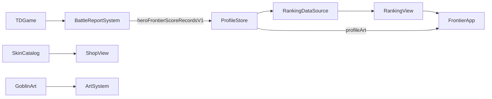

# HERO FRONTIER v0.84.4：實際排行榜、撤退與個人頁籤

## 本版功能

- 大廳「排行榜」只讀目前玩家檔案的實際自由遠征戰報。總榜依分數排序，通關、失敗、撤退同榜，逐筆標示結果；地圖榜可篩選地圖。週挑戰與好友榜仍未開放，沒有伺服器世界排名。
- 戰鬥選單「結算積分並撤退」保存當下畫面顯示的分數，包含已完成波次與正在進行的波次擊殺。重新開始本局也先結算原局。重新整理或離開頁面時，`pagehide` 嘗試同步保存。撤退後清除該局檢查點，避免重複結算；同一局再次觸發結算不會新增第二筆。
- 首頁右上角整個頭像與玩家資訊區塊可開啟個人頁籤。三款免費背景圖塊可切換並保存到目前玩家檔案；排行榜紀錄詳情顯示該圖塊，並可進入個人頁籤。線上分享與圖塊販售未推出。
- 自由遠征的兩個步驟改為「01 選擇戰場」「02 組建隊伍」，刪除狹窄摘要，擴大點擊區。初始遠征選單在 HTML 中隱藏，由大廳接管後才按需要顯示，避免啟動畫面閃現。
- 商城顯示霜華之誓、曜陽獅心、緋月狐影、赤燼戰酋四位英雄造型，以及王國軍團「日蝕王庭」概念。尚未接入實際戰鬥換裝的品項標示未推出，不能模擬購買；「暮影之翼」從商品列表隱藏，特效分類顯示敬請期待。商城仍無真實付款。
- 地精英雄展示名為「銅齒・奇克」，首席工程師為稱號。五種士兵改用新的透明圖集，各有不同體型和武器；連發、鉚釘與機偶的投射物有不同外觀。角色仍為單姿態素材，完整逐幀動畫尚待製作。

## 資料與模組

`BattleReportSystem` 是本版自由遠征排行榜的唯一計分來源。每次結算寫入 `ProfileStore.adapter('free')` 的 `heroFrontierScoreRecordsV1`，原有 `version:3` 外殼與 `runs` 陣列保持相容；新紀錄增添 `runId`、`scoreVersion:BATTLE_V1`、`outcome`、`remainingBaseHP` 和 `maxBaseHP`。舊戰報若有有效地圖、難度和分數，也會進入目前玩家的本機榜；沒有結果欄的舊紀錄依 `victory` 推定。獨立分支的 `SCORE_V1` 使用另一套算法與儲存鍵，本版不把它混入此榜。

`ProfileStore.setProfileArt(id)` 接受 `kingdom`、`snow`、`goblin`，把 `profileArt` 寫入目前玩家。舊存檔無此欄時使用 `kingdom`。管理者與測試輪次分開保存，匯出和匯入玩家備份會包含此欄。沒有新增資料庫、HTTP API 或權限。

## 使用與維護

1. 以本機 HTTP 伺服器開啟 `td.html`，按自由遠征，選戰場和隊伍並開始。
2. 戰鬥中開選單，按「結算積分並撤退」；回大廳按排行榜，確認實際分數和「撤退」標籤。勝利與失敗也會加入同榜。
3. 按右上角頭像區塊，選擇背景圖塊；回排行榜選一筆紀錄，確認詳情背景同步變更。
4. 商城可以預覽四位英雄與日蝕王庭；未推出項目無法購買。特效分類顯示敬請期待。

若積分紀錄無法讀取，原始資料不會被排行榜覆寫。先從設定匯出完整玩家備份，再檢查儲存空間。撤退保存失敗時留在遊戲選單，可排除儲存問題後重試。為遵守「每次出征都算數」，戰報不再自動裁掉舊紀錄；長期大量遊玩前建議定期匯出備份。

## 安裝、更新與回復

Node.js 18+ 無新增套件。整包更新 `td.html`、CSS、`src/td/`、`assets/td/shop/eclipse-court-concept-v1.png`、`assets/td/goblin-soldiers-atlas-v2.png` 與 `sw.js`；重新開啟頁面以使用 `sky-strike-v0.84.4` 快取。更新前先從設定匯出玩家備份。回復程式時還原更新前檔案與 `sw.js`；保留玩家存檔。新增欄位對舊版屬可選欄位，但回復後的舊版排行榜可能無法顯示撤退結果。

## 驗證

執行 `npm run check`、`npm test`。人工檢查初次開啟沒有「選擇戰場」閃現；桌機與手機上遠征步驟可讀；撤退、失敗、勝利分數排序及結果標籤；不同玩家檔案隔離；圖塊切換及備份還原；商城所有圖像可載入、未推出商品無購買入口；地精五兵在戰場小尺寸下可分辨。
