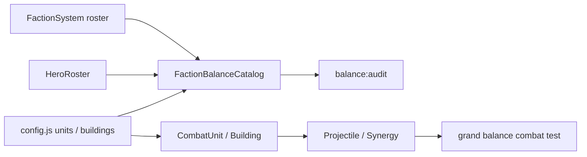

# 七軍團平衡重整 v0.85.64

## 目的與範圍

本版把現有七個軍團的英雄、士兵與防禦塔納入同一套戰力預算；不是讓它們變成同一種玩法。範圍是既有靜態前端戰鬥資料，沒有新增英雄、軍團、帳號、資料庫、HTTP API 或存檔欄位。

先前的問題不是單一數字偏高：守軍是永久定點、`CombatUnit.takeDamage()` 不承受傷害，因此生命、護甲、移速不能補償短射程；另一方面，連鎖、易傷、供電、第四擊與範圍傷害若只看卡面 DPS 也會被低估。本版把這兩類因素明確放入資料稽核和戰鬥迴圈驗收。

## 產品規格

| 軍團 | 保留的優勢 | 明確代價 | 起始驗收組合 |
| --- | --- | --- | --- |
| 霜原 | 累寒、凍結窗口、碎冰 | 直接爆發需要鋪墊 | 冰原狼人＋暴雪祭壇 |
| 王國 | 齊射、遠距優先目標、陣地支援 | 需覆蓋支援，分散戰線較弱 | 王國獵手＋赤焰火砲塔 |
| 月影 | 印記、連鎖、自然控制 | 必須讓敵人留在覆蓋區 | 奧術學徒＋星葉雷霆塔 |
| 暗影 | 死亡資源、詛咒、收割 | Boss／低魂局的循環較弱 | 暗影盜賊＋瘟疫尖碑 |
| 荒野 | 近距震地、擊殺狂熱、短窗爆發 | 射程短且有攻擊空窗 | 赤牙狂戰士＋赤牙祖靈柱 |
| 地精 | 供電網路、火器齊射、超載 | 要先架機座，斷網時降效 | 動力機座＋鉚釘武器台 |
| 娜迦 | 潮壓標記、潮衛號令、線性控制 | 近中距覆蓋要求較高 | 潮汐衛士＋潮門尖塔 |

## 數值調整

- 七位英雄的基礎普攻 DPS 收斂至 28.57–30.00；技能冷卻與招牌技能保持原本定位。
- 王國獵手、赤焰火砲塔降低起始密集清群的基礎傷害；火砲仍保有緩速增傷和每第四擊的擴大爆炸。
- 赤牙狂戰士與祖靈柱降低基礎輸出，並將組合成本調整至可在 240 金／5 木的開局同時部署；狂熱、震地與第四擊仍在。
- 地精工程師提升為可獨立開局的基礎射手；鉚釘武器台改為兩個不同目標的可見齊射，供電 +22% 規則不變。
- 潮汐衛士以實際潮矛輸出補償不會承傷的固定部署規則；潮門尖塔改為兩個不同目標的潮壓標記，不改既有 +10% 易傷規則。

## 平衡資料與架構

`src/td/config.js` 是士兵／塔的資料表，`HeroRoster.js` 是英雄資料表；專案沒有可供重整的伺服器資料庫。`FactionBalanceCatalog.js` 則是每個軍團的身分、代價、英雄、起始組合、全部士兵與全部塔定位的可執行目錄。



任何新增或移除軍團名單中的兵種、塔或英雄，都會使稽核測試失敗，直到它有明確角色和軍團定位。生命、護甲與移速不列入守軍等效戰力，除非未來先實作真正的承傷／阻擋規則。

## 可重跑驗收門檻

1. 英雄基礎 DPS 必須在 27–32。
2. 起始組合的模型壓力必須在 55–95，且最強不超過最弱 1.75 倍。
3. 同一個 12 秒、六名密集重甲敵、無英雄的真實戰鬥迴圈中，七個文件化組合每 100 等效資源的傷害需在 200–650；最強不超過最弱 3 倍。
4. 地精測試會先更新供電網路；新增的地精／娜迦多目標攻擊必須生成兩枚正常投射物，而非隱藏傷害。

執行：

```text
npm run balance:audit
node --test tests/td-grand-balance-audit.test.js
npm run check
npm test
```

這是機制與起始壓力的回歸閘門，不取代 50 波真人通關率樣本。後續數據收集應以相同難度、同英雄／裝備、輕甲群、重甲群、抗魔群、Boss 和完整 50 波的成對測試進行；未完成前不得把單一密集群結果誤稱為所有波次勝率。

## 玩家、管理與發佈

玩家不需要重置存檔。更新後建議重新開一局，因為既有戰局不會熱套用基礎數值；戰報以 `faction-reset-v08564` 與舊平衡版本分開，避免混合樣本。

管理者可用 `npm run balance:audit` 查看七軍團的英雄 DPS、起始成本和壓力；不需設定或資料遷移。發佈時必須一併更新 `config.js`、`HeroRoster.js`、`FactionBalanceCatalog.js`、`td.html`、`sw.js` 和版本檔。更新前依 [備份還原手冊](BACKUP_RESTORE.md) 匯出玩家資料；若需要回退，回到 v0.85.63 的完整 Git 版本並同步其 Service Worker 快取名稱，絕不以清除網站資料取代回退。
