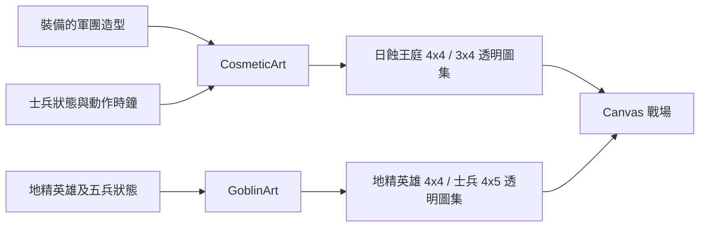

# v0.85.13 軍團動作圖與地精裁切修正

## 需求、範圍與建議

玩家回報「日蝕王庭」士兵像靜態圖塊，以及地精士兵與英雄的武器、特效在固定圖格邊緣被截斷；地精英雄在戰場稍大。本版改善已裝備造型的戰場動作與地精圖集，不改士兵、英雄、商店或波次的戰鬥數值。建議後續新圖集一律先做逐格透明邊界檢查，再接入渲染器，避免圖像看似完整卻在遊戲內切掉。

## 玩家操作與視覺效果

1. 由 `td.html` 進入 HERO FRONTIER。已有「日蝕王庭」者，於商城裝備它並在自由遠征選擇王國遠征軍；部署王國士兵即可看見待機姿勢變化與攻擊姿勢。未擁有者仍依原本試用水晶購買流程。
2. 地精工程團仍依既有解鎖狀態進入自由遠征。五種士兵的槍、鉤爪、機甲與特效已重新整理圖格；英雄「銅齒・奇克」的戰場繪製高度由 99 調為 94，原版圖缺失時的替代圖由 94 調為 90。選角立繪大小不變。
3. 「日蝕王庭」七種士兵在 4 列新圖集中有待機、兩段步伐、攻擊姿勢。現行士兵固定部署，平時主要播放待機與攻擊；移動列保留給現有動作狀態與往後擴充。

## 架構與模組

- 資產：`assets/td/combat-art/eclipse-units-{a,b}-actions-v2.png`、`assets/td/goblin/{hero,soldier}-actions-v2.png`，每格 320×320、透明 RGBA，四周至少 8 px 無內容。舊圖保留，供版本回復。
- `scripts/pack-sprite-cells.py` 將生成圖中的每個連通角色隔離、置中、對齊腳底後輸出整齊圖集。圖集本身已入庫，遊戲執行時不需 Python 或圖片生成服務。
- `CosmeticArt.drawCombatUnitSprite` 依士兵狀態選列，按單格寬高裁切；素材載入失敗時沿用原本士兵圖。`GoblinArt` 改載 v2 圖，失敗時仍使用原有靜態或 Canvas 替代圖。
- 不新增資料夾層級、資料庫、HTTP API、存檔欄位或權限。`CosmeticArt` 與 `GoblinArt` 的函式參數維持原樣；只有內部素材路徑、切格與尺寸變更。

## 安裝、更新與部署

首次安裝：安裝 Node.js 18 以上，於專案根目錄執行 `npm run serve:test`，開啟 `http://127.0.0.1:4173/td.html`；依大廳提示進入自由遠征。靜態託管時完整部署 `td.html`、`src/td/`、`assets/td/`、`sw.js` 與現有殼層檔案，需保留四張 v2 PNG 的相對路徑。既有玩家可開啟 `update.html` 更新至 v0.85.13；不需重設帳號或清除存檔。離線快取版號會更新，新圖片於頁面載入後快取。

## 管理與備份還原

更新前可由設定匯出玩家備份。美術修改不遷移存檔；回復時用 Git 還原本版修改的程式、`package.json`、`sw.js`、`update.html` 與相關文件，再以舊版 `sw.js` 發布並重新開啟頁面。舊版程式會忽略四張 v2 圖；不要刪除玩家本機資料。

## 測試與疑難排除

- `node --test tests/td-faction-motion.test.js tests/td-cosmetic-art.test.js tests/td-goblin-actions.test.js tests/td-goblin-polish.test.js`
- 測試逐格透明邊界、七種日蝕士兵的待機／步伐／攻擊取格、地精英雄尺寸與五兵圖集，並保留既有攻擊與投射測試。
- 若仍見舊圖，開啟 `update.html` 等待新版本啟用，再確認大廳版號。若個別圖檔載入失敗，檢查四張 v2 PNG 是否部署在上述路徑；遊戲會暫用舊圖。若只有某個姿勢仍有剪裁，對照圖集每格 320×320 的邊界，重新打包該圖，不需改戰鬥邏輯。

## 圖片生成紀錄

使用內建 imagegen，以專案既有日蝕王庭與地精角色圖為編輯參考，製作相同角色的待機、移動與攻擊姿勢，要求保留服裝、武器、色彩、透明背景、無文字及固定格表。另以透明背景抽取編輯日蝕 B 圖。輸出經 `pack-sprite-cells.py` 分離連通姿勢、統一透明留白後保存為上述 v2 PNG；沒有把玩家截圖當成遊戲素材。
