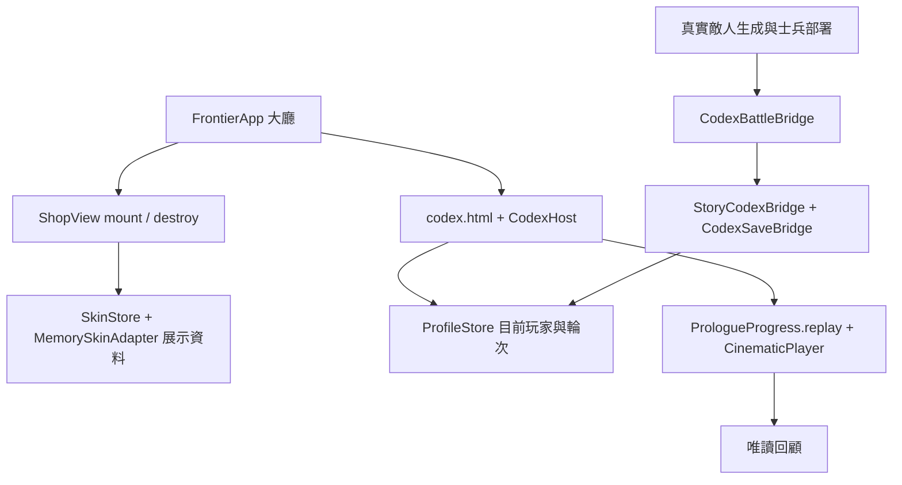

# 商城與世界圖鑑主入口整合 v0.83.5

日期：2026-09-21。

## 問題與交付範圍

商城、世界圖鑑已在獨立 worktree 開發完成，但主目錄的大廳仍呼叫舊的未開放頁。此版把功能模組與素材接入目前主目錄，保留 v0.83.4 的左側桌機導覽、手機預告比例及簡潔貨幣列。沒有執行整個分支的 Git merge，也未覆蓋分支基底的戰鬥 Core。

開發順序為：確認模組契約與存檔邊界 → 接商城生命週期 → 接圖鑑目前玩家／真實遭遇 → 接序章回顧 → 自動測試與瀏覽器驗證 → 更新文件與版本。

## 使用方式與目前限制

- 大廳 → 商城：開啟完整展示商城；可查看分類、收藏、外觀、模擬購買與裝備狀態。右上「返回」回到大廳。
- 商城使用獨立記憶體資料，每次從大廳重新進入恢復展示初始狀態。5,230 展示水晶不屬於帳戶鑽石，沒有真實付款，也不會寫入玩家錢包或正式收藏。外觀尚未套用到正式戰局。
- 商城 → 換裝前後比較：可開啟 Skin Lab。試裝頁包含 hunter、arcanist、rogue 三名已製作英雄；chief 尚無對應試裝美術。
- 大廳 → 世界圖鑑：進入英雄、軍團、士兵、防禦塔、敵人、裝備、地圖、編年史八類介面。內容依目前玩家／測試輪次解鎖；未取得的故事資訊仍受限制。
- 世界圖鑑 → 編年史 → Cinematic Collection：故事中完成或跳過序章後，可重播《曾經的和平》。回顧不推進任務、重發獎勵或寫入觀看進度。正常閱讀圖鑑仍會更新已讀標記。
- 圖鑑已解鎖的英雄／地圖可導向自由遠征；右上首頁圖示返回大廳。
- 排行榜與好友尚無已完成模組，保留未開放提示。序章正式影片尚未製作，沿用既有分鏡 fallback。

## 架構、資料夾與 API

- `src/td/shop/`：SkinSchema、SkinCatalog、SkinStore、ShopArt、ShopTemplates、ScrollRail、ShopView。大廳掛載時不載入獨立頁面的 main.js；離開呼叫 `destroy()` 解除事件。
- `shop.html`／`shop.css`：獨立展示入口與共用樣式。`skin-lab.html`／`skin-lab.css`、`src/td/skin-lab/`：試裝比較。素材在 `assets/td/shop/`。
- `codex.html`／`codex.css`、`src/td/codex/`：圖鑑與編年史。`CodexHost` 注入目前 ProfileStore、核准的故事任務、完整 ChronicleSeed 與序章條目；素材在 `assets/td/codex/`。
- `FrontierApp.openShop()`：建立獨立 MemorySkinAdapter 與 ShopView，暫停戰鬥並隔離背景操作；離開移除視圖。
- `FrontierApp.bindCodex()`：重新綁定目前玩家，安裝實際 spawn／部署橋接。波次預告不再提前登記尚未生成的敵人。
- `CodexIntegration` 的 `readOnlyReplay:true`：完成回顧不再寫入觀看狀態；以 PrologueProgress 的既有權限驗證執行。
- `td.html?panel=free&hero=<id>&map=<id>`：圖鑑前往遠征，主程式再次檢查解鎖；`panel=shop` 可直達展示商城。
- 沒有新增資料庫或網路 API。正式進度仍由 ProfileStore／CodexSaveBridge 儲存於目前瀏覽器，沒有匯入分支的 standalone／debug 示範存檔。
- 單一示範任務完成只解鎖既有任務獎勵，不推論第一章完結，不產生未經事件取得的史料。WORLD_STORY_BIBLE_V1.md 未修改。

## 安裝、設定與部署

使用 Node.js 18+，專案根目錄執行 `npm run check`、`npm test`，再執行 `npm run serve:test`，開啟 `http://127.0.0.1:4173/td.html`。本次現有預覽伺服器使用 4175。亦可直接開啟 `td.html`；Edge 檔案模式已驗證跨頁保存。

不需新帳號、金鑰、npm 套件或資料遷移。HTTP、檔案模式及不同瀏覽器／連接埠的資料不會自動同步，請固定使用同一個入口。手機沿用 td-mobile.html 的橫向 iframe 殼。

部署需包含三個功能頁、CSS、`src/td/codex`、`src/td/shop`、`src/td/skin-lab`、對應素材，以及更新後的主入口與 sw.js。Service Worker 升為 0.83.5，功能程式預先快取，圖片沿用按需快取；未看過的圖片不保證離線可用。codex-dev.html 僅供本機開發診斷，不是主選單入口，也未接正式玩家資料。

更新前先由大廳設定匯出玩家備份，再更新整套網站檔案。保留 localStorage，重新整理到大廳版本 v0.83.5。此交付只修改本機，未遠端發布。

## 版本來源與回復

- 主目錄延續 v0.83.4 的未提交工作，沒有 reset、stash 或切換主分支。
- 世界圖鑑來源：`feature/codex-chronicle`，HEAD `2c934c0`，新增主目錄 Host、回顧及事件接線。
- 商城來源：`feature/shop-ui`，HEAD `6f4926b`，包含該工作目錄尚未提交的 Skin Lab 0.4.0 三英雄試裝內容；來源 worktree 保留原狀。
- 既有序章播放器繼續使用，不被 cinematic-player 分支的獨立範例覆蓋。
- 修改前檔案快照：`artifacts/integration-v0835-backup/`。回復前先備份目前程式與玩家資料，再依相對路徑覆回快照中的主入口、ProfileStore、sw.js、版本與文件。新增功能模組可保留在磁碟；舊主入口不會引用它們。不要整個工作區 hard reset。
- `artifacts/integration-v0835-release.json` 記錄此版主要檔案 SHA-256；原始分支與快照保留作為回復依據。

## 驗證與測試清單

- `npm test`：520 項通過，0 失敗。
- `npm run check`：通過。
- `npm run test:features`：可單獨回歸入口、正式輪次圖鑑、真實遭遇、獎勵與展示商城。
- `scripts/qa-feature-integration.cjs`：Edge 桌機、觸控橫向、file URL 三種流程通過。測試在獨立瀏覽器環境建立資料，不操作使用者現有存檔。
- 確認模擬購買取消、確認購買與返回；正式 ProfileStore 在模擬購買前後完全相同。
- 確認八類圖鑑、序章收錄與唯讀回顧、輪次與錢包保持、返回大廳；無非預期 404 或 pageerror。
- `scripts/qa-prologue-cinematic.cjs` 已更新到正式圖鑑入口，通過首次播放、自然完成、字幕、暫停、跳過、直橫向重播、損壞影片、自動播放拒絕回歸。
- `scripts/qa-integrated-skin-lab.cjs`：三名英雄在目前 Core 均可載入素材與播放動作，無 pageerror 或資源 404。
- 單元驗證真實生成才記錄敵人、不提前發現整波敵種、任務只授予既有獎勵、不生成秘密里程碑。
- 觸控測試為 Edge 模擬；尚未執行 iOS Safari 實機測試。

## FAQ

**分支完成為何首頁還顯示未開放？** 分支的功能頁尚未整合到當時的主目錄入口；此版已補上。

**更新後仍看到未開放？** 確認開啟的是目前主目錄的 td.html，重新整理，查看大廳小字是否為 v0.83.5；不要為更新而清除玩家資料。

**商城 5,230 和大廳 0 顆鑽石不一致？** 前者明確標示為展示水晶，使用獨立示範資料。模擬購買不扣正式餘額；重新進入會重設。

**以前在分支讀過的圖鑑未出現？** 分支獨立展示存檔不會自動匯入正式玩家。此處按目前玩家與測試輪次顯示。

**只有一支序章可回顧？** 目前只接入已完成的序章播放流程；其餘影像未完成不假裝開放。
