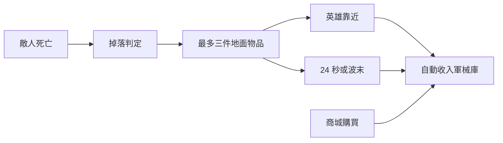

# 0.69.1 地面戰利品與商城軍械

> 0.69.5 美術補強：地面裝備直接裁切軍械九宮格的實際物品圖，並加入傳說／史詩／精良各自的光柱、卡框、地面符文與浮動指示；掉落率、拾取半徑及戰鬥數值不變。

## 產品決策

舊流程在 30 波內最多強制暫停 13 次，且第 9、10 波等區段會連續彈出三選一。新版取消波末自動開啟戰利品視窗，讓戰鬥連續進行。

- Boss 必定掉落；旗手、祭司、盾衛有 16% 機率；普通怪為 1.8%。
- 地面同時最多 3 件，避免特效與物件堆積。
- 英雄進入 58 世界單位內自動拾取；24 秒後或波末自動回收，不會遺失。
- 裝備直接收入軍械庫，不會自動替換目前配裝。
- 半獸人、幼龍、骷髏等關鍵內容在第 5／10／15 波直接解鎖，進度不受隨機掉落影響。
- 商城加入獅心王弓、月銀古杖、常青冠冕、先鋒戰鼓、噬魂冥燈、幽骨王冠。每種最多購買三件，重複購買逐次加價。

## 使用者操作

擊倒敵人後，稀有戰利品會在地面以發光圓形圖示出現。移動英雄靠近即可收取；不想操作也可繼續戰鬥，系統會自動回收。右側開啟商城可購買軍械，購入後到「軍械」介面配置給相容的英雄或士兵。

## 架構與 API

`FieldLoot(id, item, x, y)` 管理地面位置、24 秒期限、接近判定與 Canvas 顯示。`LootSystem.rollDrop()` 決定掉落；`grant()` 套用物品；`milestone()` 處理固定解鎖。`ShopSystem(hero, armory)` 可購買英雄升級或軍械庫裝備。TDGame 持有 `fieldLoot`，在死亡流程生成、更新時拾取、波末回收。

沒有新增資料庫、網路 API、帳號權限或存檔格式。掉落判定只在死亡時執行，地面物品上限為 3，效能成本固定且很小。

## 安裝、部署與還原

沿用 README 的安裝方式。部署時需包含 `src/td/entities/FieldLoot.js`、更新後的 LootSystem、ShopSystem、TDGame、td.html、td-combat.css、package.json 與 sw.js。Service Worker 快取為 0.69.1；關閉舊分頁再開啟即可更新。

要還原舊流程，可移除 td.html 的 FieldLoot 腳本與六個軍械商品，從 TDGame 移除 fieldLoot 生成／更新／繪製／回收，並恢復波末的 `openLoot(wave)` 呼叫；ShopSystem 建構式恢復只接收 hero。還原部署時使用新的快取名稱，避免與 0.69.1 混用。既有 `openLoot` 與 `claimLoot` 仍保留，方便回復或未來改成玩家主動開啟。

## QA 清單

- Boss 必掉、特殊怪／普通怪機率與三件上限。
- 英雄靠近、逾時與波末回收。
- 第 5／10／15 波固定解鎖且只觸發一次。
- 六種商城裝備可購買、正確扣款、收入軍械庫、單種三件上限。
- 波末不呼叫強制戰利品視窗。
- `npm test`：357 項通過；`npm run check` 通過。
- `scripts/qa-field-loot.cjs`：實際瀏覽器驗證地面掉落、靠近拾取、不開戰利品視窗、六個商品及購買訊息。截圖位於 `artifacts/qa-field-loot-ground.png`、`artifacts/qa-field-loot-shop.png`。

## FAQ

**裝備沒走過去會消失嗎？** 不會，24 秒或波末會自動收入軍械庫。

**掉落會直接換掉裝備嗎？** 不會，需自行在軍械介面配置。

**為什麼一般怪很少掉？** 避免地圖充滿圖示，也保留 Boss 和特殊怪的獎勵辨識度。
