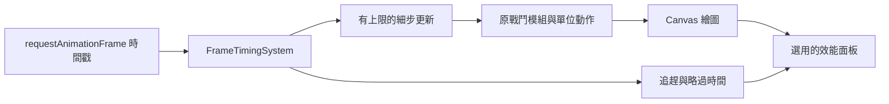

# v0.85.31 掉幀時間追趕與怪物動作銜接

## 需求、原因與範圍

玩家反映緩速期間整場像 LAG，並希望繼續改善怪物和士兵的動作。上一版修正了部分走路停格，但沒有量測真實 FPS。檢查後確認：舊戰鬥迴圈每次只計入最多 33 毫秒，若實際兩幀相隔 50 毫秒，就丟掉 17 毫秒的戰鬥時間。連續掉幀會讓整場模擬變慢，與視覺停格可同時發生。本版先修這個可確定的時間誤差，提供效能資訊，再改善怪物轉向與緩速步伐；不預設霜原特效一定是效能瓶頸。

## 玩家操作與介面

遊戲選單 → 設定 →「顯示效能資訊」可開關戰場角落的面板。面板顯示 FPS、影格間隔與更新／繪圖呼叫的 P95 耗時、怪物與冰霜特效數、追趕延遲及略過時間。預設關閉，不存入玩家檔案，也不會改變戰鬥。若 FPS 降低，可比較霜原緩速前後和 ×1／×2／×3 的數字。手機版使用較小面板；再次按開關即可隱藏。

怪物緩速時以較短的實際步幅維持可讀的走路節奏，路線轉彎時正背方向逐漸接上；完全停步不踏步。既有士兵的出手時序與怪物移速、緩速倍率、傷害及波次數值不變。整場戰鬥在短暫掉幀時能追上實際時間，因此所有單位的動作與計時會一起更穩定。

## 架構與 API

`FrameTimingSystem` 接受 `requestAnimationFrame` 時間戳與遊戲速度，把經過時間轉成上限為 1/30 秒的更新步。單幀最多跑八步；餘量可在後續幀追趕。背景分頁或極端卡頓時最多計入 100 毫秒真實時間，待追趕量最多 400 毫秒，避免無限追趕。暫停、選角與結算會清空待追趕量。`PerformanceMonitor` 只在玩家開啟時取樣，約每半秒更新文字；更新與繪圖呼叫耗時是 JavaScript 側數值，不能等同完整 GPU 呈現時間。

`Monster` 仍以真實位移更新路程和隊列，只用 `walkPhase` 決定走路影格，並以 `routeHeading` 平滑更新繪圖用的 `visualHeading`。沒有新增資料庫、HTTP API、權限、存檔欄位或依賴。新增兩個戰鬥系統腳本，並列入 `td.html` 與 Service Worker 離線清單。

## 安裝、更新、部署、備份與回復

沿用 [安裝手冊](INSTALLATION.md) 的 Node.js 18+ 與靜態伺服器，無新套件和環境設定。部署時同步發布 `FrameTimingSystem.js`、`PerformanceMonitor.js`、`TDGame.js`、`Monster.js`、`td.html`、`td.css`、`main.js`、`sw.js` 和版本頁；離線快取為 `sky-strike-v0.85.31`。更新後確認遊戲顯示 v0.85.31，選單內有「顯示效能資訊」，開啟後面板數值會變動。若仍是舊版，使用 `update.html` 更新快取。

備份玩家資料依 [備份還原手冊](BACKUP_RESTORE.md)。要回復時把上述程式、樣式、版本頁與快取一起還原至 v0.85.30，再重新載入；玩家資料不需轉換。

## 測試與限制

- [x] 50 毫秒影格依完整時間推進，單步仍不超過 1/30 秒。
- [x] 三倍速最多八步追趕；暫停與長時間背景返回不爆量更新。
- [x] 緩速時路程變短但步頻可讀，轉彎方向漸進，停步不空踏。
- [x] 本機瀏覽器驗證設定開關、面板數值和第一波戰鬥顯示。
- [x] `npm run check`、`npm test`、`git diff --check`。
- [ ] 在目標手機和大量冰霜特效戰鬥量測 FPS、更新／繪圖耗時，再依數據選擇特效優化。背景分頁或極端持續負載仍會略過時間，以免更新迴圈失控。

## FAQ

**面板的 FPS 很低，應該先看哪項？** 先比較更新與繪圖呼叫的 P95 耗時，再看怪物和冰霜特效數是否同時增加。繪圖呼叫耗時不包含所有 GPU 作業，必要時再用瀏覽器效能工具確認。

**「追趕中」或「略過」代表什麼？** 短暫掉幀會分步追趕；負載超過安全上限或分頁在背景太久，會略過一部分時間，避免遊戲陷入無限補算。這些數字用於診斷，不影響存檔。

**緩速效果是否被削弱？** 沒有。怪物位置仍依原緩速倍率計算，只調整畫面中的步幅與轉向姿勢。
