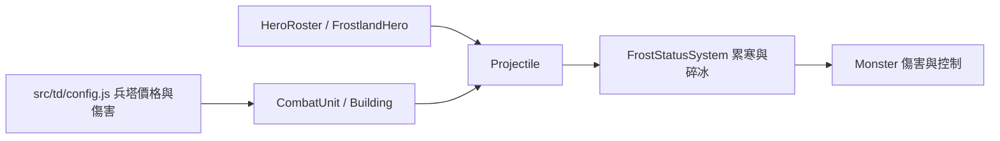

# v0.85.8 霜原與王國開局平衡

日期：2026-09-23。適用入口：`td.html`，霜原盟族 TESTABLE V1。這次回應「王國容易守住，霜原開局太難」的實玩回饋，只調整既有霜原數值，不新增英雄、軍團、裝備或劇情。

## 需求、風險與開發順序

玩家從同樣的 240G／5 木材開始，應能立刻組出有傷害且能累積寒冷的防線。原版最強可負擔霜原開局在 12 秒六目標模擬造成 392 傷害，王國「獵手＋赤焰火砲塔」造成 2288；霜原前期購買組合也較受價格限制。只提高碎冰倍率會讓尚未凍結的第一波維持原難度，所以先改善前期單位價格與基本輸出，再以相同起始預算、寒冷開窗和回歸測試驗收。

保留軍團差異：霜原靠累寒、減速、凍結和碎冰連攜；王國仍有較高的直接群體爆發。後期六目標密集站位與實際移動波次不同，這些結果不能當成全地圖勝率。

## 數值與玩家操作

| 項目 | v0.85.7 | v0.85.8 | 原因 |
| --- | ---: | ---: | --- |
| 冰原狼人 | 80G／1 木；傷害 9 | 75G／1 木；傷害 14 | 讓早期累寒兵單獨部署時也能補刀 |
| 冰晶尖塔 | 100G／2 木；傷害 8 | 90G／2 木；傷害 14 | 起始資源可建「雙狼人＋冰晶」 |
| 暴雪祭壇 | 175G／3 木；傷害 9／1.7 秒 | 150G／3 木；傷害 29／1.2 秒 | 提供能負擔的群體輸出與累寒核心 |
| 雪徑獵手 | 傷害 24 | 傷害 31 | 降低尚未開窗時的單體缺口 |
| 霜牙・凜普攻 | 傷害 16 | 傷害 20 | 英雄開局更能協助守線 |
| Q 霜痕獵令 | 每目標傷害 14 | 每目標傷害 26 | 早期施放兼具累寒與可見傷害 |

開局建議：首次守線先放「冰原狼人＋雪徑獵手」（200G／3 木），用獵手的長射程在敵人離開狼人的守區後繼續補刀。敵人密集或有較長路口時，改用「冰原狼人＋暴雪祭壇」（225G／4 木），讓兩者射程重疊累寒與清群；想優先凍結單一目標，可用「雙狼人＋冰晶尖塔」（240G／4 木）。Q 給進入交疊區的敵群；累寒達 100 開窗後，再補巨熊或碎冰重弩收尾。狼人、獵手與暴雪祭壇的遊戲內用途文字也提示此搭配；卡片價格和傷害取自現有 config，無新設定步驟。

## 架構、資料與 API

資料夾結構維持原狀：兵塔在 `src/td/config.js`，英雄普攻在 `src/td/systems/HeroRoster.js`，Q 在 `src/td/systems/FrostlandHero.js`，平衡回歸在 `tests/td-frostland.test.js`。共用投射物與敵人結算沒有更動。沒有資料庫、HTTP API、新存檔欄位或權限；既有 `ns.config`／`HeroRoster` 內部資料的上述值改變，其餘呼叫方式不變。

## 驗收與限制

- Lv.1、無英雄／軍械／升級，六個相鄰高血量重甲固定目標、12 秒、同樣起始 240G／5 木：霜原「狼人＋暴雪祭壇」由原先無法同時購買，現在造成 2277；王國「獵手＋火砲」為 2288。霜原另有凍結收益；對輕甲與秘法甲的直接傷害仍低於王國，不代表各敵種都等強。
- 霜原組合首次開窗約 1.6 秒；新增自動測試要求起始預算可買、重甲輸出至少為該王國組合 80%、3 秒內開窗。
- 首波移動模擬：在基準路線兩個相鄰位置部署「狼人＋獵手」或「狼人＋暴雪祭壇」，各自擊殺 10 隻普通敵人、0 漏怪。這是無英雄、無手動技能、固定站位的模型；其他地圖和擺位仍應實玩驗證。
- 30 秒固定目標：冰晶＋巨熊由 1566 提高到 1829；雙巨熊仍為 911。終結者仍需要控制者。
- `npm run test:frostland`：26／26 通過。`npm run check` 通過。`npm test`：583／583 通過，重跑仍全通過。較早一次全套執行曾出現冰原地圖建塔點距路線 190.70 大於 180 的失敗；單獨重跑該地圖測試及後續兩次全套執行都通過，若再出現需調查是否有測試順序或地圖狀態問題。
- 尚未以真人完成各難度 30 波、真實手機及所有敵人排列的勝率測試。若實玩仍感到吃力，應記錄地圖、難度、波次、首購組合和漏怪數，再調整；不要只看固定目標的總傷害。

## 安裝、更新與部署

取得完整 v0.85.8 專案，使用 Node.js 18 以上；無額外套件。執行 `npm run check`、`npm run test:frostland`，再用 `npm run serve:test` 開啟 `http://127.0.0.1:4173/td.html`。選霜原盟族與任一英雄即可使用新兵塔數值；選霜牙・凜才會使用新英雄數值。舊局不需要資料遷移，建議重新開始一局做前後比較。

部署時同步發布 `src/td/config.js`、`src/td/systems/HeroRoster.js`、`src/td/systems/FrostlandHero.js`、`package.json`、`td.html`、`src/td/app/FrontierApp.js`、`sw.js` 與文件。離線快取名稱為 `sky-strike-v0.85.8`；部署後關閉舊分頁再開，確認大廳與選角顯示 v0.85.8。無後端、密鑰或帳號設定。

## 管理、FAQ、備份與回復

管理者驗收卡片實際價格、Q 命中、寒冷百分比與戰報傷害；不可把固定目標模擬當作正式勝率。若卡片仍顯示舊價格，確認所有靜態檔案同步發布及新快取生效；無須刪玩家存檔。若開局缺木材，先確認選擇的是原始 240G／5 木條件及地圖／難度修正。

修改前 22 個受影響檔案與 SHA-256 清單保存於 `artifacts/frostland-balance-v0858-backup/`。要回復上一版，先保存目前工作，依 manifest 逐一比對，僅把需回退的檔案從備份目錄複製回原路徑；移除本版新增的平衡測試與本交付文件時也要同步更新入口版本、文件索引及離線快取。因工作區有其他未提交修改，不可對整個專案執行 `git reset --hard`。回復後重跑語法與霜原測試並重開頁面。

## 交付清單

- [x] 起始資源可購買累寒與群體輸出組合
- [x] 共用戰鬥、存檔與跨軍團選擇維持相容
- [x] 霜原專項、語法及全套測試已執行並記錄限制
- [x] 安裝、設定、玩家操作、管理、API、架構、部署、備份、FAQ、更新與版本文件已同步
- [ ] 真人在各地圖與難度重玩第一至五波，確認漏怪數與體感
