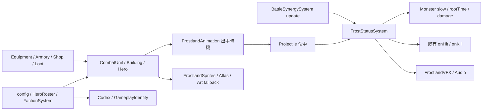

> **現行數值提醒（v0.85.8）：** 本頁保留 v0.85.0 首版表格與模擬作歷史紀錄；目前狼人、冰晶、暴雪、獵手、霜牙普攻與 Q 已調整，請以 [霜原開局平衡交付](FROSTLAND_BALANCE_V0858.md) 及遊戲 config 為準。

> v0.85.1：霜牙英雄肖像與霜原盟族群像已接入選角、頭像及圖鑑。素材、部署、回復與驗收請見[選角插畫交付](FROSTLAND_SELECTION_ART_V0851.md)。

# Frostland Faction V1 — v0.85.0

2026-09-22 · `feature/frostland-faction` · 可玩狀態 TESTABLE · 故事 CONCEPT / UNKNOWN

## 產品與交付範圍

本版以「建立寒冷 → 開啟獵殺窗口 → 碎冰」為獨立戰術循環，完成 P0 狀態與軍備、P1 英雄／抗性／連鎖／裝備，以及 P2 圖鑑、動作美術、合成音效、基礎平衡與 PC／手機介面整合。數值是 V1 可測試基準，不是全地圖最高難度的最終平衡認證。

開發次序：先盤點共用減速、定身、投射物與獎勵；再接狀態、兵塔與英雄；最後接武器、軍械、選角、圖鑑、動作與測試。主要風險是永久控 Boss、重複擊殺獎勵、跨軍團無用掉落，以及圖集串格；分別以控制恢復期、連鎖深度／預算、隊伍適用性檢查及透明像素測量處理。

獨立 worktree 包含開工時原工作區的整合快照 `04f084f`，避免從較舊 HEAD 開發而遺失現有地精、商城與圖鑑。原工作區保留原狀；本分支未合併 main。本文名稱均是遊戲工作名，不確認設定圖的族群、永凍王座或英雄血統為正史。`WORLD_STORY_BIBLE_V1.md` 未修改。

## A. Gameplay Identity

寒冷累積 × 控制戰場 × 獵殺窗口。控制者直接傷害較低；終結者造價與攻擊間隔較高。玩家必須讓兩者射程交疊，而不是只堆同一種輸出。所有士兵依現行規則永久定點、不阻擋、不承傷、可裝備一件軍械。動作不更動部署座標。

## B. Frost / Frozen / Shatter

所有參數集中於 `src/td/config.js` 的 `frostRules`；兵塔的累寒、倍率、範圍也由 config 提供。

| 規則 | V1 值與行為 |
|---|---|
| 寒冷 | 0–100；30 起漸進減速，滿值最多減速 40% |
| 衰退 | 停止有效輸入 2 秒後，每秒減少 12 |
| Frozen | 一般敵人 1.6 秒；停止移動與一般攻擊，共用 `rootTime` |
| Elite | 累寒抗性 35%、凍結時間抗性 50%，一般窗口 0.8 秒 |
| Boss | 累寒抗性 60%、窗口抗性 25%；改為 Deep Chill 1.875 秒，速度為 70%、受傷增加 12%，仍能移動／攻擊 |
| 延長 | 薩滿與極光台命中可延長，先套抗性；每個窗口總延長最多 0.6 秒 |
| 恢復 | 窗口結束後 3 秒不能再次累寒／開窗，窗口內不重新觸發 |
| 碎冰 | 每名敵人每個窗口只觸發一次；直接命中額外加 `damage × shatter`，鄰近敵人受到該加成的一半 |
| 窗口倍率 | Frozen 和 Boss Deep Chill 均適用；与碎冰加成分開計算 |
| 連鎖碎冰 | 寒冬期間，窗口內擊殺觸發半徑 75、傷害 32 × 英雄技能倍率、+25 Frost；最多 2 層，每個更新最多 24 次事件 |
| 歸屬 | 走既有 `onHit`／`onKill`；不重複計算金幣、功勳與擊殺 |

通用式：本次主目標傷害為基礎傷害 × 窗口倍率 + 本次碎冰加成，再經既有護甲與 Boss 深寒易傷。二次碎片不再次觸發一般碎冰。累寒是命中後處理，因此讓敵人達 100 的那一擊只開窗，後續攻擊才能享有窗口加成。冰原的寒冷不會套到銀葉原有冰塔。

畫面同時顯示寒冷百分比、凍結／深寒文字及「已碎冰」，不只用顏色區分狀態。預設前排策略的巨熊、獵手、巨獸，以及碎冰／窗口塔會優先射擊射程內的窗口目標；士兵改用其他手動策略時仍遵守玩家選擇。

## C. Soldier Roster

以下是 Lv.1；既有五級成長、擊殺熟練度與回收規則繼續生效。

| 士兵 | 價格（金／木） | 攻擊／間隔／射程 | Frost 與窗口互動 | 動作、時期、軍械 |
|---|---:|---|---|---|
| 冰原狼人 | 80／1 | 9／0.55 秒／125 | +16；窗口 ×1.2 | 骨甲毛皮，舉爪／揮爪／回復；前期累寒；先鋒戰鼓 |
| 冰原巨熊 | 180／3 | 32／1.8 秒／135 | +3；碎冰 +2 倍，半徑 65 | 厚毛冰甲，站起／拍地；中期終結；先鋒戰鼓 |
| 極凍鳥 | 145／2 | 8／1.3 秒／185 | 三目標冷羽，每個 +22 | 展翼／振翼／發射冰羽；中期群體累寒；月銀古杖、常青冠冕 |
| 雪徑獵手 | 125／2 | 24／1.35 秒／245 | +5；窗口 ×2.2 | 皮革長弓，搭箭／拉弓／放箭；前中期遠射；獅心王弓 |
| 霜骨薩滿 | 165／2 | 5／1.6 秒／165 | +20；附近效率 +15%；延長 0.25 秒 | 獸骨紫布，舉杖／指向／施法；中後期支援；月銀古杖、常青冠冕 |
| 冰脊長毛巨獸 | 650／5 | 65／2.4 秒／160 | +4；重踏半徑 35；碎冰 +1.8 倍，半徑 80 | 棕毛象牙，揚身／重踏；後期終結；先鋒戰鼓 |

各兵種四格實際姿勢，攻擊時間達 45% 才發射投射物；失效目標或回收單位不補發。效果另有爪痕、地面衝击、冷羽與彈道。軍械沿用實際傷害、攻速、射程、目標或連鎖修改，場上以金色裝備標记提示，沒有宣稱每件軍械都替換身體模型。

## D. Tower Roster

| 塔 | 價格（金／木） | 攻擊／間隔／射程 | 職責與效果 |
|---|---:|---|---|
| 冰晶尖塔 | 100／2 | 8／0.85 秒／170 | 基礎產寒，每擊 +25 |
| 暴雪祭壇 | 175／3 | 9／1.7 秒／160 | 半徑 62，每目標 +28；區域累寒減速 |
| 碎冰重弩 | 195／3 | 35／2 秒／270 | 無累寒；碎冰 +2.4 倍、半徑 58；長距終結 |
| 霜骨圖騰 | 140／2 | 無直接攻擊／175 | 附近累寒 +30%；與同類／薩滿只取最高，不疊加 |
| 霜墓尖碑 | 225／3 | 20／1.8 秒／180 | 跳躍三個目標、+10、碎冰 +1.2 倍／半徑 55 |
| 極光獵台 | 190／3 | 17／1.1 秒／220 | +15、窗口 ×1.8、延長 0.2 秒，共用延長上限 |
| 冰河核心 | 420／5 | 18／2.6 秒／215 | 半徑 92，每目標 +50；昂貴的後期控制 |

七塔有不同 Canvas 結構（尖晶、祭壇、巨弩、骨柱、尖碑、極光環與三晶核心），並有五級標記及攻擊效果；SVG 是圖鑑／替換槽的原型資產。塔身尚不是角色等級的精繪點陣美術。

## E. Hero 與四階武器

霜牙・凜：狼人狩獵領袖工作名；普攻 16、間隔 0.8 秒、射程 165、+16 Frost、窗口 ×1.4。英雄仍遵守既有承傷、死亡、復活及移動規則。

| 技能 | 效果 | 基礎冷卻 |
|---|---|---:|
| Q 霜痕獵令 | 210 內最多四目標，14 × 技能倍率傷害，+45 Frost | 9 秒 |
| W 破冰獵矛 | 優先窗口目標，60 × 技能倍率，窗口 ×1.2、碎冰 +1.8 倍、+12 Frost | 12 秒 |
| E 獵群號令 | 自己與 230 內冰原士兵狩獵 5 秒；累寒 ×1.25、窗口倍率 +0.25 | 22 秒 |
| F 寒冬合獵 | 活躍波次有敵人時，6 秒全場每秒 +26 Frost、冰原部署進入 Hunt、窗口擊殺連鎖碎冰 | 70 秒 |

符文沿用每級冷卻減少 10%；冰原召喚護符改為每級延長 E 1 秒。搭配地精或暮影時，英雄仍有自己的 Q/W、E 自身強化與全場寒冬，不要求冰原軍團。

| 等級 | 武器／稀有度 | 升級費用 | 相對基礎傷害 |
|---|---|---:|---:|
| 0 | 骨柄獵矛／制式 | 初始 | ×1 |
| 1 | 霜鋼獵矛／精良 | 100G | ×1.2 |
| 2 | 極光牙矛／史詩 | 160G | ×1.4 |
| 3 | 寒冬王牙／傳說 | 220G | ×1.6 |

四階是獨立可辨識的獵矛圖像，依英雄動作／幀作手部定位、轉角與左右翻向；保留 `equipment.spear` 欄位與單一商品逐階購買。英雄使用 16 格待機／走路／攻擊／施法圖集，不以整張紙片旋轉代替姿勢。這是 2D 動作實裝，不是 3D 骨架動畫。

## F. Early / Mid / Late

前期用狼人或冰晶塔建立接敵區，再加入獵手；中期補巨熊／重弩追擊，極凍鳥分散寒冷，圖騰支援射程交疊區；後期用冰河核心與巨獸清理密集波，寒冬合獵留給敵人密集時。高抗性 Boss 要增加累寒覆蓋並把 W 留在深寒窗口。

30 秒、六個高血量固定目標、Lv.1 無英雄／無軍械的可重跑模擬：雙巨熊 360G 造成 911 傷害，冰晶＋巨熊 280G 造成 1566；首次窗口分別約 29.35 與 2.8 秒。冰晶＋狼人約 1.95 秒開窗但總傷害 604，呈現控制與終結的取捨。對 Boss 的冰晶＋巨熊約 7.85 秒首個深寒，30 秒兩個窗口，無定身。這些比較刻意隔離機制，不代表實際移動波次勝率。

執行 `npm run benchmark:frostland` 更新 `artifacts/frostland/balance-performance.json`。200 敵人／36 士兵／600 次更新的本機模擬平均約 1.1 ms、p95 約 1.5 ms；不包含 Canvas/GPU 與真機手機成本，不能當成手機幀率保證。

## G. Weakness

未鋪寒冷時終結者效率差；目標離开射程會丟失進度，2 秒後衰退。高抗性延遲窗口，3 秒恢復期無法連控。控制塔低直接輸出，後期巨獸與核心耗費大量金幣／木材；支援只取最高值，堆疊圖騰沒有額外收益。

## H. 與其他軍團區隔

王國穩定正規防線；銀葉自然／元素回應，保留原有印記和自然鏈；暮影亡魂與死亡收益；荒野集結形成周期狂潮；地精是有供能成本、超載与冷卻的機械網路。冰原的爆發取決於**敵人身上的寒冷窗口**，不把銀葉冰術或荒野戰吼換色，不增加產魂、地精經濟或避寒補給系統。

## I. Core 與架構

沒有新資料庫、後端 API 或外部服務。沿用靜態 Canvas＋全域 namespace，新增 `FrostStatusSystem` 作共用狀態鉤子，並重用既有慢速、定身、傷害與獎勵流程。

新增系統均位於 `src/td/systems/`；圖集和替換槽在 `assets/td/frostland/`，獵矛在 `assets/td/items/`；圖集測量／模擬在 `scripts/`，證據在 `artifacts/frostland/`。核心變更還涵蓋 EnemyCombat 凍結停止攻擊、CombatFeedback 防止把冰封畫成樹根、TDGame 介面與回呼歸屬，以及選角／圖鑑進度門檻。

音效採 Web Audio 短音合成，可在遊戲選單 → 設定切換；預設關閉，首次使用者操作後才建立音訊。最多 6 聲部、同類 100ms 節流；VFX 手機最多 36、桌面 72 組，無外部音訊下載。沒音訊 API 或播放被限制時不影響遊戲。

## J. Save Migration / 備份與回復

主檔與章節存檔 schema 維持原值；新增穩定 ID `frostland`、六士兵、七塔與四個武器 ID。舊檔沒有新 ID 仍可載入；三階武器沿用 `equipment.spear`。第 10／20 波整備檢查點保留兵塔、英雄、武器与軍械，不保存敵人 Frost、寒冬、Hunt、待發動作與 VFX。

更新前在設定匯出完整備份，保留原瀏覽器來源（host／port）；不同來源的 localStorage 不共用。回復程式請以 `git revert <本版功能提交>` 建立反向提交，不使用清空目錄或重設原工作區；先匯出 v0.85.0 檔，再還原更新前備份。舊版程式不認識新的冰原檢查點，不能拿新版兵塔存檔直接降版續局。

## K. Codex Integration

動態資料來源提供軍團、英雄、6 士兵、7 塔及 4 階武器；玩法取實際 config，Lore 全標 UNKNOWN／CONCEPT。管理者可測試全內容，新玩家測試輪次保持未解鎖。圖鑑以英雄／軍團各自授權判定，英雄先解鎖不會順便公開軍團內容。武器仍由該英雄授權控制。

## L. Story Unlock Integration Point

尚未指定正式 Chapter。未來使用者確認劇情後，在已核准的 `StoryCatalog` milestone rewards 分別增加 `heroes:['frostland']`、`factions:['frostland']`，沿用 `ProfileStore.complete`、`allows` 與 Codex availability。這裡只是既有 API 的接點，本版沒有新增該劇情獎勵，沒有修改 Chronicle 年代或關係。北境／西方、獄烈戰爭、南方帝國、神秘古族、銀葉與暮影古史全部 UNKNOWN。

## 安裝、操作、更新

1. 使用 Node.js 18+，進入本分支工作目錄；不需新套件、金鑰或資料庫。
2. 執行 `npm run check`、`npm test`；以 `npm run serve:test` 啟動，預設 `http://127.0.0.1:4173/td.html`。本次驗收伺服器使用 4185。
3. 設定 → 管理者遊玩 → 自由遠征 → 選地圖 → 霜牙・凜及任意軍團，或任意英雄＋霜原盟族 → 開始。
4. 點招募／建造，選單位、草地位置、確認部署；電腦 Q/W/E/F、手機按技能鈕。商店（R）購買獵矛三階；軍械庫為士兵裝一件適用道具。
5. 開啟 `frostland-preview.html` 可切換四種英雄姿勢、四階獵矛、六兵種攻擊、Q/W/E/F 特效與暫停；使用真實渲染模組，不寫入遊戲進度。
6. 靜態部署時同步發佈 HTML、CSS、`src/td/`、三張 PNG、SVG 與 `sw.js`；本版快取 `sky-strike-v0.85.0`。重載舊分頁以更新資產。本次未遠端部署。

找不到冰原：先確認不是新玩家故事鎖定，管理者可測試。舊肖像／整張圖集：更新 CSS 和 PNG 同版，關閉舊分頁再開。暫時顯示程序繪圖：等待圖集載入或使用既有重試入口。Boss 沒有停住：這是 Deep Chill 的預期規則。沒聲音：音效預設關閉，需手動開啟；瀏覽器必須允許互動後音訊。

## QA 與已知限制

自動測試涵蓋全 Hero×Faction、所有兵塔、Frost 衰退／恢復／抗性、一次碎冰、連鎖上限與獎勵歸屬、三階購買／不足／滿級、軍械轉移、可用掉落、舊檔、冰原章節檢查點、故事門檻、透明圖集、逐格身體／武器切換、出手延遲／取消與 VFX 上限。全專案測試及語法檢查記錄在 `artifacts/frostland/`。

另以瀏覽器驗收桌面選角、實戰、窄螢幕自動手機模式、商店與動作預覽。人工視覺檢查修正了肖像整張圖集、跨格手部／弓／羽翼，以及預覽的碎冰回呼。真實手機硬體、所有30波難度通關及長期平衡仍需後續實玩；不能以模擬替代。
