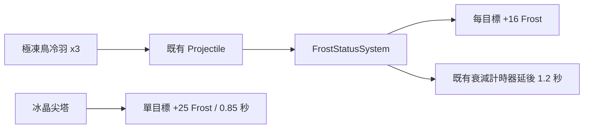

# 霜原職責分流 v0.85.69（本機變更）

日期：2026-09-28  
狀態：已實作、尚未部署。工作區版本檔已由其他進行中的變更推至 `0.85.69`；正式發佈前仍須將所有版本顯示與 Service Worker 清單統一驗收。

## 產品決策

玩家回饋指出「極凍鳥」與「冰晶尖塔」都透過 Frost 造成漸進緩速，容易被視為名稱不同的同一種塔。本次不移除霜原的群體控場，而是把可感知的戰術責任切開：

| 項目 | 職責 | 實際規則 |
| --- | --- | --- |
| 冰晶尖塔 | 單體開窗 | 每 0.85 秒對一個目標 +25 Frost；沒有延後衰減。適合菁英與 Boss 的凍結窗口。 |
| 極凍鳥 | 群體鋪寒、維持進度 | 每 1.3 秒連鎖 3 個目標、每個 +16 Frost；每次命中使該目標既有的部分 Frost 延後 1.2 秒才開始衰減。 |

冰晶尖塔的單體累寒速度仍顯著高於鳥；鳥的優勢只在多目標與讓分散敵群的寒冷條不易中斷。延後衰減不會延長 Frozen／Deep Chill、繞過 3 秒恢復期、增加傷害，也不會永久保存 Frost。

## 架構與資料

`src/td/config.js` 是唯一的數值來源；`frostBird.frostHold` 為 1.2 秒。`FrostStatusSystem.prepare` 將它交給既有 Projectile，命中後由 `FrostStatusSystem.hold` 調整既有 `idle` 衰減計時器。這不新增存檔欄位、資料庫、HTTP API、權限或新狀態循環。

## 操作與 UI

建造卡／部署卡會顯示「中期群寒維持」與「延後 1.2 秒衰減」。玩家要讓一名菁英盡快凍結時選冰晶尖塔；面對分散群怪、需要讓多條 Frost 進度不中斷時選極凍鳥。沒有新按鍵或設定。

## QA 與安全

`tests/td-frostland.test.js` 驗證尖塔仍為 +25 單體開窗、鳥為 +16／三連鎖／1.2 秒維持，並驗證維持期結束後 Frost 仍會衰減。既有 Frost 測試仍覆蓋 Elite／Boss 抗性、凍結恢復期、碎冰、軍械與跨軍團。

本次基線測試發現與本調整無關的既有失敗：`Codex exposes actual Frost gameplay...` 仍要求霜原沒有劇情獎勵，但工作區內未提交的 `StoryCatalog.js` 已加入相關獎勵。未修改該流程。

## 安裝、部署、更新與回復

需求仍為 Node.js 18+，不需額外套件。整合發佈時須同版發布 `src/td/config.js`、`src/td/systems/FrostStatusSystem.js`、`tests/td-frostland.test.js`、本文件及既有版本／Service Worker 檔案；統一公開版號與快取後再部署，不能只上傳其中一個腳本。

玩家更新後重新開啟遊戲並選霜原盟族；讀取既有存檔安全，因為沒有 schema 變更。若需回復，將上述三個程式／測試檔還原到本次修改前的版本並使用與回退版本相符的完整靜態發佈包；玩家資料不需清除或轉換。
