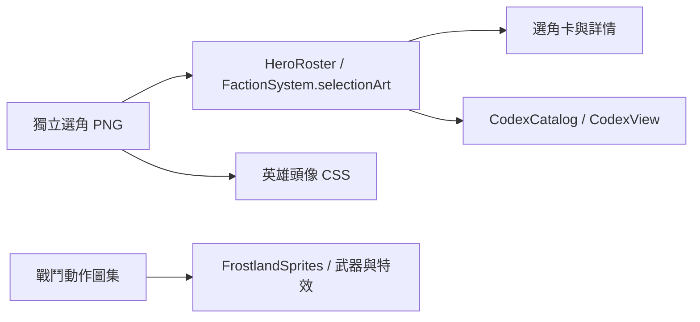

# Frostland 選角插畫 — v0.85.1

2026-09-22 · feature/frostland-faction · 遊玩 TESTABLE／設定 CONCEPT

## 需求與設計

選角頁需要清楚的英雄肖像與軍團主視覺。新增兩張獨立插畫：霜牙・凜的狼人面容、骨甲與獵矛；霜原盟族的狼族、巨熊、冰鳥、獵手、薩滿與猛獁群像。卡片突出主要面容，軍團詳情使用橫幅裁切。群像是視覺概念，不新增正史或可玩兵種。

## 使用與安裝

執行 `npm run serve:test`，開啟伺服器顯示的 `/td.html`，進入自由遠征、選擇戰場，再選擇霜牙與霜原盟族。選角卡、詳情圖、英雄 HUD 頭像及已揭露的圖鑑條目使用新圖。原英雄與士兵多格動作圖、武器掛載、技能特效繼續由戰鬥模組處理。

## 架構與介面

資產為 `assets/td/frostland/hero-selection-v1.png` 與 `faction-selection-v1.png`。`selectionFocus` 記錄裁切焦點；詳情元素的 `data-faction` 僅供 CSS 對應軍團。`slots.json.selectionArt` 記錄素材角色，重建占位圖腳本會保留此欄位。無新 API 端點、資料庫、權限或存檔格式。

## 管理、部署與備份

部署須包含兩張 PNG、更新的程式與 CSS，以及 v0.85.1 service worker。更新整份靜態目錄後重新載入頁面；若仍見舊圖，強制重新整理並確認資產 URL 回應成功。不要清除玩家存檔。備份整個版本目錄與原有存檔；回復上一版時還原前一版完整靜態目錄。Git 前版為 `7e3c235`，不要只回退 PNG 或個別 CSS。

## 素材交付與驗收

使用內建 image_gen，各生成一張原始 PNG 並直接複製進專案。完整提示詞與來源檔名見 `artifacts/frostland/selection-art-prompts.json`。原圖不進行重新上色、去背或圖像加工；畫面裁切由 CSS 完成。

檢查項目：英雄／軍團卡片與詳情載入新圖；小尺寸頭像可辨識；切換其他軍團不殘留冰原裁切；圖鑑英雄不再顯示戰鬥格；既有戰鬥圖集與武器路径不變；語法與完整測試通過。驗收記錄見 `artifacts/frostland/SELECTION_ART_QA.md`。
