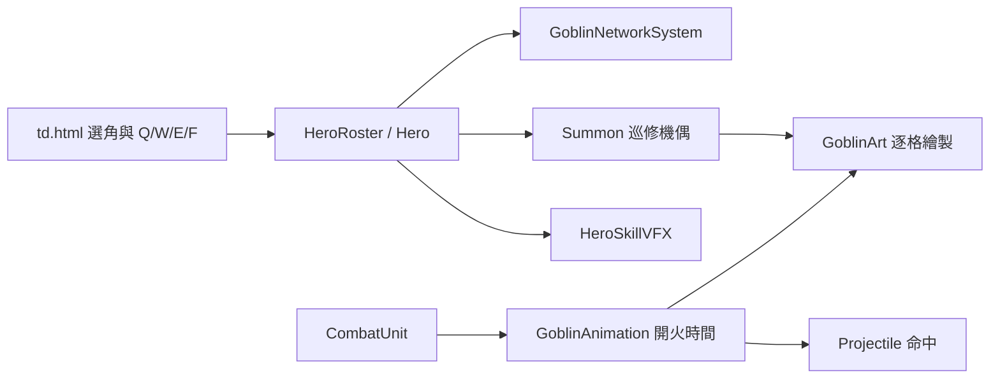

# 地精戰鬥動作、技能與軍團群像交付（v0.85.8）

## 需求與產品決策

玩家在 `td.html` 選擇奇克與地精工程團時，應直接看到角色姓名、軍團群像與專屬技能；進入戰場後，英雄及五種士兵應按戰鬥狀態切換姿勢，射擊須與開火格同步。原先單姿態立繪只有上下位移，無法傳達出手時機。軍團仍沿用既有故事解鎖權限，選擇卡不顯示「測試」，但這不代表新增故事章節。

開發次序：先接入可讀的選角群像與名稱，再接入英雄及士兵動作圖集，接著重做地精三個主動技、技能圖示與特效，最後跑回歸測試與桌機瀏覽器驗收。沒有新資料庫、網路 API 或存檔 schema。

## 操作與介面

自由遠征選角第二步選「銅齒・奇克」與「地精工程團」。奇克 Q「臨場改裝」使自身射擊間隔縮短 30% 共 5 秒，附近最近一座供電機械也獲改裝；W「蒸汽洩壓」傷害並緩速 112 範圍內敵人，若網路正在冷卻也減少 3 秒；E「巡修機偶」派出一台可移動的鉚釘機偶，第三發附帶濺射。F「全網超載」維持原本的供電門檻及 5 秒超載／7 秒停機。Q 無機械網路亦能施放，W 需有附近敵人或冷卻中的網路。技能失敗提示會說明對應原因。

英雄有待機、行走、扳手攻擊、工程施技四列各四格；五種士兵各有預備、步行、開火／工具動作、收勢四格。士兵為固定部署，但圖集保留步行格供召喚機偶及將來可移動角色使用。選角展示與戰場均使用新素材；載入失敗時回到舊圖集與 Canvas 備援。

## 架構與資料流

資料夾：`assets/td/goblin/` 保存軍團群像、英雄／士兵動作圖集與技能 SVG；`src/td/systems/GoblinAnimation.js` 管理士兵開火時點；`GoblinArt.js` 選格繪製；`HeroRoster.js` 管理 Q/W；`Hero.js` 管理 E 與改裝時間；`Summon.js` 管理機偶穿刺彈。配置由既有 `FactionSystem` 與 `HeroRoster` 提供。無新增資料庫欄位或 HTTP API。內部介面：`GoblinAnimation.queue(unit,targets,options)`、`update(unit,dt,monsters,projectiles)`、`frame(unit)`；`HeroRoster.cast(hero,slot,monsters,onKill,onHit)`；`Hero.castSummon(summons)`。

## 美術與生成提示

- `assets/td/goblin/faction-selection-v1.png`：1536×1024 黃銅工坊戰場群像，奇克、工程師、重銃手、長槍手、回收技師與大型機偶；無文字、無 UI。生成提示核心：*premium cinematic landscape faction selection key art, cohesive steampunk goblin engineering corps, brass foundry fortress, warm furnace sparks and turquoise energy, one complete scene*。
- `assets/td/goblin/hero-actions-v1.png`：1448×1086 透明 4×4 逐格，奇克待機、跑動、扳手攻擊、工程施技。生成提示核心：*transparent production 2D sprite sheet, exactly four columns and four rows, same goblin chief engineer throughout, visibly distinct full-body action poses, generous clear cell gutters*。
- `assets/td/goblin/soldier-actions-v1.png`：1122×1402 透明 4×5 逐格，每列一個兵種，每列預備、步行、出手、收勢。生成提示核心：*transparent production 2D sprite atlas, exactly four columns and five rows, mechanic, gunner, sharpshooter, recycler, piloted siege mech, four distinct actions per row*。
- `assets/td/goblin/skill-icons-v1.svg`：四象限工程齒輪、蒸汽閥、機偶、超載電弧，由 SVG 手工繪製。

## 驗證、風險與回復

`node --test tests/td-goblin-actions.test.js tests/td-goblin-network.test.js tests/td-faction-weapons.test.js` 驗證開火時點、三技獨立效果、武器升級與網路相容；`npm run check` 驗證腳本；`npm test` 做完整回歸。桌機瀏覽器進 `td.html`，確認奇克姓名、霜原與地精名稱均不含測試、地精卡有群像，開局部署工程師並確認英雄／士兵繪圖。

手機橫向與小尺寸、完整 30 波數值平衡仍須長局人工驗收。美術圖集不可單獨覆蓋成非透明或改變網格尺寸；若新資產無法載入，保留的舊圖集為執行時備援。回復上一版可由 `artifacts/goblin-actions-v0858-backup/` 的修改前檔案覆回，並清除瀏覽器離線快取後重載；不需資料庫遷移。
