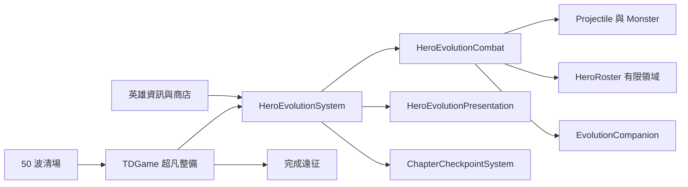

# 七英雄進化補齊與 8D 驗收 v0.85.56

## 範圍與玩家流程

本次補齊既有七位英雄的覺醒、超凡、被動、技能效果與演出，沒有新增種族或英雄。

1. 守成第 20 波，以 3 枚首領勳章購買覺醒石；在英雄資訊按「發起覺醒試煉」。
2. 試煉暫停下一波倒數，只接受英雄及其召喚物的傷害；不產生一般首領援軍。英雄倒下即取消，保留進化石，復活後可重試。
3. 必須實際擊殺試煉首領才完成進化。重置為 Lv.1，繼承傷害倍率、攻速、最大生命底線及裝備。覺醒後再升級可继续成長。
4. 守成第 50 波後進入「超凡整備」，以 5 枚首領勳章完成第二次試煉。尚未覺醒者可在此依序完成兩階。
5. 超凡英雄可召喚無獎勵的試招幻影。按「完成遠征」才結算勝利；不強迫進化，試煉中則需先完成或失敗。
6. 第 10、20、50 波安全整備時保存章節進度。在 20／50 波購石及完成進化後再次保存。重開可回到整備區，試煉本身不保存、不覆蓋安全檢查點。

## 已補齊的戰鬥差異

| 英雄 | 覺醒效果 | 超凡追加效果 |
|---|---|---|
| 王國獵人 | 王印增傷；獵區緩速、破甲；處決選擇帶印目標 | 擴大獵區；擊殺傳印；兩段延遲追箭 |
| 森林奧術師 | 控場共鳴增傷；破盾禁錮；連鎖；受控密集區星墜 | 延遲折返、受控目標額外回響、全域脈衝 |
| 暮影刺客 | 換位、契印與傳遞、處決、短暫無敵 | 多段換位与追擊殘影、加速、封鎖領域、處決後殘影 |
| 荒野酋長 | 單人可用的傷害／攻速戰域、衝鋒擊退、祖靈重擊 | 低血戰域增強、密度擴大斧擊、限時首領增傷姿態 |
| 地精工程師 | 連鎖穿甲、破盾拆甲、個人超載和強化機偶 | 命中累積核心能量（上限 100），E／F 消耗能量增傷，重力拉回 |
| 霜原獵人 | 狼印碎冰增傷、持續寒冷領域、冰狼幻影緩速聚敵 | 狼王幻影、凍結死亡傳冷、白夜領域與全域碎冰 |
| 娜迦英雄 | 潮壓增傷、多段突刺、旋潮緩速傷害、兩名潮衛幻影 | 擊殺傳印、擴大禁域、三名高頻潮衛、全線潮擊 |

印記屬於施放英雄、有有效時間；過期即移除。首領的位移只有普通敵人的四分之一。領域每次更新至多一次脈衝、每次至多 12 目標；延遲攻擊佇列上限 24，每次更新至多執行 6 次。幻影重新施放會替換同類舊幻影，時間到或英雄倒下即消失。大招亦各有目標上限，避免密集敵軍造成無上限工作量。

娜迦取得專屬三叉戟徽記與潮環；兩階可辨識，保留原英雄及商城造型。刺客修復遺漏 y 座標造成非有限 Canvas 半徑。進化領域、徽記、召喚物使用原 Canvas；核心能量、戰域剩餘時間、印記剩餘時間、試煉／試招身份直接可見。

## 8D：為何過去「有進化」仍不完整

- **D1 責任與範圍：** 本地獨立盤點既有規格、遊戲入口、戰鬥、渲染與存檔，七英雄一律納入。
- **D2 問題：** 有技能名稱、rank 與成功回傳，卻缺少部分狀態消費者；50 波立即結算，使超凡無法正常挑戰；Lv.15 重置的傷害與攻速可能下降。原測試可直接讓活著的試煉首領完成進化。
- **D3 暫時圍堵：** 保留既有娜迦特效防護；進化領域及演出例外只中止該效果，記錄 `hero.evolutionFault` 並提示，不中斷戰場循環。
- **D4 根因：** 技能宣告、狀態寫入、戰鬥讀取、玩家入口與保存時機沒有共同驗收；過度依賴不檢查參數的 Canvas stub，未驗證完整生命週期。娜迦被漏出原六英雄徽記清單。
- **D5 永久對策：** 以共用戰鬥契約處理印記、增傷、傳遞、護甲削弱、有限領域與幻影；補上真正流程與嚴格完成條件；保存 power／interval floor；補齊娜迦演出。
- **D6 驗證：** 專項測試驗證實際傷害、控制、時間到期、延遲攻擊、幻影攻擊、能量、試煉傷害歸屬、死亡重試、14 組 Lv.15 戰力繼承、56 技能完整動畫與狀態清理；正式瀏覽器驗證按鈕、20／50 波清場事件、存檔、試招與結算。
- **D7 防止再發：** `npm run test:evolution`、`npm run check:evolution`、`npm run qa:evolution` 為進化變更的驗收指令。新增效果必須同時有施放、消費、到期、渲染与存檔決策，不以文字陣列完整當成完工。
- **D8 交付：** 程式、共用手冊、版本入口與離線快取同步為 v0.85.56；本機變更備份及驗證證據位於 `artifacts/evolution-completion/`。未包含遠端發布。

## 架構與內部契約

無資料庫或新網路 API。`Hero.evolution` 增加可選 `powerFloor`、`intervalFloor`、`energy`；缺值仍依舊 rank 倍率。章節 schema 保持 1，新增允許 wave50；舊版程式可能不接受 wave50 檔案，回復程式前需備份 localStorage。

- `clearedWave(game)`：排除正在打的當波；門檻表示守成波次。
- `completeTrial(game, monster)`：要求本人 trialOwner、stage 相符、英雄存活、首領死亡且 inactive；成功後消耗石頭並保存。
- `cancelTrial(game)`：清除該次試煉、待發攻擊及幻影，保留石頭並恢復先前的準備暫停狀態。
- `HeroEvolutionCombat.pulse`／`afterHit`／`onDeath`：共用有上限的領域、能量與死亡效果；死亡處理具重入防護。
- `EvolutionCompanion`：繼承既有 Summon，投射物仍以英雄為 owner。

## 安裝、設定、更新與回復

沿用 Node 18 以上與原本靜態頁安裝方式，無新增套件。瀏覽器 QA 另需 Playwright 與 Microsoft Edge。執行 `npm run serve:test` 後開啟終端顯示的本機網址 `/td.html`。玩家不需設定進化參數。

部署時必須整包包含兩個新增模組 `HeroEvolutionCombat.js`、`EvolutionCompanion.js`、既有修改檔及 `sw.js`；確認頁面與快取版本一致。使用更新頁更新快取，再關閉舊遊戲分頁。不要混用新版入口與舊模組。

修改前備份位於 `artifacts/evolution-completion/before/`。`rollback.cjs --check` 檢查目前檔案是否仍符合交付雜湊；只有全部符合時 `--apply` 才還原。若其他任務已更新任一檔案，腳本拒絕覆蓋，應先合併。回復不刪除新檔，舊入口會停止載入它們；玩家存檔應另外備份。

## 驗收證據與界限

具體結果保存於 `completion-tests.log`、`checkpoint-tests.log`、`browser-results.json`、`test-final.log`、`check.log`。瀏覽器以加速的第 20／50 波場景驗證流程，沒有宣稱實玩完整 50 波或所有難度達成統計平衡。桌機與手機尺寸的 Edge 驗證也不等同實體手機熱機、触控及長局測試。

本次進化專項 75 項通過；納入波次 HUD 的聚焦回歸 79 項通過。Edge 分別以 1280×800、852×393 執行全部七英雄兩階四招，共 112 次按鈕施放、每次 25 個即時／後續畫面，沒有 pageerror 或正常流程觸發保護。最後透過可見的「完成遠征」按鈕實際點擊結算。完整回歸為 782／787；語法檢查通過。

完整回歸另發現地圖發布測試假設 revision0，而工作區已有使用者發布的 revision1，以及舊地圖可建位置斷言與新配置不同。該地圖資料未由本次進化修補覆蓋；詳見完整測試日誌。
