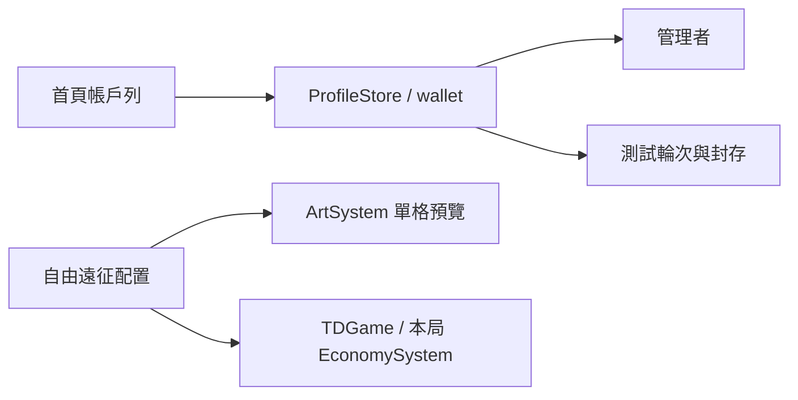

# v0.83.3 大廳比例、造型預告與自由遠征

## 使用方式

大廳右上顯示玩家頭像、帳戶金幣、鑽石；點餘額可查看用途。帳戶貨幣供造型等外觀內容使用，與本局建造金幣完全分開。現階段初始餘額為 0，尚無取得、購買或裝備造型功能，不會用示意金額冒充真實餘額。

首頁下方依序為新造型、期間限定企劃、最新消息。前兩張可開啟概念圖預覽；開放日期與售價尚未公布。橫向手機將三張卡放在右上橫滑列，保留底部導覽。

自由遠征保留兩頁：地圖與難度 → 英雄、軍團與本次遠征。地圖完整等比例顯示，確認按鈕在介紹之後。角色／戰旗一次顯示 3–4 張，可橫滑查看其他選項；下方展示技能與軍團介紹。士兵使用建造選單相同的單一角色預覽，手機士兵列可左右滑動。

## 架構與資料

沒有新增 HTTP API 或資料庫。`td-lobby.css` 管理大廳；`td-expedition.css` 在舊樣式之後載入，僅管理 `#td-profession-screen`。`TDGame.refreshRosterPreviews()` 重用 ArtSystem 的素材載入與單格預覽。`FrontierApp` 顯示帳戶與概念預告。

每份 profile 新增 `wallet: { gold: 0, diamonds: 0 }`，兩欄必須為非負安全整數。讀取或匯入舊存檔時補齊缺少的 wallet，保留其他欄位。saveVersion 仍為 1。管理者、測試與封存各自保存；新 ROUND 歸零、封存保留舊餘額。戰鬥 EconomySystem 不讀寫 wallet。

## 安裝、更新與備份

沿用 Node.js 18+，專案根目錄執行 `npm run serve:test`，開啟 `http://127.0.0.1:4173/td.html`。手機入口為 `td-mobile.html`，以橫向操作。無新增環境變數、套件或伺服器。

更新前由設定匯出完整 JSON。部署須包含新 CSS、兩張 `assets/td/lobby/` 造型圖、JS、HTML 與 sw.js；快取版本為 v0.83.3。重新整理後檢查右上版本。圖未載入先檢查檔案與伺服器回應，勿直接清除網站資料。

匯入／匯出包含 wallet。回退前先備份含餘額的新存檔；本次修改前的介面副本位於 `artifacts/v0830-before-expedition/`。該副本早於其他平衡修改，回退應只還原介面相關差異，勿整包覆蓋新的戰鬥調整。不要以旧版存檔覆蓋唯一的新備份。

## 驗證

- 自動測試：旧資料遷移不改戰鬥紀錄、帳戶與測試隔離、新 ROUND／封存回復、備份還原、非法餘額拒絕。
- 瀏覽器：桌機 1600×900、筆電 1366×767、手機橫向約 843×390，檢查兩頁、地圖比例、技能、軍隊列、帳戶、預告及開始按鈕。
- `npm test`、`npm run check`；本版結果記錄於 `artifacts/v0833-tests.txt` 與 `artifacts/v0833-check.txt`。

## FAQ

帳戶顯示 0 是正常的：尚未開放造型貨幣的取得與消費。戰鬥賺到的金幣不會自動轉成帳戶金幣。預告圖是可確認的外觀概念，尚未表示角色已獲得該造型。
