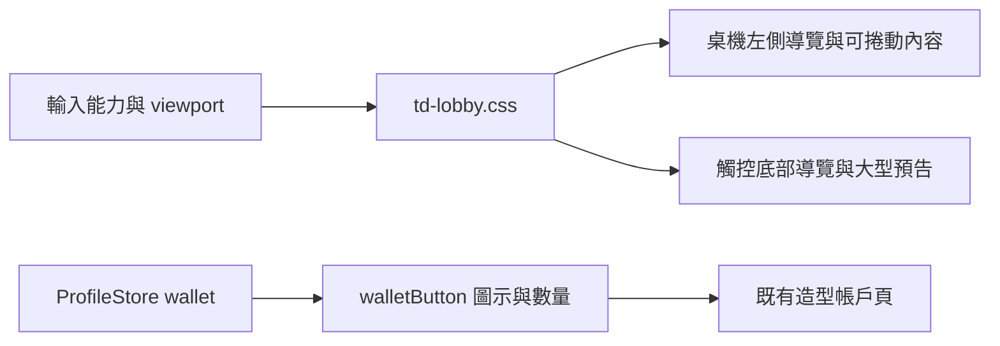

# 大廳版面調整 v0.83.4

日期：2026-09-21。桌機採左側導覽；手機增加新造型預告面積；帳戶貨幣只顯示符號與數量。

## 操作與版型

桌機使用滑鼠／可懸停輸入時，即使視窗較矮或放大頁面，也維持左側選單。高度不足時可在左側選單與右側內容區各自捲動。卡片與原有入口保持可操作。

觸控裝置（`hover:none` 且 `pointer:coarse`）在網頁寬度不超過 1100 CSS px 時使用底部導覽。橫向畫面左方約 64% 放劇情模式與自由遠征，右方約 36% 放宣傳卡；宣傳卡至少 210px 高，造型名稱、介紹與查看按鈕可讀。左右滑動宣傳區可看限定企劃與最新消息，也可先以鍵盤聚焦宣傳區再左右捲動。

手機正式入口 `td-mobile.html` 既有的橫向遊戲殼保持不變：手機直立時，遊戲內容會旋轉為橫向。若宿主直接提供直向的遊戲視窗，CSS 另有模式卡在上、至少 240px 高宣傳卡在下的排列。

帳戶列顯示 `✦ 數量` 與 `◆ 數量`，不再佔用空間顯示「帳戶金幣／鑽石」文字。滑鼠停留仍有完整名稱與數量，螢幕閱讀器也可辨識。點按任一貨幣進入造型帳戶頁，查看完整說明；餘額與戰鬥資源規則不變。

## 程式與 API

- `td-lobby.css`：以輸入能力及可用寬度切換大廳版型，移除單靠高度切至手機導航的條件。
- `FrontierApp.walletButton(kind, amount)`：kind 為 gold／diamonds，回傳含圖示、數量、title 與 aria-label 的 wallet 操作按鈕。
- `.home-bottom`：具名、可聚焦的宣傳區；手機使用橫向 scroll-snap，保留三張卡與對應操作。
- 無新增資料庫、網路 API、權限或資料遷移。版本與 Service Worker 更新為 0.83.4；新玩家輪次記錄此版本。

## 安裝、設定、部署與更新

使用 Node.js 18+。專案根目錄執行 `npm run check`、`npm test`，再以 `npm run serve:test` 啟動並開啟 `http://127.0.0.1:4173/td.html`。直接開啟 `td.html` 也適用；不需新增設定或 npm 套件。依裝置能力自動選版型。

更新前從遊戲設定匯出完整玩家備份。更新整套程式，尤其 `td-lobby.css`、`FrontierApp.js`、`td.html`、`ProfileStore.js`、`sw.js` 與 `package.json`；清理過時 HTTP 快取或重新整理頁面，但不要刪除 localStorage。檔案模式與 HTTP 網站仍是各自的存檔環境，不會自動同步。

本次只更新本機專案，未執行遠端部署。正式部署照既有部署流程。管理者不需重建帳戶或重新設定餘額。

## 回復與常見問題

修改前快照：`artifacts/lobby-v0834-backup/`。要回復：先備份現在的檔案與玩家資料，再將快照中的檔案依相同相對路徑覆回，重新整理並等待舊版 Service Worker 接管。保留其他工作內容，勿用整個 Git 工作區重設。新增的文件及測試可以保留，執行入口不依賴它們。

- 桌機選單下方沒出現在畫面內：在左側選單捲動；右側內容另有捲動區。
- 手機只看到新造型：宣傳卡可左右滑動，後面是限定企劃與消息。
- 不確定貨幣符號：點按即可打開完整帳戶說明，桌機亦可懸停查看名稱。
- 開啟方式不同而餘額不同：file:// 與 HTTP 使用不同儲存環境，可透過既有匯出／匯入功能轉移。

## 測試

`npm run check` 與 `npm test`：454 項通過，包含貨幣按鈕完整數量及無障礙名稱測試。

`scripts/qa-lobby-responsive.cjs`：需可用的 Playwright 與 Edge，並在 4175 埠啟動本機伺服器。驗收 1440×900、960×450 桌機，以及 844×390、390×844、667×375 觸控手機。檢查導航方向、宣傳卡最小尺寸、頁面溢出、造型／限定企劃與錢包入口。手機測試使用正式 iframe 橫向殼；不是僅縮小桌機瀏覽器。

截圖及結果：`artifacts/qa-lobby-v0834/`。正式手機裝置的瀏覽器工具列與安全區仍可在實機回饋後微調。
