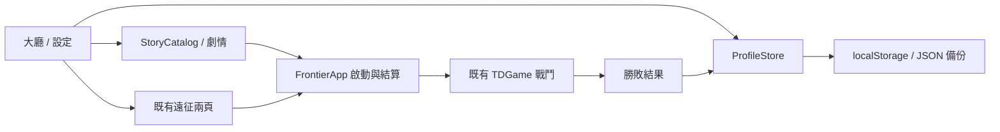

# HERO FRONTIER 0.83.0 — 大廳、故事與玩家檔案

## 本版範圍

P0 提供主大廳、導覽、故事模式骨架、一個三波故事示範任務、原有自由遠征兩頁整合與解鎖存檔。PC 採左側選單／中右雙卡／底部資訊列；手機橫向採底部導覽與精簡模式卡。四張新美術位於 `assets/td/lobby/`，按鈕和文字皆為 HTML，而非烘焙在圖片中。

完整章節、P1 圖鑑／編年史／排名及 P2 商城／好友尚未實作；入口明確顯示未開放。本版不含線上服務、付費貨幣、體力、帳號驗證或排行榜上傳。

## 開始使用

1. 安裝 Node.js 18 以上，於專案目錄執行 `npm run serve:test`。
2. 開啟 `http://127.0.0.1:4173/td.html`；手機使用 `td-mobile.html`，橫向操作。
3. 初次升級預設進入「管理者遊玩」，保留舊遠征戰績和第 10／20 波存檔。
4. 劇情模式 → 烽火初燃 → 觀看／跳過序章 → 使用雷恩與王國守住三波。勝利解鎖測試檔的雙隘口要塞。失敗不解鎖。
5. 自由遠征維持「地圖＋難度 → 英雄＋軍團」兩頁。管理者無進度或難度軍備限制，但正常消耗資源，正常戰鬥。

## 玩家檔案與重新測試

大廳右上「設定與測試」有兩種獨立檔案：

- 管理者遊玩：既有紀錄保留，所有內容可選；故事仍以實際通關計算。
- 新玩家測試：雷恩、王國、新手谷地、見習／標準起始。英雄和軍團分開記錄，鎖定卡顯示原因。

「繼續此輪測試」保留進度。「開啟新一輪測試」經畫面確認後封存舊輪，建立新輪；故事、解鎖、戰績及中途存檔皆重新開始。裝備沿用既有單局制，開新局或新輪不繼承。管理者資料不受影響。

每輪包含 round、startedAt、startedVersion。封存區可回復舊輪；當前輪先封存。重玩故事／再挑戰一次不等於開新一輪。

## 儲存與備份

主要 key：`heroFrontierProfilesV1`，saveVersion=1。包含 active、nextRound、profiles.admin、profiles.test、archives。每份 profile 包含 completed、encountered、discovered、cinematics、unlocks、data、lastRun／lastFreeRun。

遷移首次複製 `heroFrontierScoreRecordsV1` 與 `heroFrontierChapterCheckpointV1` 至管理者 free 資料區，原 key 完整保留。故事與自由模式透過 `story:`／`free:` namespace 分開保存戰績及中途存檔。本版故事只有三波，尚無故事中途續玩。

設定 → 匯出完整備份，保存 JSON。匯入選擇 JSON 後需按確認；驗證格式後，將當前 envelope 保存至 `heroFrontierProfilesV1.beforeImport`，再替換。若需回復匯入前資料，可由瀏覽器開發工具將該 key 的 JSON 匯出後透過相同介面匯入。

資料損壞會停止載入且提供原始檔下載，不自動抹除。磁碟配額失敗不更新記憶體中的 profile；畫面回報失敗。不同分頁同時寫入會拒絕舊分頁覆蓋新資料，重新整理後再操作。不要清除瀏覽器網站資料來處理更新問題；先匯出備份。

## 模組與內部 API

無新增 HTTP API 或資料庫。`ProfileStore` 負責版本／遷移／交易式本地儲存，`StoryCatalog` 負責任務及敵人清單，`FrontierApp` 負責大廳呈現和啟動戰局。`TDGame` 只增加啟動 gate、開始／結束／波次事件，以及返回大廳接點。

- `ProfileStore.newRound()`：封存 test 並建立下一輪，原子更新單一 envelope。
- `switchTo(id)`／`restoreRound(round)`：切換或回復玩家。
- `adapter(mode)`：固定捕捉 profile id，提供既有戰報／checkpoint 相容 Storage 介面。
- `allows(kind,id)`：heroes／factions／maps／difficulties 永久權限；管理者通過。
- `complete(mission)`：冪等通關與獎勵；僅由勝利結果呼叫。
- `seenCinematic(id)`：序章啟動即收錄，跳過仍可回顧。
- `FrontierApp.openFree()`／`launchStory()`：換 catalog 與儲存 namespace 後呼叫既有 chooseProfession。

## 擴充規則

後續任務完成後才加入對應英雄；第一章完整通關才解鎖月影／暗影軍團；第二章對應里程碑才解鎖荒野。本版示範任務不能代替整章通關。第二章和其他任務顯示製作中。

管理者僅是本機開發／遊玩身份，並非線上安全權限。未來伺服器排行榜必須自行驗證戰局，不接受前端管理者／測試紀錄作為正式競賽成績。

## 測試與版本回復

執行 `npm test` 與 `npm run check`。新增 `tests/td-profiles-story.test.js` 驗證舊存檔保留、模式隔離、封存／還原、匯入損壞、配額失敗、分頁衝突、三波人類敵人、勝利解鎖及入口 gate。

手動驗收：PC 16:9、手机約 844×390、返回大廳、故事序章跳過、三波戰鬥入口、自由遠征鎖卡、刷新保留、管理者恢復。真機觸控／離線安裝和長時間完整戰鬥需另行驗收。

修改前入口、版本檔、service worker 與 TDGame 備份在 `artifacts/p0-v0827-backup/`。回退時先匯出 profiles，恢復備份的 td.html／sw.js／package.json／TDGame.js；其他既有檔不需覆蓋。新版資源可以留在磁碟但舊入口不載入。正式發布需整套部署新 HTML／JS／CSS／四張圖片；sw.js cache 已更新至 0.83.0。

### 視覺驗收補充

首頁對照「塔防/首頁PC.png」和「首頁PHONE.png」重做：左側背影英雄／王城背景、中右雙模式卡、底部資訊列、手機底部導覽與上方小卡。故事頁對照「劇情模式PHONE.png」採章節／路線／任務三區。示意圖的貨幣、體力與尚未實作的商業內容未加入。四張圖片為本次生成的獨立美術資產。

最終 434 項測試通過，語法檢查通過。PC 1600×900 首頁內容不溢出；手機約 844×390 故事頁開始按鈕 bottom=371px、內容無垂直溢出。原始截圖工具的 viewport 截圖有縮放裁切，因此使用 fullPage 截圖並搭配 DOM 邊界驗證。
