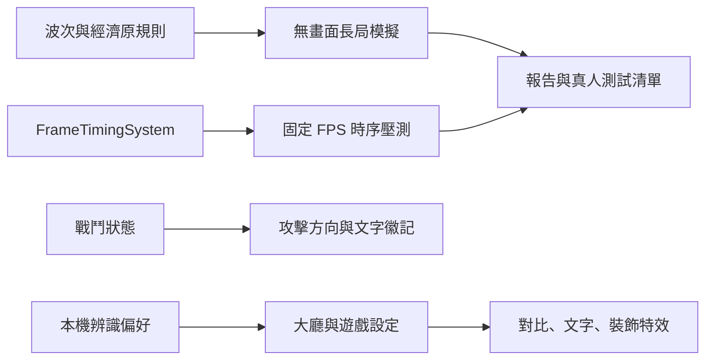

# v0.85.36 長局模擬、戰鬥提示與辨識設定

## 產品判斷與範圍

玩家反映緩速像延遲、怪物走動及戰鬥不自然，也要求檢查 30 波對局。本版先保留既有傷害、速度與波次規則，用可重現模擬尋找風險，再改善動作提示、狀態辨識與裝飾特效負擔。模擬不能替代真機影格、真人戰術與主觀手感。

## 模擬方法與結果

`node scripts/qa-long-session.cjs` 在 Node 中執行 30 分鐘固定影格時序，涵蓋 60／30／20／15／10 FPS、×1／×3；另以既有波次、經濟、部署、移動及自動戰鬥程式跑 6 軍團 × 3 個固定採購策略，共 18 局標準難度。原始輸出寫入 `artifacts/qa-long-session/results.json`。

時序模型在 15 FPS 以上 ×3 沒有略過模擬時間；10 FPS ×3 受每影格 12 細步的安全上限約束，30 分鐘真實時間會略過約 3,600 秒遊戲時間。這是設計上的降級門檻，不是實測 FPS。另執行 `node scripts/benchmark-frostland.cjs`：200 怪、36 士兵、600 次純更新的平均約 1.10 ms、P95 約 1.43 ms；數字會隨電腦變動，且不含 Canvas、GPU、音訊或溫升。

18 個簡化自動編隊中，月影範圍策略與霜原廉價策略走完 30 波；其餘在第 3–10 波敗北。這個機器玩家固定部署上限 26、每波至多買兩名士兵，不建塔、不升級、不使用英雄技能、商城或戰利品，英雄固定獵手；敵軍特性、首領技能、敵軍對英雄傷害也未納入。因此兩局「走完」只代表此探針的路徑清場，不等於完整遊戲通關。結果只表示固定開局策略很敏感，不能推斷真人勝率或直接調整敵軍數值。下一輪應加入建塔、升級、技能、敵軍特性與戰利品決策，並以至少九局真人對局核對波 5／10／20／30 的剩餘城門與資源。

另以 Edge 中的正式 `TDGame.update()` 跑瀏覽器流程探針：`node scripts/qa-browser-run.cjs --normal` 使用固定獵手編隊與正常城門，在第 5 波失敗，當時還有 182G 但木材已歸零、僅六名士兵；這提示早期「有金無木」可能使單一採購路線失去增兵能力，應檢查玩家是否知道可用的替代策略，而非直接上調木材。相同探針不加 `--normal` 時只把城門耐久設為 10,000 以強制覆蓋完整流程，17,977 次更新後進入 30 波勝利狀態、寫出 30 筆逐波戰報，最多同時 69 隻怪，沒有頁面錯誤。原始資料是 `artifacts/qa-long-session/browser-run-normal.json` 和 `browser-run.json`。這個瀏覽器探針沿用正式敵軍特性、首領與戰報，但固定採購，不主動施放技能或操作商店；執行時壓縮遊戲時間且不繪製每一影格，不能當 FPS 或真人勝率。腳本需具備 Playwright 與 Edge，正式安裝遊戲不需此依賴。

## 系統與介面

`Monster` 的緩速步伐改用速度平方根修正：腳步會比正常行走慢，仍比完全按位移計算更連續；路程和攻擊時序不變。蓄力時在怪物附近顯示「攻」與指向目標的箭頭。`CombatFeedbackSystem` 為凍結、定身、緩速、腐化及感電加入文字徽記；不能只靠顏色辨認。首領的大範圍蓄力另送至隱藏的語音輔助訊息區。減少特效時跳過塵土、碎光、靈魂與部分脈衝，保留攻擊預警、命中及控制標示；霜原法術改為簡化輪廓。偏好只存本機 `localStorage`，不進入玩家進度備份；沒有資料庫、HTTP API 或新權限。

## 操作、部署與回復

在主大廳「設定 → 畫面與動態」或戰鬥中的「遊戲選單 → 設定 → 戰場辨識」調整三項偏好，立即生效，重開仍保留。離線部署須包含 `td-accessibility.css` 與本版 `sw.js`；既有 Node.js 18+ 和靜態伺服器要求不變。若仍看到舊版，至 `update.html` 更新快取。回復至 v0.85.35 時，同步還原 HTML、CSS、程式、版本標記和 Service Worker；舊版會忽略本版三個本機偏好鍵，不影響存檔。

## 驗收與限制

- [x] 固定影格及 18 局自動編隊模擬，原始報告可重跑。
- [x] 瀏覽器中跑正式 30 波流程及正常城門固定編隊各一局，紀錄戰報與錯誤。
- [x] 單元測試驗證緩速腳步、蓄力提示、文字徽記及減少特效保留預警。
- [x] Edge 瀏覽器驗證大廳設定可勾選、儲存並在重載後套用。
- [ ] iPhone Safari 與低中階 Android Chrome 的霜原高怪量、第 20／30 波熱機、GPU 影格與觸控。
- [ ] 真人逐格觀看 ×1／×2／×3 怪物轉彎、攻擊與緩速；不能把無畫面模擬當主觀驗收。
- [ ] 五至八名新玩家及九局平衡實玩，確認文字大小與密集狀態徽記不遮住關鍵目標。

## 常見問題

**為何 10 FPS ×3 仍可能慢？** 系統限制單影格最多 12 次細步，避免無界追趕；真機若掉到此區間，應先找繪圖與特效負擔，再選擇降載或倍速提示。

**模擬大量失敗是否代表軍團失衡？** 不能。自動編隊刻意不建塔、不升級、不使用技能與戰利品，只是保守壓力探針。
