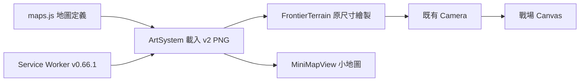

# v0.66.1 新手谷地美術更新

## 產品與設計

使用者已確認較乾淨、明亮的奇幻地景方向，本版將已確認的空地圖正式載入遊戲。保留 1536×1024 世界、道路座標、出生點、城門、建造區、鏡頭、英雄／士兵／怪物素材及戰鬥數值。沒有新關卡、資料庫、帳號、HTTP API 或新套件。

美術減少草地碎紋理，強調樹木與岩石塊面，河面使用較柔和的藍綠色。裝飾樹石仍是背景繪畫，不新增碰撞；可部署位置以既有綠色預覽為準。建造區邊緣原有裝飾仍可能出現在單位旁。

## 素材與架構

- 正式素材：`assets/td/beginner-valley-v2.png`，1536×1024，3,285,975 bytes。
- 回復原圖：`assets/td/beginner-valley-v1.png`，3,573,343 bytes，原檔保留。
- 新圖比原圖小約 8%，同一張靜態圖片繪製，不新增每幀處理。
- `maps.js` 與 `ArtSystem.js` 的載入路徑同步改為 v2，`sw.js` 快取版本為 `sky-strike-v0.66.1`。
- 使用空地圖原圖作 style-transfer 生成；核心規格為保留路線與場景位置、簡化細碎紋理、柔和光影、無角色／UI／文字。先前含角色的 AI 合成示意沒有放進遊戲。

## 安裝、更新與使用

1. 使用 Node.js 18 以上，於專案根目錄執行 `npm run serve:test`。
2. 開啟 `http://127.0.0.1:4173/td.html?v=0.66.1`，選擇英雄與軍團後開始遠征。手機沿用既有專用入口。
3. 地圖自動載入，不需要設定或移轉存檔。舊有戰績與裝備不受影響。
4. 發布時上傳完整版本（包含新 PNG、maps、ArtSystem、Service Worker），不要只替換圖片。
5. 若仍看見舊地圖，關閉舊分頁重新開啟；必要時只清除該網站 Cache Storage，再連網載入。不要刪除 localStorage 戰績。

## 備份與回復

本次修改前的主要檔案另存於本機 `artifacts/map-v0661-backup/`。該備份包含當時尚未提交的其他工作，不應整包覆蓋後續版本。

只回復地圖時：將 `src/td/maps.js`、`src/td/systems/ArtSystem.js`、`sw.js` 內的 `beginner-valley-v2.png` 改回 `beginner-valley-v1.png`，更新 Service Worker 快取名稱為新的唯一版本；同步調整地圖素材測試期待值，再執行測試與部署。保持道路與建造區資料不動。完整版本回退需使用對應版本的完整備份，不能僅回退 package.json。

## QA 與已知限制

- `npm test`、`npm run check`：執行紀錄在 `artifacts/test-v0.66.1.txt` 與 `artifacts/check-v0.66.1.txt`。
- `scripts/qa-map-v0661.cjs`：使用 Playwright 與 Edge，檢查實際 v2 載入、尺寸、可建造草地、道路禁建、PC／手機入口與 JS 錯誤。
- `artifacts/qa-map-v0661/alignment.png`：洋紅線是既有敵軍中心線，青色多邊形是既有建造區。人工檢視路線位於道路與橋面。
- `battle-desktop.png` 使用遊戲實際 renderer 與既有角色素材；測試用軍隊只存在 QA 頁面。
- `phone-portrait.png`、`phone-landscape.png` 為手機尺寸模擬，不等同實體手機效能驗證。
- `results.json` 包含相同頁面下新舊地圖繪製耗時抽樣；此數據不是實體裝置 FPS 保證。
- 美術更新不解決大量怪物重疊或血條密集問題。
