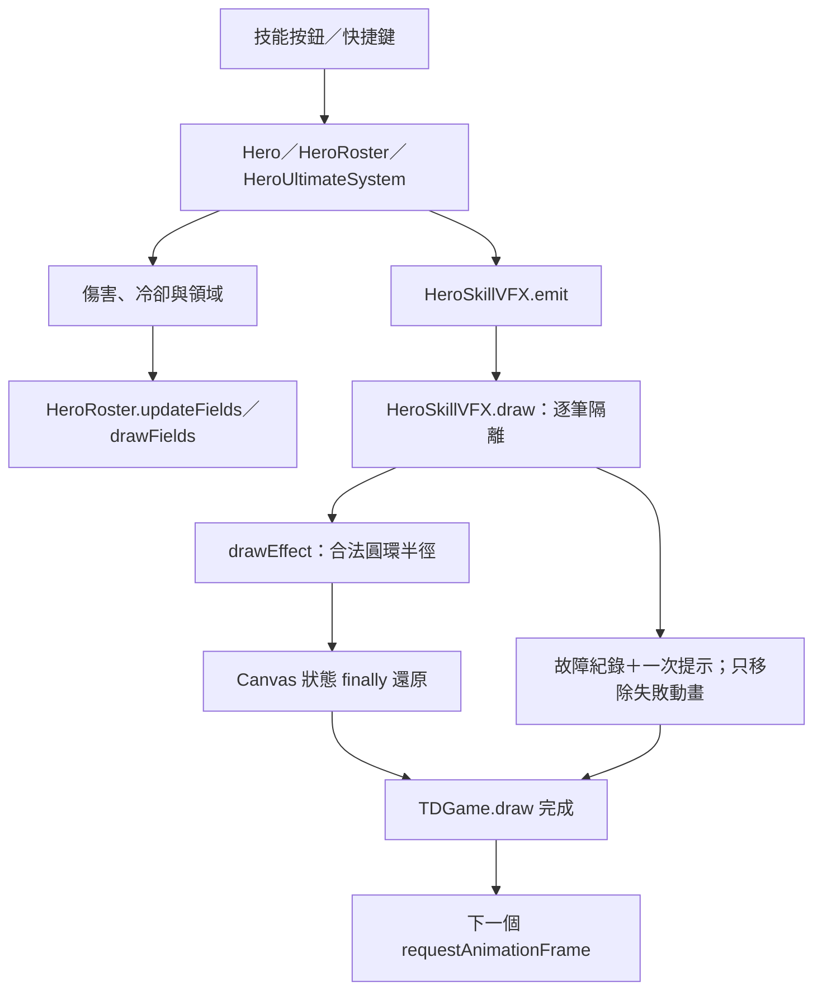

# 娜迦技能凍結：8D 根因分析與交付

版本：0.85.54 · 日期：2026-09-26。狀態：本機修復與回歸完成；未部署正式站，未宣稱已完成玩家裝置觀察。

## D1：問題處理責任與範圍

本次依產品、架構、介面、開發、QA、文件與交付角色逐階段檢查。範圍為破潮者・賽洛 Q／W／E／F 的技能執行、施放動畫、地面領域、Canvas 狀態與動畫影格排程。不新增英雄、軍團或戰鬥規則。

工作區已有其他未提交、且持續更新的地圖、五十波平衡與預覽器修改。本次保留它們；0.85.53 已被平衡工作使用，因此這份 8D 修復使用 0.85.54。期間另一項修改也加入了旋潮半徑下限，本次保留並以獨立失敗重現驗證；本次另補足故障隔離、狀態還原、診斷與回歸門檻。

## D2：用可重現條件定義問題

| 項目 | 查證結果 |
| --- | --- |
| 使用者症狀 | 按娜迦技能後，戰場畫面不再前進；多次修正後仍出現 |
| 可確認的觸發 | 娜迦 W「旋潮領域」施放動畫的出生幀／早期影格；空場即可，不需要大量敵人 |
| 故障位置 | `HeroSkillVFX.draw` 的 `naga-maelstrom` 分支呼叫 `ctx.ellipse` |
| 真實瀏覽器 | Edge 153.0.4234.48，原生 Canvas 拋出 `IndexSizeError` |
| 擴散結果 | `TDGame.draw → TDGame.loop` 拋出例外，末尾的下一次 `requestAnimationFrame` 沒有執行 |
| 排除範圍 | 相同原生 Canvas 探針中，Q、E、F 各 121 個時間點未重現相同例外；不因此聲稱所有可能問題皆不存在 |

重現步驟：開 `td.html` → 自由遠征選娜迦英雄／軍團 → 出征 → 按 W。未修版在正常高更新頻率下就可能停止。自動探針同時直接繪製 `age=0`，避免測試機太慢而跳過錯誤時間窗。

證據保存於 `artifacts/naga-8d-v08554/`：

- `browser-before.json`：W 出生幀半徑 −7.76、完整例外堆疊與 RAF 停止。
- `red-tests.txt`：修復前新回歸測試因負半徑失敗。
- `browser-after.json`：修復後四技能、連續施法與 RAF 驗證。
- `fixed-battle.png`：修復後戰場截圖。
- `before/manifest.json`：開始盤點時的 21 個檔案 SHA-256 快照。

## D3：圍堵與復原機制

1. 修正旋潮的圓環半徑，最低為 1；萬潮裁決的同類計算也套用相同下限。
2. 娜迦施放動畫逐筆隔離例外；僅移除失敗動畫，保留已執行的傷害、冷卻、領域與其他動畫。
3. 用 `finally` 還原動畫、潮門斬擊巢狀繪製與地面領域的 Canvas 狀態，防止例外留下位移、透明度或繪圖堆疊。
4. 地面領域發生例外時只移除失敗的娜迦領域，仍繪製其餘領域。其他類型的錯誤不再冒充娜迦錯誤。
5. 畫面提示「娜迦技能動畫已略過，技能效果與戰鬥繼續」；每筆故障只提示一次。原始型別、訊息與堆疊保留在 `hero.nagaVfxFault`，並記錄至瀏覽器 console。

圍堵只負責限制影響，不能作為正常驗收通過的理由。正常情境的測試明確要求 `nagaVfxFault` 與 `nagaFieldFault` 都沒有產生。

## D4：發生根因、漏檢根因與 5 Why

### 發生根因：固定間距大於初始圓環半徑

原公式：`r = 76 × (0.24 + 0.76 × age / 0.82)`；第三圈的半徑為 `r − 2 × 13`。

出生瞬間：`76 × 0.24 − 26 = −7.76`。前約 0.110 秒仍可能小於 0；Canvas 的 `ellipse` 不接受負半徑。這是確定的幾何計算錯誤，不需要推測裝置效能、敵軍資料或快取才成立。倍速與第一幀時機可能讓測試跳過這段動畫，因此人工觀察有時看似正常。

### 漏檢根因：測試沒有真實 Canvas 契約，也未走完整影格路徑

- `td-naga-prototype.test.js` 原有技能測試確認了施法結果、特效型別、傷害與領域，沒有繪製出生動畫。
- 原 VFX 測試使用接受任意參數的 Proxy 假 Canvas；負半徑也會「通過」。
- 先前加入的故障注入只測 `updateFields` 與 `drawFields`，沒有涵蓋稍後獨立執行的 `HeroSkillVFX.draw`。
- 無「按技能 → 更新 → 原生繪製 → 下一幀仍持續」的回歸門檻。

### 為何舊修正未消除問題

`4b3d3b1` 首次加入娜迦技能演出時即含該公式；後續 `5a98416`、`cd1dd91`、`6916550`、`5034f98` 所屬修正期間，這段公式仍保留。尤其 `5034f98`（0.85.49）只保護脈衝與地面領域，未保護出生動畫。本次證據支持「缺陷持續存在、漏掉正確路徑」，而非已證明「被後來某版重新引入」。舊文件對 Canvas 故障隔離的描述涵蓋過廣，已加註此限制。

| Why | 答案 |
| --- | --- |
| 為何戰場停止？ | 繪製拋例外，下一個動畫影格沒有排程。 |
| 為何繪製拋例外？ | 旋潮內圈傳給 `ellipse` 的半徑小於 0。 |
| 為何出現負值？ | 初始半徑只有 18.24，卻減去固定間距 26，沒有下限。 |
| 為何修正後仍發生？ | 先前聚焦領域傷害／地面效果，沒有修到獨立的施放動畫。 |
| 為何驗收沒有阻擋？ | 假 Canvas 不檢查參數，也缺少出生幀及主迴圈連續性驗證。 |

沒有使用者過去每次當機的完整堆疊，不能斷言每一次都只有這個原因；本報告列出的路徑已有修復前後可重現證據。

## D5：永久修正設計

沿用既有模組與資料夾，不增加資料庫、HTTP API、帳號權限或存檔欄位。

模組關係：`HeroSkillVFX.drawEffect(ctx, hero, effect)` 負責單筆圖形；`draw` 管理每筆繪圖狀態與娜迦例外邊界；`HeroRoster` 仍管理領域；`TDGame` 只負責呈現故障提示。動畫層不重新計算傷害，也不退款冷卻，避免因畫面錯誤重複傷害。

沒有將主迴圈改成無條件吞掉所有錯誤；不讓未修復的戰鬥邏輯錯誤默默持續。此故障邊界限定於娜迦動畫。

## D6：實作驗證

- `tests/helpers/strict-canvas.cjs`：拒絕負／非有限半徑，追蹤 `save/restore` 與繪圖狀態。
- `tests/td-naga-skill-crash.test.js`：出生幀與前 120ms、四技能完整生命週期、拒絕重複施法、30／60／120 FPS × 1／2／3 倍速的正式 RAF 迴圈、各技能例外注入、地面例外、54 敵軍／100 次連按／背景返回，以及版本快取一致性。
- 原生瀏覽器：四技能各 121 個時間點；桌面 1280×800 與橫向 852×393 各 60 次成功按鈕施法、3,600 次正式更新與繪製；總計 120 次施法、7,200 次更新／繪製，零未捕捉例外、零正常情境容錯紀錄。
- 傷害與領域驗證：正常繪圖不改變生命、冷卻與領域；W 會傷害敵軍並到期，密集目標及背景返回維持每次最多 12 名目標。
- `npm run check` 通過；最終 `npm test` 共 715 項通過、0 失敗（其中本次新增 21 項防當機測試）。結果記錄在 `check.txt`、`full-tests.txt`。

限制：瀏覽器測試是桌面 Edge 的真實 Canvas 與手機尺寸 viewport；沒有宣稱測過實體 iPhone／Safari，也不是 GPU FPS benchmark。背景返回的長時間步由確定性測試注入。壓力探針直接跑更新／繪製，其 1／2／3 倍速排程由獨立 RAF 測試驗證。

## D7：防止再發生

1. `npm test` 自動收錄這份測試；既有 GitHub Pages 工作流程會先跑它，失敗即不能進入部署步驟。
2. `npm run test:naga` 可快速執行娜迦專項；`npm run qa:naga` 執行真實 Edge／Canvas 探針。後者需要 Playwright 和 Edge，未假裝已加入無瀏覽器依賴的 CI。
3. 驗收必測出生幀及前 120ms，並驗證傷害、領域存續、Canvas 狀態與下一幀；不得只確認「沒有拋錯」。
4. 正常測試若使用容錯也判失敗，避免往後靠移除動畫讓測試假綠。
5. 新增版本一致性檢查：套件、玩家資料版本、戰報、大廳、遊戲入口、更新頁與 Service Worker 使用同版號，且三個修正模組列入離線快取。

安裝與執行：Node.js 18+，於專案根目錄執行 `npm run check`、`npm test`。需要瀏覽器探針時，安裝可解析的 Playwright（例如 `npm install --no-save --package-lock=false playwright`）及 Microsoft Edge，再執行 `npm run qa:naga`；也可透過 `NODE_PATH` 使用既有 Playwright 套件。`npm run serve:test` 後開啟 `http://127.0.0.1:4173/td.html` 可人工驗收，不需資料庫設定。

## D8：交付、更新與還原

本次工程結案條件是「原版確定失敗、修正版同測試通過、正常技能效果仍成立、未預期娜迦動畫故障不凍結戰場」。正式部署後的使用者裝置觀察仍須另外確認。

玩家操作維持 Q／W／E／F 與原有按鈕。E 需要附近娜迦守軍；Q／F 需要合法敵人。更新後確認大廳顯示 0.85.54；網頁／PWA 使用更新入口並重新開啟舊分頁，快取應為 `sky-strike-v0.85.54`。不用刪玩家存檔，也不需重開測試輪次。

部署須整套同步發布程式、入口與 `sw.js`；本次沒有推送或發布。若更新後仍有問題，記錄版本、地圖、波次、按鍵、速度與裝置；若出現動畫略過提示，維護者可讀取 `towerFrontierGame.hero.nagaVfxFault` 的原始堆疊定位，不把提示當成正式修復完成。

還原資料分兩組：`before/` 是盤點起點原始證據，不應整批覆蓋後續並行修改；`rollback/` 與 `rollback-manifest.json` 專供本次 0.85.54 變更回退，保留先前並行的旋潮半徑修正與其他原有工作。於根目錄執行 `node artifacts/naga-8d-v08554/restore.cjs --check` 先驗證，確定要回退時使用 `--apply`。工具會比對完成版本雜湊；任何檔案之後又修改就整批拒絕還原，要求先人工合併。此本機快照位於忽略的 artifacts，應隨交付備份保存。

回退只處理本次記錄的程式／文件與新增測試，版本退至 0.85.53；玩家 localStorage 存檔不動。0.85.53 缺少本次的動畫故障隔離和回歸保護，不應視為本缺陷的最終解決版。再次部署回退版時，程式與 Service Worker 同步回退並關閉舊分頁。
