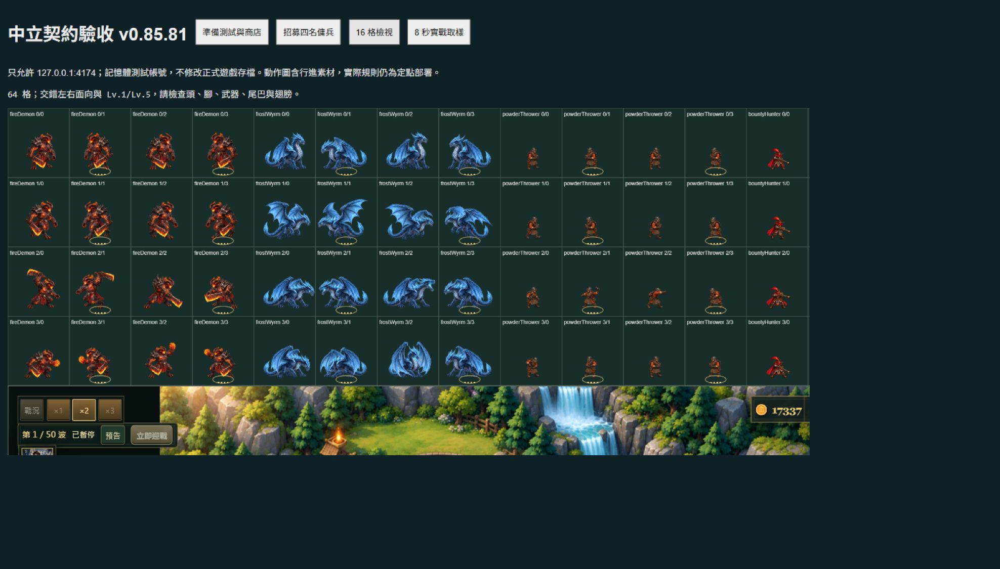

# 中立 BOSS 契約 · v0.85.81

2026-09-29。本次為本機實作，尚未遠端發布，也未建立 Git 提交。

## 產品範圍與設計

以「火焰惡魔」取代未上架的長槍衛兵，新增「寒冰惡龍」；完成火藥投手，更新原本就存在的賞金獵人。不是新增英雄或軍團，不替兩名 BOSS 契約訂死陣營／劇情身分，不新增平行裝備系統。

| 契約 | 招募金幣 | Lv.1 傷害／間隔 | 射程／濺射 | 定位與代價 |
| --- | ---: | --- | --- | --- |
| 火焰惡魔 | 1050 | 110／2.15 秒 | 175／64 | 對地混沌烈焰爆發；高價、慢攻，不能對空 |
| 寒冰惡龍 | 1200 | 115／2.7 秒 | 225／48 | 魔法寒息可對空；22% 緩速 1.2 秒，不累寒、不凍結 |
| 火藥投手 | 180 | 30／1.45 秒 | 165／38 | 對地小範圍快投；較海盜重砲小範圍、低單發 |
| 賞金獵人 | 233 | 43／1.7 秒 | 255／無 | 沿用原本穿甲狙擊、優先目標與擊殺賞金 |

價格為 ceil(config.cost × 1.5)，表列未受工坊折扣。全部不耗木材。BOSS 的單體基礎 DPS（51.16／42.59）低於翡翠古龍（66.67），以爆發／射程／短控場區隔，不取代軍團協同。裝備及升級沿用既有倍率；寒息緩速時間不隨等級延長，無限冰凍不是此單位機制。這是初始平衡，不宣稱全波次或所有配隊已完成平衡驗證。

## 玩家操作與 UI

1. 開啟 `td.html`，進入遠征。BOSS 契約需「軍團老兵」或「災厄遠征」，管理者可直接測試。
2. 戰鬥中按 R／商店，往下找到「傭兵館 · 中立契約」。不是大廳外觀商城。
3. 點商品，再點可建造位置並確認。取消、非法位置、金幣不足都不扣款。
4. 選單位可升至 Lv.5、配戴一件相容軍械、出售回收實付金額的 70%。

BOSS 商品以金色框區別，四張卡使用與戰場相同角色。所有傭兵仍為永久定點、不承傷；行走／翼拍圖保留為素材與驗收，不表示可操控移動。沒有把新增單位放進本軍團一般建造列表。

## 架構與資料

```text
config.units → FactionSystem.canHire + TDDifficultySystem
                         ↓
td.html 中立契約 → BuildSystem → CombatUnit → Projectile / UnitVFX
                                      ↓
ArtSystem → NeutralMercenaryArt    ArmorySystem
                                      ↓
                               ShopSystem / LootSystem
```

- `powderThrower`、`fireDemon`、`frostWyrm` 是新增 unit ID；`bountyHunter` 不改 ID，保留舊記錄相容。
- `ranks` 為可選的五級名稱。CombatUnit 依既有升級費用／功勳規則成長，裝備稱號仍優先。
- 火藥投手／惡魔可用先鋒戰鼓；惡龍可用常青冠冕與翡翠龍心；獵人沿用獅心王弓。
- `LootSystem.usable` 加入已部署且 active 的士兵，不把尚未購買的所有傭兵當成可用者。商店軍械適用者文字同步顯示已部署傭兵。
- 沿用單一攻擊與傷害管線；沒有新增持續粒子陣列、定時器、HTTP API、資料庫、存檔欄位或套件。

## 圖像驗收

四張正式檔案位於 `assets/td/neutral/`：`fire-demon-actions-v1.png`、`frost-wyrm-actions-v1.png`、`powder-thrower-actions-v2.png`、`bounty-hunter-actions-v4.png`。每張 1254×1254 真正 RGBA、4×4 共 16 格，列為待機／行進／攻擊／回復或再裝填。回復列在實際攻擊冷卻期間播放。

使用內建 image_gen 產生及編輯，未用程式修改 PNG 像素。[提示詞與原始輸出對照](NEUTRAL_CONTRACT_ART_PROMPTS_V08581.md)。未採用的長槍兵與舊草稿不列入快取；生成原檔仍保留在 Codex generated_images。

逐格 alpha 檢查發現極淡 alpha=1 殘留；4px 格緣沒有任何 alpha>1 像素，可見角色（alpha>50）皆完整、不跨格。渲染只內縮 4px 去除格線殘留，不剪角色；逐格腳底定位補償原圖排版差異，整張採固定比例，不為隱藏缺圖而縮小角色。BOSS 可見最大高度 104／105，普通兵 60，再套共同 1.12 士兵比例。商店使用預先量測的首格裁切，不讀 Canvas 像素。

目視檢查待機、行進、攻擊、回復與鏡像。Lv.5 使用既有階級圈，不另宣稱有五套角色造型。素材失敗時保留 CombatUnit 既有替代畫法；離線清單包含四 PNG 與新模組。



## QA 與效能結果

- `npm run test:neutral`：9/9 通過；涵蓋九軍團×四難度、招募資金與取消、五级名稱、滿級、回收、軍械購買／轉移／歸還與掉落資格、實際命中／範圍／緩速、對空資格、死目標、64 格 alpha 與獨立內容、左右／Lv.1&5 繪製、素材缺失、特效預算。
- 120 模擬秒持續射擊：投射物數量有界，傷害有限值，沒有永存特效。
- 相關靜態交付／動作圖回歸及新增測試共 30 項通過；`npm run check` 通過；新模組與驗收 JS 另行 `node --check` 通過；`git diff --check` 無內容錯誤（只有既有換行提示）。
- 完整 `npm test`：920 項，906 通過、14 未通過。未通過集合與上一版既有清單相同；兩個因新增名冊而變動的精確清單測試已更新，沒有降低其資產要求。
- 瀏覽器實際點選四張商店按鈕並確認部署，扣款依序 1050／1200／180／233，預覽均載入。未改正式遊玩 origin 或玩家存檔。
- 第一輪：獨立 4174、20 個高血量測試敵人、四名傭兵、×2，執行 8 秒；監測器保留的最後 120 筆 P95 為影格 10.1 ms、更新 1.8 ms、HUD 1.5 ms、繪圖呼叫 1.7 ms。四兵實際攻擊次數 6／7／8／11。
- 第二輪同一瀏覽器只有 8 筆，影格 P95 1010 ms，但更新 7.5 ms、HUD 4.8 ms、繪圖呼叫 4.8 ms，並且截圖工具無法擷取。疑似瀏覽器排程／背景節流，**原因尚未確認**；不以第一輪數字宣稱所有卡頓已修好。
- 瀏覽器另回報 MutationObserver.observe 非 Node 錯誤，無來源位置；本專案 `src`、`scripts` 與入口找不到 MutationObserver 用法，歸屬未確認。部署與攻擊未因此停止，不宣称控制台零錯誤。

既有 14 項失敗：舊防禦塔數量清單、南方守軍五階名稱、選角數量、矮人密集波平衡、南方英雄覺醒技能兩項、矮人塔特效、預覽量測表、軍團肖像數量、塔定位數量、選角版面選項數、建造卡數量、集中單位比例、矮人士兵 UnitVFX。完整歷史見 [v0.85.80 紀錄](PERFORMANCE_PROFILE_8D_V08580.md)。本次不是全專案綠燈交付。

## 安裝、部署、版本與還原

無新依賴。沿用 Node.js 18+；`npm run serve:test` 後開 `http://127.0.0.1:4173/td.html`。本版七處版本一致為 0.85.81，Worker 名稱 `sky-strike-v0.85.81`。更新後重新載入確認版本；不要為顯示新傭兵清除存檔。

發布必須同步本次 JS、td.html、td.css、package.json、update.html、sw.js 及四張正式圖，不只替換 HTML。沒有執行外部發布，也沒有把驗收頁當正式遊戲入口。

驗收：以另一個 PowerShell 視窗設定 `$env:TD_TEST_PORT='4174'` 再執行 `node scripts/serve-test.js`，開 `/scripts/neutral-contract-lab.html`。等遊戲載入後依序「準備測試與商店 → 招募四名傭兵 → 16 格檢視／8 秒實戰取樣」。頁面拒絕正式 4173；用記憶體 ProfileStore，測試結束停止專用伺服器。

更新前匯出玩家 JSON 並保存完整部署副本。需要回退時成套回復上一版程式、資產和 Worker，並使用更新前的玩家備份；舊賞金獵人素材未覆蓋。本次工作目錄已有大量未提交內容，沒有以 reset／checkout 覆蓋，也未把其他人的修改混入提交。新單位戰鬥快照不保證可由舊版解碼，應在新版本完成該局或回復更新前備份。
