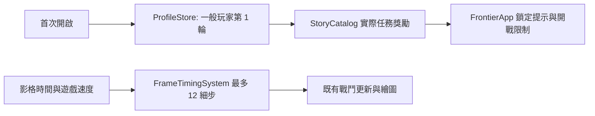

# v0.85.33 新玩家入口、解鎖承諾與低幀率倍速

## 產品範圍與順序

1. 全新瀏覽器存檔預設建立一般玩家第 1 輪，只解鎖王國獵手、王國軍團、新手谷地與劇情／標準難度；保留獨立管理者檔供既有管理與測試流程使用。
2. 鎖定提示先查目前可玩的故事任務是否真的發放該英雄、軍團或地圖；有任務才顯示任務名稱，其他內容明示尚未開放。
3. 三倍速在持續 15–20 FPS 時，每影格允許最多 12 個不超過 1/30 秒的模擬細步。仍保留 100 毫秒單幀真實時間與 400 毫秒待辦上限，避免背景返回或更嚴重過載造成無限追趕。

這一輪解決可重現的入口、提示與時間誤差。第一關 14 步教學長度、霜原特效 GPU 負載、怪物隊列緩速觀感與全波次平衡仍需玩家或目標裝置實測，沒有依推測改動玩法數值。

## 玩家操作與介面

- 第一次開啟 `td.html` 進入「一般玩家」進度，從王國與雷恩開始。原有玩家存檔的啟用檔案保持不變。
- 大廳「設定與玩家資料」可切換管理者與一般玩家；開始新一輪前會顯示封存確認。兩者戰績、裝備與存檔隔離。
- 鎖定的英雄或軍團不再宣稱「完成第一章」即可解鎖，除非正式故事獎勵確實包含該項目。現有第一章四關只發放地圖。
- 戰場效能面板的用法維持不變。三倍速掉幀時應觀察 FPS、追趕中與略過時間；「略過」是累計值，對比前後增量才可判斷是否仍在掉時間。

## 架構、資料與 API

`ProfileStore` 只在儲存鍵完全不存在時建立 `{admin, test}` 並啟用 `test` 第 1 輪；`test` 是現有內部存檔鍵，玩家介面稱「一般玩家」。既有 `saveVersion:1` 存檔不遷移或改寫啟用身份。舊版零散戰績與章節快照仍複製到管理者檔，避免覆蓋原資料。

`FrontierApp.lockReason()` 讀取 `StoryCatalog.missions[].rewards`，與 `ProfileStore.complete()` 的解鎖資料共用來源；尚無可玩任務的項目顯示未開放。`FrameTimingSystem.next()` 維持原回傳結構 `{steps,step,realMs,backlogMs,discardedMs}`，把每影格上限由 8 改為 12 個細步。沒有新增資料夾、資料庫、HTTP API、權限、外部依賴或存檔 schema。

## 測試與真機驗收

- [x] 新存檔預設一般玩家，管理者檔仍存在；舊存檔保留原啟用檔案。
- [x] 第一章四關只解鎖資料中列出的地圖；英雄與軍團鎖定提示不作虛假承諾。
- [x] 15／20 FPS 持續 60 秒、三倍速重放推進 360 模擬秒，沒有逐幀丟棄；細步不超過 1/30 秒。
- [x] 暫停、背景返回仍有安全上限；本版新玩家／故事鎖／時間追趕專項測試、`npm run check`、`git diff --check`。
- [ ] 全工作樹 `npm test` 最後一輪為 642／643 通過；同期新增且未納入版本管理的 `tests/td-evolution-presentation.test.js` 失敗：霜原英雄圖集測試預期來源格寬 320，當下繪圖呼叫為 331（來源 X=662，測試預期 640）。此測試與本版三個修改模組無關，需由該素材工作確認後重新跑全套，不宣稱全套通過。
- [ ] **目標手機實測**：低、中階 Android Chrome 與 iPhone Safari 各跑霜原高怪量／高冰霜特效，於 ×1、×3 比較至少 3 分鐘，接著完成第 20／30 波長局；記錄裝置、瀏覽器、FPS、影格 P95、更新／繪圖 P95、怪物／特效數、略過時間增量、溫升及「像 LAG」的時段。以瀏覽器 Performance trace 補足 GPU 與完整呈現時間。模擬 viewport 和 Node 測試不算真機通過。
- [ ] **真人首局觀察**：5–8 位未玩過的玩家使用全新一般玩家檔，記錄是否找到第一關、首戰開始時間、教學卡住／跳過步驟與第一章完成後對解鎖的理解。

真機樣本若顯示低 FPS 或略過時間持續增加，先按更新／繪圖及完整影格 trace 定位瓶頸，再決定霜原特效降載或倍速策略；不直接把所有卡頓歸因於緩速。

## 安裝、部署、更新、備份與回復

沿用 Node.js 18+ 與靜態伺服器。同步發布 `ProfileStore.js`、`FrontierApp.js`、`FrameTimingSystem.js`、`td.html`、`sw.js`、`update.html` 與版本文件；離線快取為 `sky-strike-v0.85.33`。更新後在新瀏覽器資料環境檢查一般玩家第 1 輪及鎖定提示；舊玩家應保留原進度與啟用檔案。依 [備份還原手冊](BACKUP_RESTORE.md) 匯出完整玩家資料。

如需回復，將本版程式、HTML、Service Worker 與版本頁一起還原至 v0.85.32；目前存檔 schema 不變，毋須資料轉換。已由玩家建立的第 1 輪進度不應刪除。

## 常見問題

**為什麼更新後還是管理者檔？** 舊存檔保留原啟用檔案；在「設定與玩家資料」切換到一般玩家或開始新一輪即可。

**為什麼通關第一章仍未解鎖某英雄或軍團？** 目前四個正式故事任務只發放地圖。尚未推出的任務不顯示為已可完成的解鎖條件。

**三倍速是否保證任何手機都流暢？** 沒有。這版修正可重現的 15–20 FPS 時間丟失；裝置若持續超過處理能力，畫面仍會掉幀，極端負載仍會略過模擬時間以維持操作安全。
