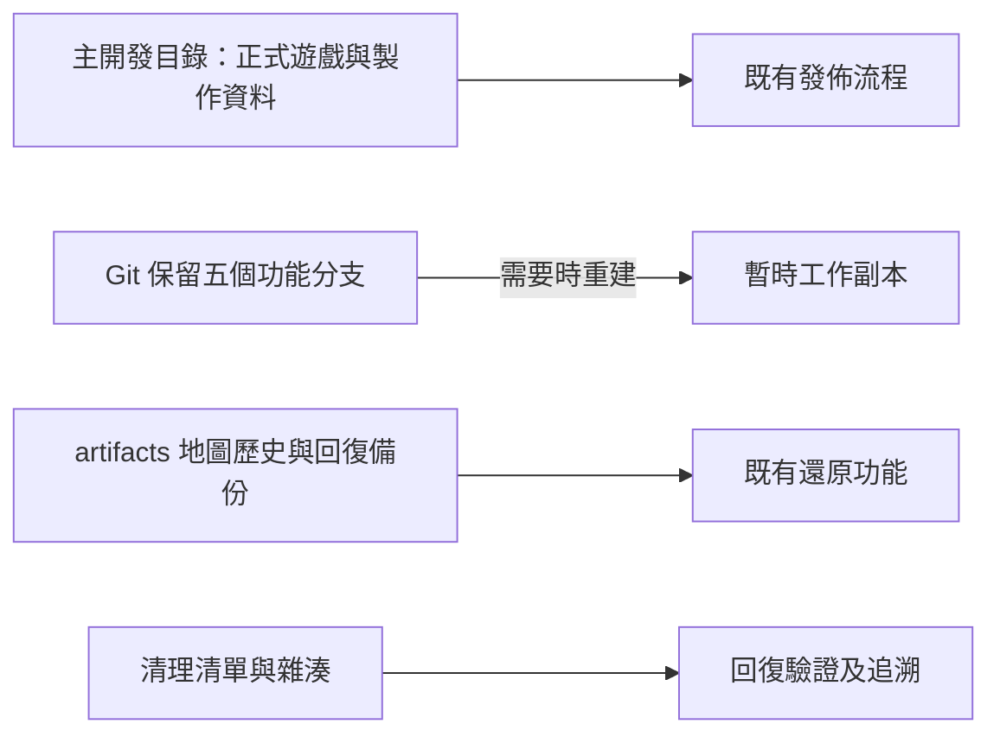

# 專案容量整理紀錄

- 維護版本：`storage-2026.09.28.1`
- 日期：2026-09-28
- 起始 Git 提交：`f475993`（遊戲當時為 v0.85.66）
- 目的：整合重複開發副本、清除可重建快取，保留現有遊戲與未來製作價值。
- 本次僅作本機儲存整理及文件更新；遊戲版號、素材路徑、API、資料庫、存檔與部署流程沿用現況。

## 實際處理

| 項目 | 移除量 | 處理方式 |
| --- | ---: | --- |
| 五份閒置 Git 工作副本 | 約 1.63 GiB | 保留原分支及提交；檢查未提交、未追蹤、忽略檔案與雜湊後，使用非強制 `git worktree remove` |
| 37 個測試瀏覽器純快取目錄 | 237,763,589 bytes，約 226.75 MiB | 依固定目錄清單核對雜湊、路徑、連結及獨占讀取後清除 |
| 合計 | 1,987,927,558 bytes，約 1.85 GiB | 此數為已記錄移除檔案量，不含約數百 bytes 的 worktree 指標及 Git 登錄差額 |

清理前檔案總量為 4,838,317,930 bytes，約 4.51 GiB。清理後中途量測為 2,869,299,160 bytes，約 2.67 GiB；同期另有功能開發持續新增素材與修改程式，所以總量差額不等於本次移除量。證據清單、當時未提交檔案備份與測試紀錄占約 6 MiB，後續紀錄可能小幅增加。

這次整合的是磁碟上的重複工作副本。五個功能分支仍保有自己的歷史，沒有將舊分支程式強行合併進現行遊戲。

## 保留資料

- 世界觀、故事設定、概念稿、參考圖、正式圖片與製作原稿全部保留。
- 正式遊戲入口、管理／預覽工具及其腳本、樣式、素材均保留。
- `artifacts/map-history` 當時已有 0–15 共 16 版地圖歷史，全部保留。
- `artifacts/naga-8d-v08554`、其他回復快照、release-snapshot、測試截圖、報告與崩潰證據保留。
- 測試瀏覽器的 Local Storage、Session Storage、IndexedDB、Service Worker、Cookies、Preferences、Crashpad 等資料保留。
- `.git` 與五個原分支保留；沒有壓縮或重寫歷史，沒有刪分支。

只因目前沒有遊戲引用，不能判定世界觀、候選角色、圖示原稿或旧圖沒有未來用途。完全相同但各自被程式引用的正式圖片亦保留，避免為少量容量引入路徑變更。

## 純快取範圍

僅處理以下五個已知測試 profile 中存在的固定子目錄：

- `artifacts/qa-v057/chrome-cdp`
- `artifacts/qa-v057/chrome-profile`
- `artifacts/qa-v057/chrome-profile-2`
- `artifacts/qa-v057/edge-profile`
- `artifacts/qa-v058/profile-1366`

固定子目錄為 `Default/Cache`、`Default/Code Cache`、`Default/GPUCache`、`Default/DawnGraphiteCache`、`Default/DawnWebGPUCache`、`ShaderCache`、`GrShaderCache`、`GPUPersistentCache`。

沒有使用全專案依名稱含 Cache 的搜尋刪除。清理前進程命令行未見上述 profile／worktree 絕對路徑，候選快取檔案亦通過獨占讀取；這不是對所有開啟檔案控制代碼的全面掃描。

## 保留的開發版本及還原

| 工作副本 | 保留分支 | 原提交 |
| --- | --- | --- |
| cinematic-player | feature/cinematic-player | 73865a679cc8aac5f8557be56757ab31ed332588 |
| codex-chronicle | feature/codex-chronicle | 2c934c0e751612299eac0161f80707cbe725477b |
| expedition-score | feature/expedition-score | ff8a9c170d2dff2ef98d3fb1246ac06cada9b397 |
| frostland-faction | feature/frostland-faction | 1dc70692614b46a19d5f93144b9704a379038b24 |
| shop-ui | feature/shop-ui | ba8413d875e3dc640dc476e2935201eb70121a62 |

五份副本都已實際重建、驗證，再以非強制方式移除驗證副本。驗證檔案數分別為 407、581、390、727、527。霜原副本的 14 個 ignored 參考檔已確認與主目錄同名檔 SHA-256 完全相同，重建時從主目錄複製並再次核對。

在專案根目錄使用 PowerShell 7：

```powershell
pwsh -File artifacts/storage-cleanup-20260928/restore-worktree.ps1 -Name cinematic-player
```

`-Name` 可改成表內其他工作副本名稱。工具拒絕覆寫已存在的目錄；分支仍在原提交時使用原分支，分支後來有進展則以原提交建立 detached 副本，不回退或覆寫該分支。若主目錄參考圖已改變，霜原完整還原會停止，要求先找回清單中對應原圖。

Windows Git checkout 可能將 LF／混合換行轉為 CRLF；部分還原文字檔不會與清理前逐位元相同。工具對這些檔案核對 Git 正規化後的內容物件，其餘檔案核對原 SHA-256，並明列兩類數量，不將換行差異宣稱為位元一致。

若只需重新取得分支程式，也可執行 `git worktree add .worktrees/cinematic-player feature/cinematic-player`。本次證據與工具位於被 Git 忽略的 artifacts；保存專案時需一併備份 `.git`、必要 artifacts 與 `assets/td/reference`。這是本機可回復整理，不代表已建立另一磁碟或遠端災難備份。

純快取不另備份，使用原測試瀏覽器時由瀏覽器重建。不要為重建快取而清除玩家儲存或重設 profile。

## QA 與限制

- `git fsck --full --no-dangling`：通過。
- 原五個分支及提交保留；五份副本均完成實際還原核對。
- 2,699 個非目標 artifacts 檔案：清理後全部存在且 SHA-256 未變，包含地圖歷史與回復工具。
- 清理前記錄的 623 個遊戲／素材／根目錄檔案：核對時無缺失；原素材均保留。同期其他開發正在修改部分程式與入口，因此沒有宣稱整個工作區逐位元不變。
- `npm run check`：通過。
- 靜態交付、地圖發佈、序章、商城四組測試：45/45 通過。
- 清理前全套：825 項，822 通過、3 項英雄進化相關失敗。
- 清理後全套當次：825 項，815 通過、10 失敗。期間現行地圖、故事、英雄與入口程式持續被其他開發修改；記錄此結果，不將它當成固定版本的前後回歸比較，也不宣稱全套綠燈。
- 本次未改動正式遊戲程式或素材；全套遊戲驗收應在同期功能整合穩定後另外完成。

詳細證據位於 `artifacts/storage-cleanup-20260928/`：容量清單、刪除清單、原分支、工作副本檔案雜湊、保護檔案雜湊、工作區當時未提交檔案備份、五份回復驗證結果與測試日誌。

## 後續維護規則

1. 保留一份主開發目錄；功能分支需要隔離時才建立工作副本，完成後核對唯一資料再退役。
2. artifacts 分成快取、驗收證據、回復備份、地圖歷史逐項管理，禁止整包清除。
3. 世界觀、原稿與未完成設計依製作用途保留，不以「現在搜尋不到引用」判定廢棄。
4. 整理正式發佈內容、圖片轉檔或路徑整併須另成一批；先檢查動態引用，再做全新瀏覽器、舊版升級與離線驗收。
5. 本紀錄的 cleanup.ps1 是帶有當次雜湊前置條件的一次性執行證據，不作自動定時清理工具；未來清理須重新盤點。


