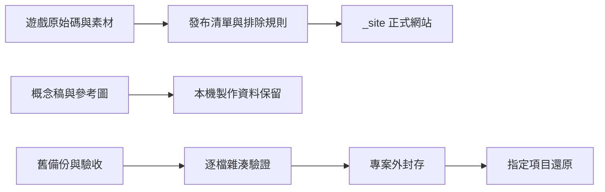

# 專案整理與發布分離

- 日期：2026-10-07；維護版號：`storage-2026.10.07.1`。
- 遊戲維持 v0.85.87；本次調整儲存位置與發布工具，不改玩法或玩家存檔格式。
- 起始提交：`4d223a7`；其他進行中的劇情／英雄介面修改不屬於本次提交。

## 已完成整理

65 個舊備份／驗收項目，共 2,219 個檔案、640,657,028 bytes（約 641 MB），移至專案旁：

`C:\Users\Owner\Documents\ChatGPT\HeroFrontier-Archives\2026-10-07`

封存保留原本 `artifacts/...` 相對路徑。主要包含 release-snapshot、map-grid、qa-nature-motion、舊版驗收圖、舊程式快照及五個舊測試瀏覽器的完整資料。逐檔記錄並核對 SHA-256，不刪除內容，不清除 Cookies、Local Storage 或其他瀏覽器資料。

其中 73 個、86,379,851 bytes 的舊驗收檔原本受到 Git 追蹤；此次從目前版本移出，歷史提交仍可取回。這不重寫 Git 歷史，也不表示 clone 包或 `.git` 立刻減少同樣容量。

同硬碟搬移只讓主專案減少約 641 MB，**不會釋放整顆硬碟的可用空間**。若要防硬碟損壞，仍須把封存資料另備份至其他磁碟。

## 保留內容

- `.git`、世界觀文件、全部正式素材、概念稿、參考圖與重複但仍被引用的素材。
- `artifacts/map-history` 的 36 份地圖版本；開發者工作台的還原功能維持原路徑。
- `artifacts/storage-cleanup-20260928` 舊回復工具與證據。
- `artifacts/naga-8d-v08554`、`artifacts/evolution-completion` 和近期地圖、故事、美術驗收資料。
- 新版地圖行動驗收資料及其指向素材資料夾的連結均留在原地。
- 工作區未提交修改。搬移後核對 588 個保護檔案（素材、地圖歷史及當時工作檔），均與搬移前一致。

`.release-stage` 和 `.worktrees` 目前為空資料夾，不影響容量；保留即可。

## 安裝、操作與還原

遊戲安裝與啟動沿用 README，不需要封存資料。沒有新增 npm 套件、API token 或資料庫。

封存工具需要 PowerShell 7.3+。在原專案根目錄執行：

```powershell
pwsh -File scripts/archive-project-artifacts.ps1 -Mode Verify
pwsh -File scripts/archive-project-artifacts.ps1 -Mode Restore -Target artifacts/map-grid
```

第二行只把舊地圖驗收資料搬回原路徑；不會覆寫正式地圖。若原位置已有新產物，工具拒絕覆蓋，需先另存新產物再還原。查看舊版備份手冊中的 `artifacts/...` 路徑時，若檔案已封存，先用相同 `-Target` 還原，再按原手冊操作。

重新封存已還原的項目：

```powershell
pwsh -File scripts/archive-project-artifacts.ps1 -Mode Archive -Target artifacts/map-grid
```

清單位於 `artifacts/storage-cleanup-20261007/archive-manifest.json`，另有完整副本位於封存資料夾根目錄。清單含原路徑、大小、SHA-256；兩份都應備份。新 clone 若要使用舊封存，先將封存中的清單複製到上述本機清單位置，並使用原專案路徑。工具拒絕不同根目錄、路徑越界、連結、檔案內容改變或目的地已存在，不會自動清除或覆蓋。

`-Mode Plan` 只用於本次固定範圍的首次盤點；清單已存在時拒絕重建。此工具不是定期刪除器，勿把本次備份名稱規則直接用於未來自動清理。

## 正式發布與製作資料

`scripts/build-static-site.cjs` 沿用原發布入口、CSS、webmanifest、sw.js、assets、src，只排除：

- `assets/td/concepts/`：20 個製作概念稿，共 59,056,230 bytes。
- `assets/td/reference/`：14 個本機參考檔，共 35,379,906 bytes；本來已不進 Git，新增本機打包防線。
- 既有的 `codex-dev.html` 與 `src/td/codex/CodexDebug.js`。

概念稿、參考圖全部保留原檔。正式發布相較上一版少約 59.1 MB；本機打包排除量另含約 35.4 MB 未追蹤參考圖。這是整個發布目錄容量，不代表玩家每次開遊戲的下載量。尚未確認可安全退役的舊素材、動態序章／首領圖片、管理及預覽入口仍保留。

```powershell
npm run check:site
npm run build:site
```

第一行只檢查並列出容量，不寫入 `_site`；第二行建立 `_site`。如果 `_site` 已存在，先把它移到備份位置，再重新執行；工具刻意拒絕混入舊輸出，避免已排除的檔案殘留在線上。GitHub Actions 改呼叫同一個打包命令，從乾淨 checkout 建立網站。

## 架構與介面



沒有新增 HTTP API。Node 工具匯出 `plan(root)`（唯讀清單）及 `build(root)`（建立新的 `_site`），CLI 只接受無參數或 `--check`。封存清單 schema 1 是本機維護資料，不讀寫玩家帳號、戰績或章節存檔。

## QA 與版本回復

- 2,219 個封存檔案搬移前後 SHA-256 一致；獨占讀取檢查通過。
- 588 個受保護檔案在搬移前後一致，36 份地圖歷史完整保留。
- 實際還原 `artifacts/check-v0.38.0.txt`、核對內容並重新封存成功。
- 新增 3 項發布測試：全部 SW 資產與 HTML 依賴可發布、動態素材與原稿保留、排除規則及拒絕覆蓋既有輸出。
- 發布前執行 `npm run check:site`、`node --test tests/static-site-package.test.js`，並對本次提交的獨立副本執行全套測試。
- 本次獨立副本實測：1,034 項測試全數通過，`npm run check` 與發布清單檢查通過。發布內容 715 個檔案、795,935,239 bytes；所有 SW 宣告資產均存在。
- 回復發布工具時可撤回本次維護提交，沿用上一版工作流；本機檔案仍用封存還原工具取回。不要直接將歷史驗收圖加入新版發布包。

## 常見問題

**整理後遊戲缺圖嗎？** 正式素材未搬移；發布測試涵蓋 SW 清單、HTML 引用、序章、劇情、首領及地標素材。

**為什麼資料夾變小，硬碟空間沒增加？** 本次採可還原封存，資料仍在同一顆硬碟。

**舊驗收連結打不開？** 依封存清單找相同路徑，用 `-Mode Restore -Target artifacts/項目名稱` 還原。

**找不到清單？** 從封存根目錄取回 `archive-manifest.json`；若封存也不在，先找備份，不要以空清單重新執行。
