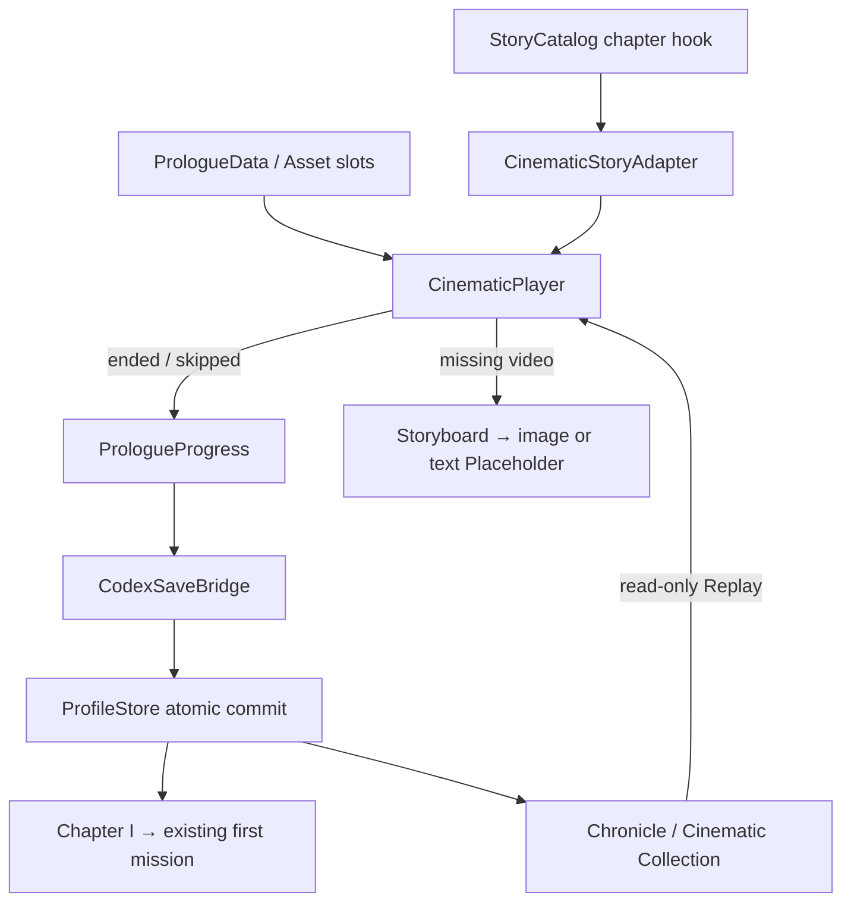

# HERO FRONTIER — PROLOGUE CINEMATIC V1

程式版本：0.83.3；資料版本：1.0.0；序章｜破碎的和平之前；顯示名稱：《曾經的和平》。

## 產品範圍與開發決策

交付播放、資料、Story 觸發、Chronicle 收藏與 Asset 插槽。採使用者提供的 10 個 Shot，總長 60 秒；不新增鏡頭或 Canon。WORLD_STORY_BIBLE_V1.md 保持原樣；不修改 Combat Balance。此版本沒有正式影片、正式 Key Frame、配音或新角色設計。

先定義資料與素材／Reference，再實作播放器，再接入玩家進度與收藏，最後驗收及補齊文件。未知角色外觀與場景設計維持 null／pending-approval。片尾兩句 Concept Line 僅有 2 秒，是沿用指定 Shot 時段；正式配音前需由製作方確認可讀性，不能擅自延長或增加 Shot。

## 安裝與第一次使用

1. 保留完整專案目錄，安裝 Node.js 18 以上。
2. 在根目錄執行 `npm run check`、`npm test`。
3. 執行 `npm run serve:test`，瀏覽器開啟 `http://127.0.0.1:4173/td.html`。這是本機伺服器，只綁定 127.0.0.1。
4. 點「劇情模式」→「開始挑戰」。未看過序章時自動播放。
5. 素材未完成時，介面顯示分鏡預覽。可暫停、關閉字幕、跳過；Esc 等同跳過。
6. 完成或跳過後進入 Chapter I《破碎的和平》標題頁，按「開始第一個故事任務」即可進入既有「烽火初燃」任務。

直接開 `td.html` 的 `file://` 模式也可使用文字預覽與內建 Concept 字幕。正式影片／外部字幕建議透過 HTTP 測試。沒有新增 npm 安裝依賴、伺服器 API、資料庫或登入設定。

「New Game」是目前新玩家測試輪次的第一次故事任務；在設定開啟新一輪會先封存舊輪次。管理者、測試與封存輪次分別保存觀看紀錄。同輪次已看過後，「開始挑戰／重玩任務」直接進任務，不強制再播。

## A／B／C：素材與字幕

- MP4：`assets/cinematics/prologue/prologue_zh_tw.mp4`。
- 10 張 Key Frame：`assets/cinematics/prologue/shot_01_world.webp` 至 `shot_10_title.webp`；完整檔名與時間見 [素材插槽](../assets/cinematics/prologue/README.md)。
- 字幕：`assets/cinematics/prologue/subtitles/zh-TW.vtt`、`en.vtt`、`ja.vtt`，UTF-8 WebVTT。
- 角色、地點及字幕 Schema：`assets/cinematics/prologue/cinematic.schema.json` 的 `$defs.character`、`$defs.location`、`$defs.subtitles`。
- 製作資料匯出：`assets/cinematics/prologue/manifest.json`。

資料來源 `src/td/cinematic/PrologueData.js` 為 classic script，可離線載入。編輯資料後執行 `node scripts/export-prologue-manifest.cjs`，再跑測試檢查匯出是否一致。正式 MP4 建議使用目標瀏覽器支援的 H.264／AAC，畫幅 16:9；依實際影片長度驗收字幕與片尾。不得用佔位空檔冒充 MP4／WebP。

繁中目前只有使用者提供的 Concept 字句；英文與日文保留空檔且選單停用。核准翻譯完成後更新對應 VTT，在 `subtitleTracks` 對應的 status 改為 `approved`，同步 inline cues 與 manifest。播放器依 VTT 顯示影片字幕；VTT 載入失敗或 file:// 受限時改用內建同語言 cues，未知語言不自動生成翻譯。

## D：Story 呼叫與進度 API

```js
const api = TowerFrontier.cinematic;
const player = new api.CinematicPlayer(api.prologueCatalog);
const progress = new api.PrologueProgress(frontierApp.store);
const identity = progress.identity();
if (!progress.prologueSeen) {
  const result = await new api.CinematicStoryAdapter(player).trigger(
    TowerFrontier.systems.StoryCatalog.chapters[0],
    'cinematicOnChapterStart'
  );
  if (progress.complete(result, identity)) {
    // Host 顯示 Chapter I，再進入第一個 Story Mission。
  }
}
```

`StoryCatalog.chapters[0].cinematicOnChapterStart` 為 `prologue_before_shattered_peace`。實際入口為 `FrontierApp.startCinematic()`，完成後由 `finishPrologue()` 儲存並顯示第一章。

`player.play(cinematicId, {replay?})` 回傳 Promise：`{cinematicId, watched, reason, playback, replay}`。`ended`／`skipped` 的 watched 為 true；`unknown`／`busy` 不記錄觀看。播放器本身不寫存檔。Story Adapter 保留 `cinematicOnChapterStart`、`cinematicBeforeBattle`、`cinematicAfterBattle`、`cinematicOnChapterComplete` 介面；未知 hook 拒絕，播放器例外回傳 `player-error`。

`PrologueProgress.complete(result, identity)` 只接受本片 ended／skipped，拒絕錯誤 ID、播放未完成及已切換的玩家／輪次。寫入失敗會拋出，UI 提供重試與備份。重複完成為冪等。`prologueSeen` 從目前 profile 的 `cinematics` 推導，不另存第二個可能不同步的布林值。

## E：Chronicle 收藏與重播

大廳「世界圖鑑」→「編年史 / Cinematic Collection」→《曾經的和平》→「Replay Cinematic · 重播影片」。觀看和跳過具有相同收藏資格；未解鎖時只有前往故事按鈕。

```js
await progress.replay('prologue_before_shattered_peace', player);
```

Replay 不寫入存檔，不完成任務，不發放獎勵，也不進戰鬥。Source：`CONFIRMED / STORY EXPERIENCE`。

沿用既有 Codex 契約：`profile.cinematics` 儲存 `cinematic:<id>`；`profile.data.codexProgression` 儲存 Codex envelope。完成時以一次 ProfileStore commit 寫入 watched、unlocked 與專屬 `prologue.experienced` 里程碑。收藏 Seed 為 `TowerFrontier.cinematic.prologueChronicle`，可供既有 CodexCatalog 的 chronicles 設定使用；`cinematicProgress: id => progress.state(id)` 提供解鎖與觀看状态。完整 Codex UI 若整合，應將此 Seed 加入其 seed 清單，將 Replay 連至同一個 player；不得額外發出後續故事里程碑。

此工作目錄原先尚未整合其他工作副本的完整 Codex 頁面。本次使用 `feature/codex-chronicle` 既有 `CodexProgressAdapter`、`ChronicleProgressAdapter`、`CodexSaveBridge`；使用 `feature/cinematic-player` 現有 Catalog 與 Story Adapter 契約。只將所需模組帶入目前專案，不覆寫其他工作副本；大廳提供本次 Cinematic Collection 入口。未合併完整 Codex／商城分支。

## F：Missing Asset 與例外

- MP4 404、解碼失敗或載入逾時：改為 60 秒 data-driven storyboard；播放中停滯超過 8 秒亦回退。
- Key Frame 404：當段顯示 Shot 標題與描述，時間軸照常前進。
- 字幕缺少：用同語言 inline Concept cues；不阻擋 Skip。
- 自動播放遭瀏覽器拒絕：顯示「點此播放」，仍可選分鏡预覽或跳過。
- 頁籤隱藏：暫停，返回後恢復原播放狀態；使用者手動暫停不會自動恢復。
- Skip／結束：停止影像、取消動畫與 timeout、移除監聽器、關閉 dialog 並恢復焦點。
- 存檔配額、其他分頁競爭：不覆寫現有資料。顯示可讀訊息與重試，必要時匯出後重新整理；不要清除瀏覽器資料。

## 架構與資料夾



`src/td/cinematic/` 為播放與序章資料；`src/td/codex/` 為既有存檔 Adapter；`src/td/app/` 為大廳与 Story 接線；`assets/cinematics/prologue/` 為素材與 schema。核心战鬥模組不依賴播放器。

## 部署、更新與回復

發布時帶上上述目錄、`td-cinematic.css`、更新後 `td.html`／`sw.js`。目前只準備本機修改，尚未部署。Service worker 版本為 `sky-strike-v0.83.3`，只預快取實際存在的殼層與繁中字軌；不把尚未存在的影片或 10 張圖片加入安裝清單。MP4 與 Range 請求交由伺服器及瀏覽器處理，不快取 partial response。正式靜態主機應提供 video/mp4、text/vtt 與影片 Range 支援。

更新前在設定匯出「完整備份」。同一 origin 的新版沿用 `heroFrontierProfilesV1`，不需資料遷移。新觀看紀錄與收藏會隨既有備份匯出／匯入，封存輪次也包含在內。

本次修改前的檔案快照位於 `artifacts/prologue-v0833-backup/`；其中保留了原本尚未提交的修改。要回到本次實作之前：先另備份目前目錄與瀏覽器存檔，再依快照內的相同相對路徑覆回原檔，重新啟動站台並讓舊版 service worker 接管。新增的 cinematic 檔案可保留但不再被舊入口載入；不要使用 `git reset --hard`，也不要覆寫其他工作副本。單純回復程式不會刪除玩家資料。

## QA 與後續驗收

`npm run test:cinematic`：時序、10 Shot、引用、字幕、完成／Skip、原子儲存、重播唯讀、隔離、匯出匯入、後續線索未解锁、Story 入口与 Bible hash。

`node scripts/qa-prologue-cinematic.cjs`：需 Node 可找到 Playwright 與已安裝 Edge；先以 `TD_TEST_PORT=4175` 啟動本機伺服器（PowerShell：`$env:TD_TEST_PORT='4175'; npm run serve:test`）。可用 `PROLOGUE_TEST_URL` 指定站台。檢查缺素材、暫停、Skip、回顧、手機畫面、自然結束及字幕。

`node scripts/qa-prologue-media.cjs` 額外測試真實瀏覽器解碼／ended、載入逾時及 file:// Story 流程。解碼素材為記憶體中的純色 WebM 短片，不寫入正式 MP4 插槽，也不等同正式 H.264 影片驗收。

本次驗收：`npm run check` 通過；完整測試 453／453 通過；兩組 Edge 瀏覽器測試皆無 pageerror。截圖與結果在 `artifacts/qa-prologue-v0833/`；變更檔案與修改前／後雜湊在 `artifacts/prologue-v0833-release.json`。

正式 MP4、圖片與翻譯到位後，仍須驗收影片音畫、實際字幕同步、十張圖的一致性及角色身分保密。Reference approved 前不視為正式美術完成。這些尚未製作的內容不會阻擋目前 Story。
