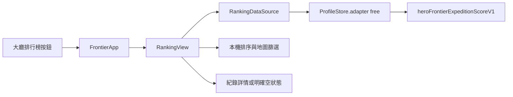

# 排行榜介面 v0.84.2

> 歷史版本：v0.84.2 曾有版型預覽與 SCORE_V1 讀取。v0.84.4 已移除示意玩家，改讀實際戰報並收錄勝、敗、撤退。當前操作以 [v0.84.4 規格](EXPEDITION_SCORE_PROFILE_V0844.md) 為準。

## 產品範圍

大廳「排行榜」現在可開啟完整頁面。桌面採列表與詳情雙欄，橫向手機保留精簡雙欄，直向手機採單欄與可橫向捲動的主導覽。列表可查看名次、玩家／英雄、陣營、地圖／難度與遠征積分；點選紀錄可查看時間、基地生命、波次、積分及已記錄的裝備。使用者可切換總積分榜、地圖排行榜、尚未開放的本週挑戰與好友排行，地圖榜可篩選地圖。右側「積分規則」解釋 SCORE_V1 概念。

目前排行榜**只讀取當前玩家檔案的本機 SCORE_V1 成績**。名次是此檔案內依分數排序的位置，不是世界名次。沒有接通線上排名、好友服務或賽季服務；頁面會直接說明。當目前檔案完全沒有積分資料時，首次進入會先顯示十筆**明確標示的版型預覽**，讓頁面設計可直接檢查；按「查看本機紀錄」可看到真實空狀態。已有真實資料時預設顯示真實紀錄，也可自行切換預覽。預覽不會寫入存檔。沒有有效紀錄、積分資料損毀與未開放頁籤均有不同提示。參考圖片只作為視覺方向，未使用圖中的玩家資料當作真實成績。

## 架構與資料流

- `src/td/ranking/RankingDataSource.js`：只讀當前 ProfileStore 的 `free` 命名空間；接受 `schemaVersion: 1`、`runHistory` 陣列，僅顯示 `valid: true`、`validationStatus: local_unverified`、`scoreVersion: SCORE_V1` 且分數為非負安全整數的紀錄。讀取失敗不改寫原始資料。最多讀取 100 筆。
- `src/td/ranking/RankingView.js`：持有頁籤、地圖、頁碼、選取紀錄與預覽狀態；每頁最多 10 筆，依分數降冪排序；地圖榜依地圖／難度選取該組最佳。所有可變文字經 HTML 跳脫，圖片路徑由程式內映射，不採用存檔提供的 URL。
- `src/td/app/FrontierApp.js`：大廳導覽、排名互動事件與頁面渲染。戰鬥、玩家檔案與商城模組維持獨立。
- `td-ranking.css`：桌面、橫向手機與直向手機斷點；`td.html` 在大廳樣式後載入。
- 沒有新資料庫或 HTTP API。當未來有伺服器排名時，應在資料來源層新增經驗證的線上資料介面，並保留本機未驗證成績與正式排名的標籤區分。不得直接上傳或宣稱本機分數為正式世界名次。

## 操作

1. 開啟 `td.html`，點左側「排行榜」。
2. 若已有同一玩家檔案的 SCORE_V1 自由遠征紀錄，點列表任一列看詳情。若沒有紀錄，先看到明確標示的版型預覽；點「查看本機紀錄」看真實空狀態，亦可再切回預覽。
3. 點「地圖排行榜」與地圖按鈕切換地圖最佳紀錄。可點「積分規則」查看計分說明。
4. 「本週挑戰」與「好友排行」會說明服務尚未開放，並提供返回本機紀錄的按鈕。

## 安裝、部署與更新

需要 Node.js 18+ 來跑測試；遊戲本體仍是靜態檔。保持 `td.html`、`td-ranking.css`、`src/td/ranking/*`、原大廳檔案與 `sw.js` 同一版本部署。可直接開啟 `td.html`，或執行 `npm run serve:test` 後開啟 `http://127.0.0.1:4173/td.html`。正式部署使用 HTTPS 靜態主機並一併更新 Service Worker，離線快取名稱為 `sky-strike-v0.84.2`。更新前在「設定與測試」匯出玩家備份；更新後重載並確認大廳顯示 `v0.84.2`、排行榜可開啟與預覽可關閉。沒有玩家檔案 schema 遷移。

## 備份與回復

玩家資料仍由 ProfileStore 匯出／匯入。正式玩家成績只有在同一玩家檔案的 `free:heroFrontierExpeditionScoreV1` 存在時才會出現；獨立 SCORE_V1 分支上的全域 localStorage 成績不會被自動搬入，避免混淆檔案與測試輪次。若要回復 v0.84.1，先保留玩家備份，再恢復上一版 `td.html`、`FrontierApp.js`、`ProfileStore.js`、`package.json`、`sw.js`，移除新增的排行榜 CSS／JS 引用，重新載入讓舊快取生效。玩家資料可沿用；不需刪除 localStorage。尚未提交的工作目錄請以檔案備份或版本控制差異做精準回復，勿整批清除其他開發中的檔案。

## 測試與已知限制

執行 `npm run test:ranking`、`npm run check`、`npm test`。瀏覽器人工檢查桌面 1920×900、橫向 844×390、直向 390×844：導覽、列表、空狀態、示意資料標籤、詳情、地圖篩選、未開放頁籤、積分規則及捲動。分數資料由尚未合併的 SCORE_V1 分支產生，因此此大廳版本的正式資料區通常會顯示空狀態。線上驗證、世界排名、賽季、好友關係與跨裝置同步仍需後端服務。

## 常見問題

- **為什麼只有示意資料？** 這個大廳尚未整合 SCORE_V1 分數產生器，也未接線上服務。預覽只展示介面，不代表成績。
- **為什麼找不到另一個測試輪次的分數？** 每個玩家檔案與測試輪次隔離；切回原檔案才會顯示該檔案的紀錄。
- **積分紀錄無法讀取？** 原始內容沒有被修改。先從設定匯出完整備份，再檢查瀏覽器儲存空間或資料格式。
- **手機看不到全部欄位？** 橫向手機保留玩家、地圖與積分；直向手機以玩家與積分為主。點紀錄可在詳情區讀到完整內容。
