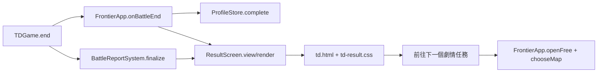

# HERO FRONTIER v0.84.6：遠征結算畫面

## 產品決策與使用方式

完整一場戰鬥結束時顯示結算卡；波次之間沿用原本的簡短提示，不打斷部署。卡片先告知勝敗，再並列得分、評級、用時，最後提供下一步。劇情任務通關並成功儲存後，獎勵卡標示解鎖的自由遠征戰場，主按鈕則前往下一個劇情任務的章節地圖。自由遠征戰場可從大廳另外選擇；最後一個劇情任務沒有下一關按鈕。

重玩劇情任務時，地圖卡改稱「已解鎖戰場」。存檔失敗時不宣稱解鎖，結算文字提醒保留頁面、匯出備份。劇情失敗與自由遠征結算顯示戰績、重試及返回選項，不出現劇情解鎖卡。自由遠征刷新最佳分數會出現明確提示。若已完成波次，可按「查看完整戰報」。手機橫向在不遮蔽主要操作的前提下縮小間距；卡片過長仍可捲動。

## 架構與資料流

- `src/td/systems/ResultScreen.js` 只整理結算資料並寫入既有 DOM；分數由 `BattleReportSystem` 提供，任務、解鎖和存檔狀態由 `FrontierApp` 提供。沒有新增資料庫或網路 API。
- `FrontierApp.onBattleEnd(victory)` 回傳 `{mode, mission?, saved?, canContinue?, newlyUnlocked?}`；`ResultScreen.view(result, options)` 回傳顯示模型，`render(ui, result, options)` 更新畫面。文字使用 `textContent`，避免將戰報資料作為 HTML 插入。
- `td-result.css` 管理桌機和手機尺寸；背景圖位於 `assets/td/lobby/victory-background-v1.png`。新 CSS、JS 與圖片列入 `sw.js` 快取；圖片採使用時載入。

## 安裝、更新、部署與設定

依 [安裝手冊](INSTALLATION.md) 使用 Node.js 18 以上版本，在專案根目錄執行 `npm run serve:test`，預設開啟 `http://127.0.0.1:4173/td.html`。若要執行本版瀏覽器 QA，在 PowerShell 先設定 `$env:TD_TEST_PORT=4175` 再啟動服務，網址改為 `http://127.0.0.1:4175/td.html`。正式執行不需新增套件、環境變數、帳號或權限。更新前依 [備份還原手冊](BACKUP_RESTORE.md) 匯出遊戲資料，再部署 v0.84.6 靜態檔；重新載入頁面，確認畫面版本與離線快取更新。若畫面仍舊，先關閉該頁再重新開啟，必要時確認 service worker 已更新；不要清除玩家資料。部署與一般更新流程分別見 [部署手冊](DEPLOYMENT.md) 和 [更新手冊](UPDATE_GUIDE.md)。

## 回復與常見問題

修改前的 25 個檔案保存在 `artifacts/victory-screen-v0845-backup/`，可作為工作區局部回復參考。正式回復應以版本管理中的 v0.84.5 程式碼和對應靜態資產重新部署，並將快取版本設為該版；玩家資料應先匯出，再按 [備份還原手冊](BACKUP_RESTORE.md) 處理。請勿直接刪除瀏覽器儲存空間。

- **通關卻沒有「前往下一個劇情」：** 確認劇情任務已成功儲存；最後一個已開放任務不會顯示下一關按鈕。自由遠征通關不會解鎖劇情獎勵。
- **戰報按鈕沒出現：** 至少完成一波後才有詳細戰報。
- **手機卡片看不到底部：** 在卡片內向上滑動；橫向操作可看到主要按鈕和戰報入口。

## 驗收

`npm run check` 通過；結算及相鄰 UI 的 55 項測試通過。共享工作區後續升至 v0.84.7 時，整套 `npm test` 為 535 項中 531 項通過：三項地圖數量測試仍預期舊版內容（`td-autumn`、`td-expedition-setup-v2`、`td-map`），另有新故事獎勵清單與圖鑑事件測試不一致（`td-feature-integration`）；這些都不經過結算顯示模組。`node scripts/qa-result-screen.cjs` 在可用的 Playwright 環境通過：桌機 1440×900 與觸控橫向 844×390、首通戰績、卡片可讀性、詳細戰報開關、重玩標籤、失敗顯示、返回章節地圖，以及解鎖按鈕開啟雙隘口要塞出征選擇。單元測試另覆蓋存檔失敗、自由遠征與後續故事任務的獎勵地圖路由；截圖位於 `artifacts/qa-result-screen-v0846/`。
