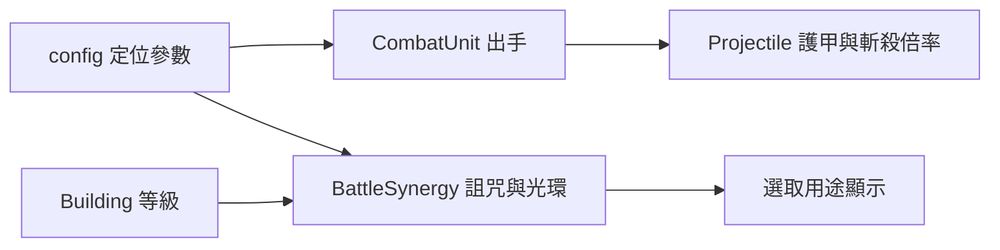

# 既有士兵與支援塔定位調整（0.69.9）

## 產品目標

本版讓玩家能用一句話回答「為什麼要買這個單位」，並讓每個軍團至少保有兩條配隊路線。沒有改變固定部署、不承傷、不阻擋的核心規則，也沒有新增資料庫或 HTTP API。

| 軍團 | 路線 A | 路線 B |
| --- | --- | --- |
| 王國 | 獵手／盾衛／統領的軍陣 | 火槍手／煉金術師的精英點殺 |
| 月影 | 奧術學徒／月刃的印記彈射 | 林裔獵手／古樹／古龍的自然引爆 |
| 暗影 | 女妖詛咒／骸將收割 | 召喚殿／墓園／魂鋼魔像的亡魂循環 |

## 數值與規則

- 王國獵手：Lv1～5 同時射擊 2／3／3／4／4 個不同目標，取代原先 2／3／4／5／6。
- 王國盾衛：射程 84 → 90；第四擊產生半徑 44 的盾震，群體受到 0.58 倍移速、持續 1.05 秒。
- 皇家重裝統領：光環由其他士兵傷害 +18% 改為攻速 +18%。王國戰旗繼續提供傷害，兩者可同時成立。
- 奧術學徒：傷害 13 → 15、射程 132 → 140、爆炸半徑 42 → 48，補足古龍前的中期範圍火力。
- 魂鋼魔像：傷害 32 → 34、射程 84 → 94、爆炸半徑 30 → 36；對重甲額外 ×1.3。
- 暮影女妖：傷害 16 → 14、射程 154 → 164；連鎖命中施加 4 秒詛咒，使其他來源傷害 +12%。
- 幽騎骸將：射程 90 → 96；攻擊生命低於或等於 30% 的敵人時傷害 ×1.45。

## 支援塔升級

支援塔升級現在同時增加效果與既有射程：補給站折扣 15% → 20%、戰旗傷害 12% → 20%、軍械工坊塔傷 15% → 23%、古樹自然傷害 15% → 23%、墓園召喚傷害 25% → 37%。選取建築會顯示當前等級的實際比例與範圍；同類效果取最高值。

## 架構

`bonusVsHeavy` 與斬殺欄位經 BattleSynergySystem.prepare 傳入既有 Projectile。統領攻速每次更新重算；BuildSystem 另保存戰鼓堡的 `towerSupportHaste`，移除統領後不殘留，也不會清掉建築支援。

## QA、部署與還原

新增 `tests/td-roster-balance.test.js`，驗證盾震、重甲加成、詛咒、斬殺、支援塔成長與月影中期選項。2026-09-17 驗證結果：`npm test` 378／378 通過，`npm run check` 通過。同預算完整 30 波、各難度與傭兵組合仍需長期樣本，自動規則測試不等於統計平衡。

完整部署 0.69.9，服務工作者快取為 `sky-strike-v0.69.9`。無資料遷移，既有戰績可保留，建議重開一局。還原時先保存當前專案，再以版本差異回退本文件列出的參數；工作區含其他同步修改，不應整體覆蓋或重設。

常見問題：女妖面板傷害降低是把強度轉為詛咒；骸將必須等目標降到 30%；同類支援只取最高值；選取支援建築可查看升級後比例。
