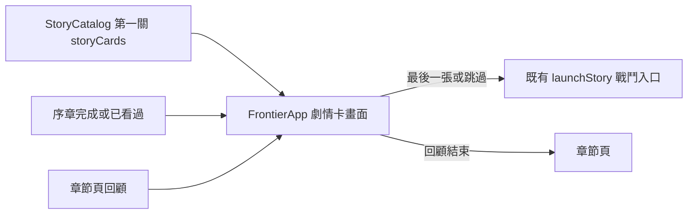

# v0.85.13 《烽火初燃》圖像劇情卡與第一章 Key Art

## 產品目的與範圍

第一關開戰前的三段長文字改為三張短劇情卡，讓第一次遊玩的玩家在幾秒內理解「谷地受襲、對方也是王國士兵、雷恩先守城再調查」。卡片改用新生成的王國場景、雷恩人物與王國軍畫面；另收錄暮影平民撤離場景，作為第三關的已核准視覺方向。沒有新增英雄、軍團、真兇證據或世界觀定論。後三關、60 秒序章與戰鬥數值不變。正式影片、配音與音效仍未製作。

## 第一章 Key Art

| 檔案 | 用途 | 圖像內容 |
| --- | --- | --- |
| `assets/td/story/kingdom-border-at-dusk-v1.png` | 第一張卡 | 王國谷地城門、烽火與預警火盆。 |
| `assets/td/story/rhen-oathkeeper-v1.png` | 第二張卡 | 守誓者・雷恩，面向不明命令與王國軍。 |
| `assets/td/story/kingdom-checkpoint-order-v1.png` | 第三張卡 | 王國軍在檢查王室命令，呈現他們也受命令所困。 |
| `assets/td/story/shadowfolk-evacuation-v1.png` | 第三關預留 | 暮影平民在舊城撤離，刻意以互助與恐懼取代反派視覺。 |

四張皆以 built-in ImageGen 生成，使用「高階奇幻遊戲 Key Art、16:9、左側留繁中劇情文字空間、無文字／商標／浮水印」為共通約束。王國畫面使用藍、金、鋼鐵與低飽和山景；暮影畫面使用靛藍、紫、暖燈與雨夜，角色均為平民，不出現黑魔法或邪惡符號。

## 玩家操作

1. 開啟 `td.html` → 劇情模式 → 選《烽火初燃》→ 開始挑戰。首次進入時先觀看或跳過原序章，再按「觀看戰前短劇情」。已看過序章時直接進入劇情卡。
2. 每張卡按「下一幕」閱讀，第三張按「開始戰鬥」。任何一張都能按「跳過並出征」。卡片停留時間由玩家控制，不會自動跳頁。
3. 在章節頁按「回顧本關劇情」可重看三張卡；回顧不開戰、不修改存檔。手機以橫向遊戲容器顯示，直拿手機時畫面隨容器旋轉。

## 系統與內容

`src/td/app/StoryCatalog.js` 保存三張卡的標題、短句、圖片；`src/td/app/FrontierApp.js` 管理索引、跳過、回顧與進戰鬥；`td-lobby.css` 負責圖片緩慢推近、文字淡入、桌機和手機排版。沒有新資料夾、資料庫、HTTP API、存檔欄位或權限。圖片均為原本離線資產。劇情卡文字只陳述第一關現有情況與雷恩的疑問，不揭露王子遇害真相。

## 安裝、更新與部署

沿用 Node.js 18+ 和靜態網站部署。開發者執行 `npm run check`、`npm test`，再執行 `npm run serve:test` 並在瀏覽器開啟 `http://127.0.0.1:4173/td.html`。玩家不需額外安裝或設定。部署時同步更新 `StoryCatalog.js`、`FrontierApp.js`、`td-lobby.css`、`sw.js`、`update.html` 與版本號；使用既有 `update.html` 更新入口。更新前可在大廳設定匯出完整備份，雖然本次沒有存檔格式變更。

## 驗收與排錯

- 首次序章完成或跳過後出現第一章，再進入三張卡；已看過序章後直接進卡。
- 三張卡可閱讀、可跳過、第三張能開戰；回顧回到章節頁且不寫存檔。
- 圖片能解碼，文字與按鈕在桌機及手機橫向畫面可見；`prefers-reduced-motion` 會停用動畫。
- 圖片失效時仍有文字與操作按鈕；若畫面仍是舊版，使用大廳設定的更新入口重試。
- `node --test tests/td-prologue-cinematic.test.js tests/td-story-maps.test.js` 驗證故事進入與解鎖；`scripts/qa-story-cards.cjs` 可在有 Playwright、Edge 與本機測試伺服器時做桌機／手機視覺驗收。

## 回復與後續

先保留玩家匯出備份，再對本版提交執行 `git revert <提交>`，一起回復程式、CSS、Service Worker 與更新頁版本。若尚未提交，保留本次差異補丁再逐檔回復；不要清除瀏覽器玩家資料。未來擴到後三關時，需先確認每關的戲劇事件與史料揭露時機；雷恩是否等同禁衛軍團長仍待敘事設定核定，本版未替他增加職務。
