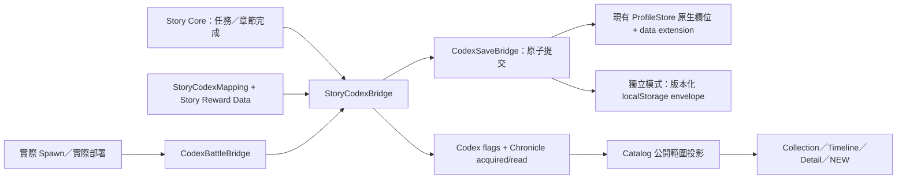

# STORY × CODEX PROGRESSION V1 / CHRONICLE UX V1.2

版本：0.79.3-codex.3，圖鑑 1.2.0，2026-09-21。分支 feature/codex-chronicle；前一版 a36c0fb。保留 PC 左 Category／中央 Collection／右 Detail 與八個主分類。21 筆史料文字不變，不新增 Canon，不改 Combat Balance。

## 1. Audit 與範圍

|責任|目前位置|本次處理|
|---|---|---|
|Story 任務與章節|其他未合併工作：src/td/app/StoryCatalog.js|只讀 Audit，不複製；getMission 讀取正式資料|
|Story UI／生命週期|其他未合併工作：src/td/app/FrontierApp.js|不修改；提供 bindStoryCore／handleStoryEvent 接口|
|Save／Profile／Unlock|其他未合併工作：src/td/app/ProfileStore.js，0.83.0，root saveVersion 1|CodexSaveBridge 注入現有 instance，重用 current/change|
|Codex flags／收藏|src/td/codex/CodexProgressAdapter.js|單向狀態推進、revision/readRevision|
|Chronicle Seed／逐段取得|ChronicleSeed.js／ChronicleProgressAdapter.js|原 21 筆與 acquired/read 不變；新增明確 archive status|
|事件與章節獎勵|StoryCodexMapping.js／StoryCodexBridge.js|Data-driven、批次原子保存、重複事件防護|
|實際 Battle Spawn／部署|WaveSystem.update、BuildSystem.placeQueued|CodexBattleBridge 包裝 instance 方法，依實際新增 entity 記錄；dispose 可還原|
|結算與圖鑑入口|CodexBattleBootstrap.js／td.html|接入現有 td 遊戲；結算 NEW CODEX ENTRY、開局畫面入口 NEW|
|閱讀與遮罩|CodexCatalog.js／CodexView.js／codex.css|投影後才搜尋與關聯；Collection／Timeline 共用|

Audit 發現 FrontierApp.onWave 現在寫入整波預定敵種，並不等同實際遇見；Codex Battle Bridge 不依賴此回呼。未合併 Profile 原生 encountered 可能含此歷史資料，轉接時保留既有紀錄，正式 Merge 應移除舊的預告式寫入，改接實際 spawn。

FrontierApp.startCinematic 在播放開始時呼叫 seenCinematic，因此舊的原始任務 ID 不作為完整觀看證明。新的已看完記錄使用原 cinematics 陣列中的 cinematic:<assetId>。

WORLD_STORY_BIBLE_V1.md 僅用於內容核對，沒有修改、複製或供前端載入；SHA-256：E209A0BDA0E48AE7DBF92B030D242563503ED31928530BE51DB99D0CA665688C。

## 2. 架構與目錄



新增模組集中於 src/td/codex，不新增資料庫或網路 API。scripts/verify-progression-browser.cjs 負責瀏覽器整合測試；tests/td-story-codex.test.js 負責 Mock Flow、存檔與接口。codex-dev.html 是本機開發入口。

## 3. Event Mapping Schema / API

```js
const mapping = {
  version: 1,
  events: {
    'mission-completed:mission-id': [
      { action: 'discoverEntry', entryId: 'enemy:halberdier' },
      { action: 'unlockChronicle', entryId: 'chronicle:black-magic',
        milestone: 'chapter1.black-magic-taboo-known' }
    ],
    'chapter1.silverleaf-record-found': [
      { action: 'updateChronicle', entryId: 'chronicle:black-magic',
        milestone: 'chapter1.silverleaf-record-found' }
    ]
  },
  chapters: {
    'chapter-id': {
      ready: true, requiredMissionIds: ['mission-id'],
      rewards: [{ action: 'unlockFaction', entryId: 'faction:arcanist' }]
    }
  }
};
```

此範例為接口示意，不代表正式任務內容。Production 的預設 mapping 只登錄現有 Seed 的 milestone，沒有杜撰 Mission → Lore 關係。Story 作者需將正式 mission ID 與既有 milestone 配對。

支援 action：encounterEntry、discoverEntry、unlockEntry、fullyKnowEntry、unlockChronicle、updateChronicle、unlockCinematic（cinematicId）、unlockFaction、unlockHero、unlockMap。目標 ID 須存在於 entryIds（Codex 頁面自動由真實 Catalog 建立）；未知 action／不符類型／未定義史料階段會拒絕整批動作，不部分解鎖。

- dispatch({id})：依 mapping.events 取 action，receipt 為 event:<id>；重複事件無副作用。
- apply(actions, receipt?)：先在記憶體驗證及運算，再一次 commit。正式事件請用穩定 receipt。
- handleStoryEvent({type:'mission-started',id})：查 mission-started:<id>。
- handleStoryEvent({type:'mission-completed',id})：先驗證現有 completed，再讀 getMission(id) 的 rewards。有效的 discovered Codex ID 也會採用；不把 kingdom-rebellion 之類尚未對應的代號猜成既有 Enemy。
- handleStoryEvent({type:'chapter-completed',id})／completeChapter(id)：requiredMissionIds 全部完成且 ready 才套用 rewards。
- handleStoryEvent({type:'cinematic-completed',id})：影片已解鎖後才記錄看完。必須由真正的播放器完成回呼發送。
- bindStoryCore({subscribe(listener)})：回傳原 source 的 unsubscribe。
- connect(target)：接收 hero-frontier:story CustomEvent；Codex 頁面由 CodexIntegration 統一接收，避免重複綁定。
- encounter('enemy'|'unit', key)：首次實際遇見才寫入並列入戰後摘要。
- beginBattle()/endBattle()：清空／取得本場新遭遇摘要；戰鬥中沒有大型視窗。
- unread()、progress.markRead(id)、chronicleProgress.markRead(id, fragmentIds)：保留每次新增的 revision；重讀不再顯示 NEW。

建議 Merge 接線：

```js
const progression = new TowerFrontier.codex.StoryCodexBridge({
  profileStore: app.store,
  mapping: approvedMapping,
  getMission: id => storyCatalog.mission?.id === id ? storyCatalog.mission : null, // 目前 sample catalog；未來改正式查詢介面
  entryIds: new Set(catalog.all().map(entry => entry.id))
});
const detach = progression.bindStoryCore(storyEvents);
// Core 先完成 store.complete(mission)，再發布 mission-completed。
// 不在 Mission UI 寫入解鎖條件。
```

Standalone Codex 預設直接可用；Profile 模式請在 CodexView 載入前設定 HeroFrontierCodexOptions.profileStore（同一 active profile），並注入 mapping/getMission。td Bootstrap 可使用 HeroFrontierProgressionOptions；若當時 game.app.store 已存在會自動採用。切換 Profile 後需重建 bridge／重新進入頁面，舊 bridge 拒絕寫到另一個 profile。

## 4. Save 欄位與 Migration

|需求|Profile 模式重用|獨立模式|
|---|---|---|
|storyProgress|completed、既有 Core 狀態；Codex 不建立副本|沒有 Story Core，因此不虛構完成任務|
|encounteredEntries|encountered；Enemy 保留原 raw type，其他為 type:id|codex.entries[id].encountered|
|discoveredEntries|discovered（Codex ID）；保留其他 Story ID|codex.entries[id].discovered|
|unlockedEntries|hero/faction/map 用 unlocks；其他 flags 在 extension|codex.entries[id].unlocked / fullyKnown|
|unlockedHeroes／unlockedFactions|unlocks.heroes／unlocks.factions|codex.entries 的單一旗標|
|chronicleProgress|data.codexProgression.chronicle 的 milestones／acquired／read|同一 envelope 的 chronicle|
|readCodexEntries|每 entry revision/readRevision；Chronicle 原本 read array|同左，不再建立另一份 read ID list|
|watchedCinematics|cinematics 內 cinematic:<id>，不採舊的「播放開始」紀錄|watchedCinematics|
|新影片／去重|extension.unlockedCinematics／receipts|同左|

Profile root saveVersion 保持 1，避免破壞現有 validate；新 extension 自有 saveVersion:1。extension 寫入時剝除原生 encountered/discovered/hero-faction-map unlocked flags，重载再從 Profile 原生欄位投影。completed、wallet、Story/Free 戰報、其他 profile 與 archives 不受影響。

獨立模式目前唯一活動 key：heroFrontierProgressionV1，saveVersion:1，包住既有 schema:1 Codex 與 Chronicle payload。首次讀取會接續 heroFrontierCodexV1 及其 :chronicle（或舊 heroFrontierChronicleV1）；第一次成功保存後使用新 envelope。舊 keys 保留為唯讀回復備份，不再同步寫入。Profile 模式不自動把全域舊存檔匯入新遊戲，避免跨存檔洩漏解鎖。

事件整批 commit 一次；容量不足與跨分頁衝突會拒絕，不寫入半套獎勵。未支援／損毀版本保留原檔並顯示錯誤。單頁完全無 storage 時保留暫存並標示。

## 5. Chronicle 閱讀與發現狀態

- 初始 9／第一章封存 8／第二章隱藏 4，與 V1.1 相同。Lore 正文與來源不變。
- 七種 visualType：WORLD、CIVILIZATION、EVENT、HISTORY、BELIEF、LEGEND、CHARACTER_RECORD，使用不同圖示與紋理。artwork 可直接替換為正式縮圖／Key Art；cinematicId 獨立保留。
- SHOW_TITLE：公開制度／歷史標題可見；HIDE_TITLE：顯示「未知事件」或「被封存的歷史」；FULLY_HIDDEN：不列出。搜尋、Detail、Timeline、related labels 使用遮罩後資料。第一章王子事件等不提前公開標題。
- Timeline buckets：Ancient History、Pre-Chapter History、Chapter I、Chapter II、Future Chapters。使用 timelineEra/timelineOrder；未記載確切年代的內容依閱讀／Story 順序排列，不新增歷史日期。空 bucket 不透露隱藏項目數量。
- Detail：Header、分類／章節／來源、Summary、✓ 已確認史實、? 尚未確認、Information Blocks、分組可點擊關聯、Cinematic placeholder。Known Facts 只取 CONFIRMED；信仰／各方史料各保留來源，不替任何一方判定真相。
- 黑魔法三個既有資訊 block 逐段加入；古代文件尚未核准，拒絕未知 milestone，不補第四段文字。王國戒嚴仍無正文，保持封存。
- Archive 狀態：LOCKED（無片段）、DISCOVERED（已有片段仍可擴充）、UPDATED（已讀後又取得未讀片段）、COMPLETE（目前已定義片段均取得，沒有 pending）。COMPLETE 不等於所有世界秘密已揭露；NEW 由未讀片段獨立控制。
- 通用 Discovery：UNKNOWN → ENCOUNTERED（模糊圖）→ DISCOVERED（基本資料）→ UNLOCKED/FULLY_KNOWN（完整資料），保存旗標單向推進。
- 一般條目點入即標記該 revision 已讀；Chronicle 閱讀後按「標記本頁史料已讀」。影片收件入口可閱讀 Coming Soon 通知並清除 NEW，與真正 watched 分開。
- PC 三欄保留；手機橫向 Collection／Timeline → Detail，Chronicle 直向捲動、固定頁籤與返回，不壓成三欄。公主／Story Map 尚無核准 ID 時顯示尚無公開關聯，不替換成不相關角色。

## 6. Development Tools

開啟 http://127.0.0.1:4173/codex-dev.html，Console：

```js
CodexDebug.encounterEnemy('boss');
CodexDebug.discoverEntry('enemy:boss');
CodexDebug.unlockChronicle('chronicle:black-magic', 'chapter1.black-magic-taboo-known');
CodexDebug.updateChronicleStage('chronicle:black-magic', 'chapter1.silverleaf-record-found');
CodexDebug.unlockHero('arcanist');
CodexDebug.unlockFaction('rogue');
CodexDebug.completeChapter('chapter1');
CodexDebug.resetCodexProgress();
```

completeChapter 是開發獎勵模擬，只套用既有 Chapter Reward Data，不改 completed。正式 bridge.completeChapter 仍嚴格檢查 Story 完成條件。Reset 清除圖鑑進度；Profile 模式只容許 test kind，保留 Story 完成與既有可用英雄／軍團／地圖。整個 Debug 檔只有 codex-dev.html 引入，且限定 loopback hostname 與該開發路徑；codex.html／td.html 不載入、不顯示指令。正式部署排除 codex-dev.html、CodexDebug.js。

## 7. 安裝、設定與使用

1. 安裝 Node.js 18+；本遊戲執行不需 npm dependencies。
2. 在此 worktree 執行 npm run serve:test；開啟 http://127.0.0.1:4173/codex.html 或 td.html。若 4173 占用，PowerShell 先設 $env:TD_TEST_PORT='4327'。
3. 圖鑑選 Chronicle，使用 Collection／Timeline、搜尋與七類／來源 Filter；點卡片，閱讀後標記已讀。手機按返回回列表。
4. 既有 td 遊戲實際生成 Enemy 或部署 Unit 會記錄；戰鬥結束顯示 NEW CODEX ENTRY，開局畫面可點世界圖鑑。
5. 新接手工程師按第 3 節注入真正 Story Core port，不複製 Story 狀態。

瀏覽器自動化需可解析 playwright 套件及安裝 Edge/Chrome；設定 CODEX_NODE_MODULES 指向套件所在 node_modules，CODEX_BROWSER_CHANNEL='msedge' 或 'chrome'，CODEX_URL 可覆寫測試頁 URL。測試使用隔離 browser context，不動玩家存檔。

## 8. 更新、部署與備份回復

更新前匯出 localStorage 的 heroFrontierProgressionV1 與舊備份 keys；Profile 模式使用原 ProfileStore export（包含 extension），不要只匯出 Codex 一部分。將同一版本 codex.html/codex.css、td.html/td.css、src/td/codex/、既有 data scripts/assets 与 sw.js 一起部署，避免新 HTML 搭配舊 adapter。不要部署內部 Bible、工作目錄、測試產物與 codex-dev.html/CodexDebug.js。Service worker cache version 隨本版更新。

從 V1.1 升級會自動沿用旧檔；不需清除瀏覽器資料。回到 a36c0fb 的隔離 checkout 可恢復上一版 UI/code；舊版讀保留的 migration 前 keys，新版繼續讀自己的 envelope。若要回復新版當時的進度，先備份目前 key，再還原先前同版本 envelope 並重新載入。舊版不識別新版期間取得的進度，因此不要把新版 envelope 塞進舊 schema 的 key。ProfileStore 匯入／回復仍遵循 Core 原有 validate/backup，不修改 root version。

## 9. QA 與限制

執行 npm test、npm run check、npm run check:codex、npm run verify:codex、npm run verify:progression。本次結果：451 項測試全數通過，語法檢查通過；Edge／Chrome 的回歸與 Progression Browser 測試皆無錯誤。結果及截圖：artifacts/qa-codex-v1.2/。單元測試 Mock Flow 涵蓋新遊戲、任務開始、實際 entity 遭遇、完成後發現、史料解鎖、NEW、閱讀消除、新階段追加、存檔及重載；另驗證 batch rollback、重複事件、Profile 隔離、章節條件、舊檔遷移、影片完成與 Spoiler policy。

瀏覽器覆蓋 PC 1920×1080、iPhone 比例橫向 844×390（19.5:9 近似 CSS viewport）、較小橫向 667×375，原回歸亦含 390×844。測試 Collection／Timeline／Locked Spoiler／Progressive Lore／Related Navigation／Search／Filter／Discovery／Debug 與真正 WaveSystem 生成 Monster、結算提示。這是 Edge/Chrome 裝置尺寸與觸控模擬，尚未實機 Safari 測試。

真實未合併 ProfileStore 0.83.0 已以記憶體 storage 讀取原檔測試，並成功 reload；沒有複製 Core 到本分支，也沒有更改其原始檔。證據 profile-core-audit.json。

## 10. Merge / Cinematic Integration Points

- Story Branch 合併後載入正式 ProfileStore、提供相同 active profile 給 Codex 頁面與 Battle Bootstrap，接上 subscribe 或事件 bus。
- Core complete 成功後才發布 mission-completed。正式 mission → Chronicle milestone mapping 需由 Story Data 確認；本版不從示範任務自動推論 prince-death 等情節。
- Chapter I 目前只有 Silverleaf 對應 arcanist 與 Shadow 對應 rogue 的 faction reward；requiredMissionIds/ready 等待正式章節清單；Hero rewards 由現有 Story mission.rewards 讀取。Chapter II wild-horde 僅 pendingFaction，尚無正式 gameplay ID，不能發出假解鎖。
- 替換 FrontierApp.onWave 的預定敵種寫入；本版實際 spawn listener 已可使用。
- Cinematic Player 回報真正 complete 後呼叫 handleStoryEvent；不要沿用 startCinematic 的舊 watched 判定。Catalog cinematicProgress + integration.player.play 已留好接口；沒有正式影片，收件／詳情保持 Coming Soon／placeholder。
- 銀葉王子／公主／暮影生活區等 canonical concept，須在正式 Hero/Map ID 對照核准後注入 resolveConcept；目前不編造條目。

## 11. FAQ

**為何完成示範任務還沒解鎖整章？** 它不是完整 Chapter I；正式 requiredMissionIds 尚未提供。

**為何黑魔法只有三段？** 第四段古代文件尚無核准內容，不能自行新增 Canon。

**為何 NEW 又出現？** 取得新的 revision／information block 後會重新提示；重送相同事件不會。

**為何看過開場仍不能重播？** 舊 Core 的旗標是開始播放，不代表看完；等待真正完成回呼與播放器。

**儲存提示另一個分頁更新？** 保留當前存檔，重新載入取得最新版後重試；不要清空所有 localStorage。

**為何部分人物／地圖沒有關聯？** 正式 Canon 與 Gameplay ID 對照尚未確定；只顯示有效且已公開的關聯。

## 12. 修改／新增檔案

新增程式：src/td/codex/CodexSaveBridge.js、StoryCodexMapping.js、StoryCodexBridge.js、CodexBattleBridge.js、CodexBattleBootstrap.js、CodexDebug.js；開發入口 codex-dev.html。

修改程式：CodexProgressAdapter.js、ChronicleProgressAdapter.js、ChronicleSeed.js（僅呈現 metadata）、CodexCatalog.js、CodexIntegration.js、CodexView.js；codex.html/codex.css、td.html/td.css、sw.js、package.json。

測試：新增 tests/td-story-codex.test.js、scripts/verify-progression-browser.cjs；更新 tests/td-codex.test.js（新版單向狀態語意）、scripts/verify-codex-browser.cjs（證據目錄）；測試報告與截圖位於 artifacts/qa-codex-v1.2/。

文件：README.md、CHANGELOG.md、本交付文件、docs/USER_GUIDE.md、ADMIN_GUIDE.md、API.md、ARCHITECTURE.md、FAQ.md、INSTALLATION.md、DEPLOYMENT.md、BACKUP_RESTORE.md、UPDATE_GUIDE.md、TEST_CHECKLIST.md；兩份舊 CODEX 文件加上歷史版本標記。
