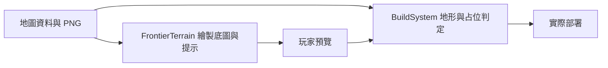

# v0.85.3 劇情戰場畫質與建塔位置調整

> **後續變更：** v0.85.9 已移除本頁記載的全圖合法亮點、紅色禁建框與 `FrontierTerrain.drawDeployment`；地形和放置規則仍沿用。現行操作與架構請見 [地圖部署視覺整理](DEPLOYMENT_VISUAL_V0859.md)。以下為 v0.85.3 當時的發行紀錄。

## 目的與設計取捨

玩家放大銀葉溪谷、暮影舊城、冰原裂谷時，舊 1536×1024 底圖容易顯得模糊，原本以大塊多邊形框出的建塔區也會把塔放到樹、廢墟或冰崖上。三張地圖的主題和道路走向保留；重繪底圖使道路、建物輪廓與路旁平地更清楚，並依可見地形重新描出建塔範圍。美術由既有地圖作參考重繪，仍為 1536×1024 PNG，**不宣稱是真 4K 或高於原生解析度**。最大戰場縮放從 1.65 調到 1.45，以減少超過圖片原生像素的放大。

## 玩法與操作

選擇建築或士兵後，地面出現細小綠色亮點。亮點是靜態抽樣的合法地面中心位置提示；移動預覽時仍以預覽顏色與文字為準，因為已有單位占位也可能使亮點附近不能放置。建塔需要整個底座都落在同一塊平坦地面內，不能跨進道路、水域、樹林、冰崖或裝飾物。道路兩側保留約 60–62 世界單位的禁建距離；冰原保留匯流後的共用防線，避免單人前期必須同時負擔兩路。

| 地圖 | 主要有意義的建塔地面 | 保留的禁建地形 |
| --- | --- | --- |
| 銀葉溪谷 | 前段草地、橋前河岸、中央彎道內側、後段草地、右岸補漏區 | 溪水、瀑布、道路與密林 |
| 暮影舊城 | 前段小平台、中央共用廣場、出彎後兩塊側台、末段補漏區 | 廢墟、水域、道路與裝飾建築 |
| 冰原裂谷 | 左側入口後雪地、匯流前雪地、共用彎道內側、後段右側雪地 | 冰水、祭壇、道路與右上冰崖 |

這些位置只定義可部署地面，不提供隱藏數值加成。不同塔射程不同；玩家仍須根據波次和資源決定先守共用彎道還是補守末段。

## 架構與維護

地圖素材及 `buildAreas`、`buildFootprint`、道路禁建距離與相機上限在 `src/td/maps.js`；`BuildSystem.terrainIssue` 對整個橢圓底座抽樣、檢查單一建塔地面；`FrontierTerrain.drawDeployment` 快取合法地面亮點，只在選擇部署時繪製。合法性仍由 `BuildSystem` 決定，亮點不自行修改規則。保留既有劇情任務、怪物路線、存檔格式與解鎖順序。沒有新資料庫或網路 API。正式入口 `td.html` 補上 `GoblinAnimation.js`，避免切換地圖後刷新單位預覽時報錯。

## 安裝、部署與回復

需要一併發佈 `td.html`、`src/td/maps.js`、`src/td/systems/BuildSystem.js`、`src/td/systems/FrontierTerrain.js`、`src/td/systems/GoblinAnimation.js`、`sw.js` 與三張新版 PNG：`silverleaf-valley-v4.png`、`shadowfall-ruins-v3.png`、`frostborn-chasm-v3.png`。安裝依現有 Node.js 18+ 靜態網站流程：執行 `npm run check`、`npm test`，以 `npm run serve:test` 開啟 `/td.html`；部署時同步整份靜態目錄，確認 Service Worker 快取名稱與目前發行版一致，關閉舊分頁後重新載入。地圖圖片在選中時載入，成功後才由 Service Worker 快取，不會在安裝時預先下載三張。玩家進度仍存在原瀏覽器來源的本機儲存；更新前從設定匯出備份。若要回復，以 Git 前版提交或備份的**完整靜態版本**取代本版，再匯入更新前玩家備份；不要只還原單張 PNG，以免路線及建塔規則和美術錯位。

## 驗收與常見問題

`tests/td-story-maps.test.js` 驗證素材尺寸、道路起終點、冰原匯流、關卡順序、道路禁建及每圖至少 70 個合法網格抽樣點和 10 個不重疊塔位；每個合法點須位於道路 180 單位內。瀏覽器另需逐圖測試選圖、預覽、放大與實際部署，確認 Console 沒有錯誤。完整回歸執行 `npm run check` 與 `npm test`。

- **仍顯示舊圖？** 關閉舊分頁，重新載入並確認 Service Worker 和三張圖片是同一版。
- **亮點附近無法建塔？** 底座可能碰到區域邊緣或已有單位；以預覽文字為準，稍微移向平地中央。
- **放到最大仍看得到像素？** 圖片原生仍是 1536×1024；本版重繪細節與限制放大倍率，不能取代真正的高解析度分層資產。
- **地圖空白？** 檢查三張 PNG 的部署路徑、Service Worker 快取，以及瀏覽器 Console 的載入錯誤。
