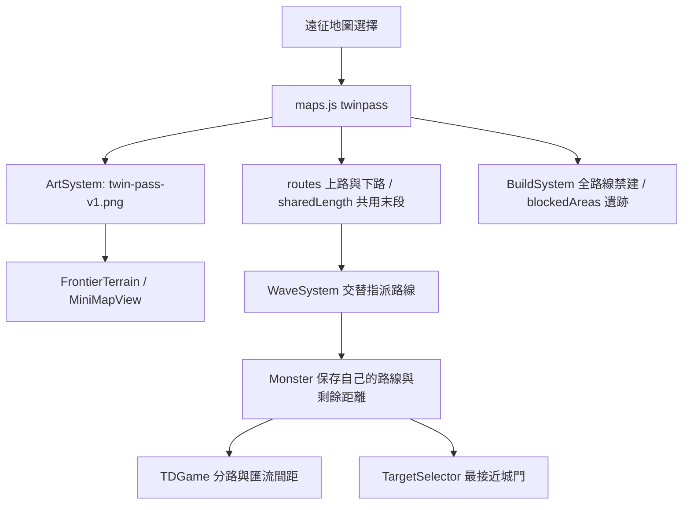

# v0.68.0 第二張地圖：雙隘口要塞

## 產品規格

使用者選定「中央小型遺跡、大片建造空地」版本；没有採用後來增加池塘、營地與花園的版本。新手谷地繼續保留且是預設戰場。

- 在遠征選擇的「目前戰場」選取「雙隘口要塞 · 雙路匯流」，再選難度、英雄與軍團開始。
- 上下入口逐隻交替出兵，兩路在右側匯流並攻擊同一座城門。總敵量、金幣與波次不加倍，沿用既有 30 波及四種難度；重開本局後由上路先出兵。
- 上側、內側、下側草地可部署，兩條道路、河谷、城堡與中央遺跡不可建造；部署時綠色邊線為候選草地範圍，紅色覆蓋為禁建區，實際合法性仍以游標預覽與提示為準。
- 士兵與塔維持固定；英雄可移動且此圖沿用不承傷規則。英雄導航仍沿用既有系統，背景裝飾沒有新增物理碰撞或高低差。
- 最接近城門索敵比較剩餘行進距離。分路期間獨立排隊，進入共用末段後保持前後間距。
- 重新挑戰保留地圖；返回遠征選擇可換回新手谷地。

## 架構、資料與 API

沿用既有 `src/td`、`assets/td`、`tests`、`scripts` 資料夾，不新增套件、帳號、權限或後端 API。

地圖 id：`twinpass`；名稱：雙隘口要塞；圖片 `assets/td/twin-pass-v1.png`，1536×1024，像素與世界座標 1:1。採用對話確認的空地優先生成圖，原生成檔 `exec-9d6b0a5d-27b4-4f44-815c-179cf29f86f5.png`。核心美術規格：雙入口 Y 型匯流、小型中央遺跡、保留道路兩側大片草地、原創立體奇幻風格。

地圖資料新增 `routes`、`sharedLength`、`blockedAreas`；`path` 仍保留第一路作相容欄位。單路地圖套用時正規化為 `[path]` 並清空新圖專屬資料，避免切圖殘留。`Monster.remainingDistance()` 提供剩餘像素距離；雙路 `progress()` 回傳其負值，保留「越大越靠近城門」排序契約。

戰績新增 `map`、`mapName` 欄位，舊紀錄不需遷移。現有最高分仍為跨地圖共用紀錄，尚未提供各圖排行榜；新圖沿用既有評分與難度，不宣稱與第一張同等難度。

## 安裝、設定、部署

1. 安裝 Node.js 18+；於根目錄執行 `npm test`、`npm run check`。
2. 執行 `npm run serve:test`，開啟 `http://127.0.0.1:4173/td.html?v=0.68.0`。不需 npm 安裝執行期套件或資料庫。
3. 於目前戰場選擇雙隘口要塞。手機仍使用同一入口，自動進入手機容器。
4. 部署整個版本，包含新增 PNG、routes 相關程式、td.html 與 sw.js；本功能版號為 0.68.0；工作區另有並行功能更新，實際套件與快取版號以 package.json／sw.js 的較新版本為準。本次完成本機更新，未推送或發布線上。
5. 若選單沒有第二張，關閉舊分頁重新載入；必要時只清 Cache Storage，保留 localStorage。

## 備份與回復

修改前檔案保存於本機 `artifacts/twinpass-v0680-backup/`，包含當時工作區其他未提交修改，回復前應另備份目前工作區，逐檔比較，不要覆蓋後續工作。

只暫停開放第二張時，可將 maps.js 的 twinpass.visible 設為 false，並移除 td.html 的 twinpass 選項，再更換快取版號。仍保留雙路引擎與素材，第一張可正常使用。完整回退需一起回復本版修改的 maps、ArtSystem、BuildSystem、WaveSystem、Monster、TDGame、MiniMapView、FrontierTerrain、BattleReportSystem、td.html、sw.js、package.json 與相關測試；完成後重跑測試。不要回退其他並行功能。

## QA 與交付限制

- `npm test`：342 項通過；`npm run check` 通過。紀錄：`artifacts/test-v0.68.0.txt`、`artifacts/check-v0.68.0.txt`。
- 新增測試涵蓋雙路指派且敵量不變、雙路禁建、遺跡禁建、有效塔位、切回單路清除資料、最接近城門索敵、1×／2×／3× 匯流間距、每隻漏怪只扣一次血，以及 30 波生成／行進／清場／獎勵流程。
- Playwright：`scripts/qa-twinpass.cjs`（測試工具需額外提供 playwright 與 Edge）；驗證選圖、真實 renderer 雙路出兵、重開與切圖、手機直橫向入口、無 JS 錯誤，並抽樣 180 隻怪物的排隊與繪製耗時。
- 截圖与結果位於 `artifacts/qa-twinpass/`：`selection.png`、`alignment.png`、`battle-desktop.png`、`phone-portrait.png`、`phone-landscape.png`、`results.json`。
- 手機檢查是瀏覽器尺寸模擬；尚未完成實體手機測試與三军團長期難度平衡。30 波流程測試不等同玩家陣容通關測試。

## FAQ

**兩個入口是否會變兩倍怪？** 不會，原波次依次分到上下路。

**為什麼大片草地中仍有不能蓋的地方？** 道路安全距離、中央遺跡、地形邊界與單位間距都會影響合法性，錯誤提示沿用既有規則。

**為什麼塔優先打另一條路的怪？** 「最接近城門」按剩餘路程比較，不按入場順序或路線節點數。

**第一張會不見嗎？** 不會，新手谷地仍為預設，兩張皆可直接選擇，沒有新增解鎖條件。
