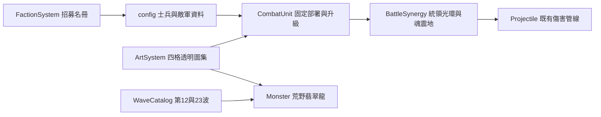

# 終極士兵 V1（0.67.0）

## 產品與操作

三軍團各有一名高價主力，依使用者核准的造型製作透明圖集，直接在「招募／建造 → 士兵」部署。士兵仍永久定點、自動攻擊，不承傷、不阻擋。沒有新增帳號、資料庫、HTTP API 或權限。

| 軍團／ID | 名稱 | 招募 | Lv1 攻擊／間隔／射程 | 能力 |
| --- | --- | --- | --- | --- |
| 王國 royalCommander | 皇家重裝統領 | 750G、5 木 | 100／1.5 秒／165 | 半徑 38 重鎚；攻擊範圍內其他士兵傷害 +18% |
| 月影 dragon | 翡翠古龍 | 800G、6 木 | 110／1.65 秒／195 | 半徑 62 魔法吐息；保留自然印記引爆 |
| 暗影 soulsteel | 深淵魂鋼魔像 | 850G、6 木 | 120／1.8 秒／145 | 每次出手有至少 3 魂則扣 3，傷害 ×1.5、爆炸半徑 +20；不足仍普通攻擊 |

古龍取代原友軍幼龍，沿用 dragon ID 與翡翠龍心／常青冠冕裝備。統領可裝不落獅盾，魔像可裝幽骨王冠；每人仍一件，回收時回庫。統領不強化英雄、建築、召喚物及自身；同類與既有傷害光環取最高，不累加。兩名統領可互相支援。

終極士兵升級金幣為「基礎價 ×（0.3＋目前等級 ×0.15）」取最接近 5 的倍數，功勳沿用士兵規則，最多 Lv5。招募／升級仍享補給折扣，回收按實付金幣 70%。同兵種無硬性上限。跨族契約仍為原價 ×1.5、免木材。

魔像的亡魂池與收割塔／召喚殿共用，選取魔像即可讀取餘額；本版沒有加入魂消耗優先選單。配隊建議：統領配多名便宜士兵；古龍配林裔獵手；魔像配能穩定清怪產魂的部隊。

## 舊龍轉敵軍

wildDragon「荒野翡翠龍」使用原 faction-dragon-v1.png，秘法甲、基礎生命 260、速度 55、護甲 2、基礎賞金 32、漏怪扣 2。沿原道路前进，可被所有一般攻擊命中，不另設飛行免疫。第 12 波替換 2 隻巨獸，第 23 波替換 3 隻巨獸；總隻數不增加，強度仍可能因組成改變。敵方龍不能招募。

## 架構與素材

友軍素材位於 assets/td/ultimate-dragon-v1.png、ultimate-commander-v1.png、ultimate-soulsteel-v1.png。每張兩個待機姿勢與兩個攻擊姿勢；不是完整行走／死亡動畫，因固定守軍不使用這些動作。待機／攻擊共用像素縮放，腳底固定；ULTIMATE_FRAMES 記錄實測來源裁切框，避免假設 AI 圖集等分造成串格。既有兵種仍採原四乘四格式。

使用內建 imagegen，以已核准概念圖為參考。生成提示：保留角色身份、護甲與武器，面向右側、全身、兩欄兩列，依序待機、呼吸、蓄力、攻擊，真正透明背景、不跨格、無文字／地板／投影。第二輪修正透明背景與分格留白。原始概念圖保存於 assets/td/concepts/。

可用 node scripts/measure-ultimate-atlases.cjs 重新讀取 alpha 邊界，更新 ArtSystem 的來源框；它不修改 PNG。更換素材時須同步修正該腳本分格邊界。

## 安裝、部署、更新與還原

沿既有安裝流程開啟 td.html 或 node scripts/serve-test.js；不需新增套件或設定。整包更新，必須包含三張新 PNG、JS、HTML 與 sw.js。服務工作者版本 0.67.0，新增素材納入離線清單。首次 HTTP 更新後重新開啟頁面，再驗證三軍團招募清單與圖片；舊局需重新開始才能一致套用版本。

改動前檔案位於 artifacts/ultimate-soldiers-backup/。此專案同時有其他未提交修改，備份是各檔修改前快照，不是 Git HEAD，也不代表完整上一版發行包。還原前先備份整個當前專案及瀏覽器戰績；只針對本功能以差異合併還原，避免覆蓋其他同步工作。正式發行／完整版本退回應使用完整發行包與一致的 sw.js；不要只換 PNG 或只退 package.json。

## QA 與限制

- tests/td-ultimate-soldiers.test.js：招募資格、資源不足、升級與回收、光環範圍／疊加／移除、魂消耗邊界、範圍攻擊、自然連動、敵方波次、透明度與裁切。
- scripts/qa-ultimate-soldiers.cjs：Edge 無頭瀏覽器載入三個圖集、各軍團卡片預覽與合法部署，輸出桌面／手機／動作圖至 artifacts/qa-ultimate-soldiers/。
- npm test、npm run check：全套回歸與語法檢查。測試結果另存 artifacts/ultimate-full-tests.txt、artifacts/ultimate-check.txt。
- 此版為可玩的高價士兵初版；功能測試不等於 30 波、所有難度及所有傭兵組合已達統計平衡。未宣稱實機手機效能或大軍團壓力測試已通過。

## 常見問題

- 找不到終極士兵：開啟招募／建造、選全部或士兵分類，向後捲動；確認目前軍團及版本。
- 古龍變貴：它已改為月影終極士兵，先用學徒、月刃與林裔建立防線再存錢。
- 魔像沒有強化：共享亡魂不足 3，或先被其他消耗單位使用；基本攻擊仍然有效。
- 圖片沒有更新：確認三張新素材均已部署、重新整理並重開遊戲；檢查資產載入重試與離線快取版本。

### 本次驗收結果

2026-09-17：npm test 331／331 通過，npm run check 通過；Edge 無頭瀏覽器確認三軍團卡片可見、預覽完成且合法部署成功，pageerror 為 0。已檢視 animations.png、desktop.png、mobile.png。素材均為 RGBA PNG，逐格透明背景及來源邊界測試通過。這些結果不代表全波次平衡或實機手機壓力測試。
