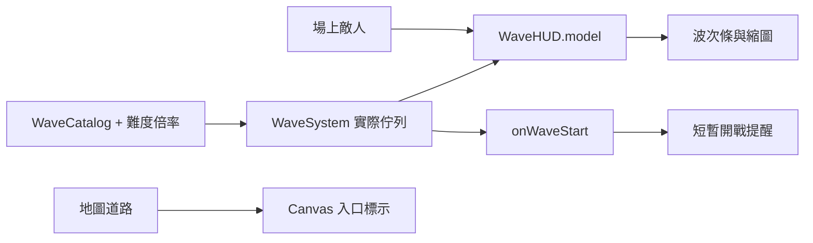

# 0.66.4 波次提示

## 目的與操作

把重複的波次文字改為可快速掃讀的兩列提示。準備階段顯示第幾波／總波數、倒數、立即迎戰、敵軍縮圖及數量。點敵軍可看名稱、護甲及本波說明，Escape 收起情報；手機可橫向滑動敵軍列。資訊也可從「情報」開啟。

進攻階段收起預告，只保留波次及剩餘敵人。剩餘數量包含尚未生成與場上存活的敵軍。一般開戰提示顯示約 1.6 秒，首領提示約 2.5 秒，依實際時間計算，不隨 ×2／×3 加速。提示不攔截戰場點擊，系統減少動態效果設定可停用淡入淡出。

路線入口繪製倒數圈與順路線方向的箭頭；暫停時顯示暫停符號。波次按鈕在暫停、進攻中與結束時不可用。原先標題的「邊境守衛」是難度名稱，現在移入詳細情報及提示，不再與波次名稱並列。

## 結構與擴充

新增 `src/td/systems/WaveHUD.js` 與 `td-wave.css`。TDGame 保留遊戲邏輯，WaveHUD 只負責呈現，每 100ms 更新文字，圖片完成載入後只畫一次。DOM 僅用 textContent 寫入字串。没有新增資料庫、網路 API、存檔格式或權限需求。

WaveHUD.model(game) 回傳 number、total、groups、tags、remaining、preparing、boss、status 等顯示資料。announce(wave) 由統一 onWaveStart 呼叫，涵蓋手動及自動開波。drawEntrance(ctx) 在鏡頭的世界座標變換內繪圖。威脅標籤由敵人類型與護甲、速度判定，最多顯示三個，窄畫面顯示第一個；完整組成仍可滑動與點選。

新增敵人時需在 Monster.TYPES 與 ArtSystem.enemyActions 登記，預告數量自動跟隨實際難度資料。圖片未載入時顯示問號，名稱與數量仍可讀取。

## 安裝、設定、發布與還原

沿用 README 的本機伺服器安裝流程與原有難度／版面設定，不需額外設定。完整部署 td.html、td-wave.css、WaveHUD.js、TDGame.js、main.js、sw.js 及既有資產。Service Worker 快取版本更新為 0.66.4，關閉舊分頁再開啟以啟用新版；不必刪除遊戲紀錄。

修改前檔案在 `artifacts/wave-v0664-backup/`，保留相同目錄結構，包含當時工作區尚未提交的內容。僅在沒有後續修改時直接複製對應備份還原；若已有新功能，先比較差異並只回復波次提示部分，避免蓋掉後續修改。還原發布仍使用新的 Service Worker 快取名稱。新檔案沒有被舊版 HTML 引用時不會執行。

## 驗證與常見問題

- `node --test tests/td-wave-hud.test.js tests/td-edge-ui.test.js`：波次資料、剩餘計算、首領／終局／暫停及介面入口。
- `npm run check`：JavaScript 語法檢查。
- 啟動 `npm run serve:test`，以具備 Playwright 與 Edge 的環境執行 `node scripts/qa-wave-hud.cjs`：桌面／手機截圖、點擊情報、Escape、暫停按鈕、開戰收起與淡出、首領標籤及視窗範圍。
- 圖片與結果位於 `artifacts/qa-wave-hud/`。

數量與原始波次表不同：預告顯示的是難度調整後實際生成數量。

敵人沒有全部顯示：縮圖列可左右滑動，聚焦按鈕也會將該項捲入視野。

看不到入口倒數：只在準備階段顯示，移動鏡頭後入口可能在視窗外，可使用鏡頭總覽。

全套測試首次結果為 321 通過、3 失敗。失敗是測試期間工作區同步新增 royalCommander、soulsteel、wildDragon 後，舊名冊／種類數量斷言尚未更新，與 WaveHUD 的呈現修改無關。未為了通過測試回退這些兵種。

最終檢查：波次與 HUD 專項 14／14 通過，瀏覽器桌面／橫向操作檢查與語法檢查通過。工作區同步變動後的全套結果為 328／330 通過，尚有傭兵名冊與新終極士兵圖集兩項非本次修改的失敗；完整輸出見 artifacts/test-v0.66.4.txt。

