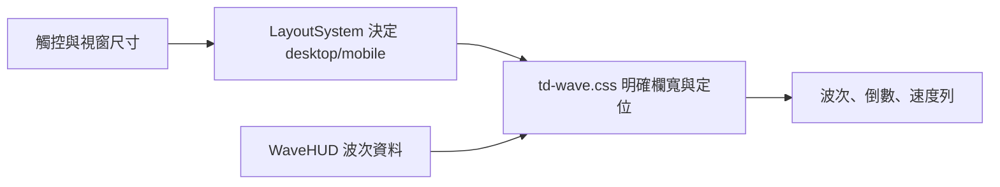

# 0.67.1 波次版面修正

## 問題與修正

手機觸控橫向模式繼承舊版 `.wave-index { width:39px }`，導致波次文字跨出欄位並與倒數重疊；速度列繼承 `translateX(-50%)`，改為靠左定位後仍向左位移。單純縮小桌面視窗不會啟用相同的觸控樣式，因此上一版檢查未捕捉此問題。

本版在 td-wave.css 明確重設波次欄寬、grid 欄位、定位及速度列 transform。波次使用內容寬度，倒數與按鈕保留獨立欄位和間距。手機準備面板寬度由 320 縮為 300 CSS px，同步縮小列高與內距；戰鬥面板依自身寬度置中。取消波次條的文字選取，避免操作時出現藍色選取區塊。

## 使用、設定與 FAQ

操作維持原樣：點怪物看情報、點立即迎戰開波，速度列提供 ×1／×2／×3。不需要改難度、鏡頭或裝置設定。手機直握時沿用既有橫向旋轉頁面，轉動手機不重建遊戲。

仍看到舊版：關閉原遊戲分頁後重新開啟，讓新 Service Worker 啟用。不要刪除遊戲紀錄。

這不是更換地圖或角色素材；畫面中的鏡頭範圍會依裝置與既有鏡頭設定不同。

## 管理、架構與 API

只修正 td-wave.css 的呈現規則，沒有新增 API、資料庫、權限或資料格式。WaveHUD 仍使用相同波次資料與事件；無每幀額外計算。

## 安裝、部署、更新與備份還原

沿用 README 安裝與本機伺服器流程。完整發布現有專案，包含更新的 td-wave.css、package.json、sw.js。版本與快取名稱為 0.67.1；無資料移轉步驟。

修改前 td-wave.css、package.json、sw.js 保存在 artifacts/wave-layout-v0671-backup/。若需回復且尚無後續修改，複製對應備份；已有後續修改時先比較差異，只還原本次 CSS。還原發布仍需使用新的快取名稱，避免新版與舊版混用。

## 驗證

- `npm test`：331 項全部通過，輸出 artifacts/test-v0.67.1.txt。
- 本機 4173 伺服器搭配 Playwright／Edge 執行 `node scripts/qa-wave-layout.cjs`。
- 5 種環境：958×454 觸控、667×375 觸控、390×844 觸控旋轉頁面、1440×900 桌面、960×540 縮小 CSS 視窗。
- 真正設定 hasTouch 與 isMobile，並確認觸控案例解析為 mobile；不是只調視窗大小。
- 逐一檢查文字欄位間距、每個速度按鈕邊界、點擊、情報展開與收起、开波提示及戰鬥面板置中。
- 截圖與幾何結果：artifacts/qa-wave-layout/。此為瀏覽器裝置模擬，未聲稱實體手機測試。
