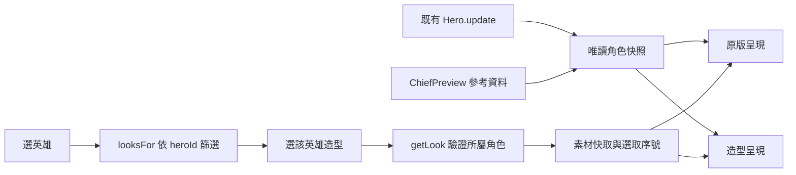

# Skin Lab 0.5.0：英雄優先與戈爾造型

> **現行狀態：** 冥骨帝王已在 v0.84.7 上架並接入正式戰場；此文件記錄 0.5.0 當時的試裝限制。見 [外觀上架交付](../COSMETIC_RELEASE_V0847.md)。

2026-09-21，`feature/shop-ui`。本版補上大酋長・戈爾，並將實驗室改成「選英雄 → 選這位英雄的造型 → 比較」。主入口不自動播放，也不列出其他英雄的造型。

## Audit、設計與範圍

商城分支基底 `7f6fa5c` 的 HeroRoster 僅有三個角色；主工作目錄後續已有 `chief`、大酋長立繪與 wild-chief 動作圖。0.4.0 只核對分支名冊，因而漏掉他。本次讀取主工作目錄確認來源，複製原版素材到商城專用路徑並建立獨立參考資料；沒有帶入或改動主工作目錄未提交的 Core。

先前雷霆設計保留毛領和重甲輪廓，差異以材質、配色為主。依回饋另做冥骨帝王：移除毛領、改為大型龍骨肩甲、肋骨胸鎧、紫黑長袍、幽綠魂火巨斧。以剪影與材質區分，戰場小尺寸也能辨識。

| 戈爾造型 | 本版狀態 | 素材保存 |
| --- | --- | --- |
| 冥骨帝王 `bone-emperor` | 立繪、待機、移動、攻擊、戰吼試作 | portrait／motion／attack／cast 四張 PNG |
| 雷霆戰王 `thunder-king` | 保留初稿，可看立繪；動作尚待裁切校準，不開放播放 | portrait／actions 兩張原始 PNG，未覆蓋或刪除 |

所有內容仍為 cosmetic-only 試裝，沒有正式販售、裝備套用、付款、Save 寫入或 Core hook。戈爾參考數值 ATK 24、HP 100、射程 112、間隔 0.66s，兩側完全共用；魂火圖不產生傷害、掉落、分數或排名。

## 安裝與使用者操作

1. 使用 Node.js 18+，在此版本根目錄執行 `node scripts/serve-test.js`。不需套件、資料庫、API Key 或登入。
2. 開啟 `http://127.0.0.1:4173/skin-lab.html`。若已設定 `$env:TD_TEST_PORT='4187'`，網址改用 4187。
3. 在「01 選擇英雄」選戈爾；「02」只出現冥骨帝王、雷霆戰王。其他角色各自只顯示自己的造型。
4. 選冥骨帝王後才出現原版／新造型立繪及同步動作。可暫停、轉向、切換戰場原尺寸；手機橫向可向下滑到比較區。
5. 切換英雄會清除造型選擇、收起比較、停止舊動畫；需重新選該英雄造型。鍵盤 Tab／Enter 可操作，無需拖曳。
6. 雷霆戰王只顯示立繪和「已保留初稿」說明；原始動作檔案仍保留供未來校準。

直接網址規則：`?hero=chief` 只預選英雄；`?hero=chief&skin=bone-emperor` 可開啟已明確指定的合法組合。英雄和造型不匹配時顯示提示並停在第二步，不會用錯誤角色播放。未知英雄停在第一步。商城霜華商品的比較連結帶上 `hero=arcanist&skin=astral-oath`，因此保留使用者已選的商品脈絡。

## 架構與 API

- `ChiefPreview.js` 在 PreviewModel 之後、HeroLooks 之前載入。`rosterFor(engine,id)` 優先讀當前 Core 的真實名冊；分支缺少 chief 時才使用凍結參考資料，未知角色拋錯。
- `createPreviewHero(engine,id)` 沿用真實 Hero 類別與動畫更新；僅缺少 chief 時，替該預覽實例提供參考 combatConfig。沒有註冊全域 HeroRoster、改 prototype 或執行戰鬥技能。合併後若 Core 已有 chief，直接使用其原有實例方法與新數值。
- `chiefLayouts` 保存新素材明確的裁切矩形、足點和身高；`createChiefRenderer` 只讀 snapshot；`chiefBounds` 包含四組動作與左右朝向範圍。
- 原版戈爾以複製素材顯示，動作列依主開發線：idle／walk／attack；cast 在原 renderer 映射為 idle。冥骨版 cast 是視覺戰吼提案，不宣稱主線已實作此演出。
- `HeroLooks.definitions` 現有四英雄、五造型。`looksFor(heroId)` 只傳回所屬造型；`getLook(heroId,skinId)` 查不到回傳 null，不再默默退回第一位英雄。`portraitOnly` 明確限制雷霆初稿不播放動作。
- `main.js` 維護 hero／skin 兩階段選取。切換英雄或造型都使舊載入序號失效並停止舊動畫，載入完成前收起比較。新動作缺圖回退原版並提示；原版缺圖提示重選。圖片立繪失敗有原版回退說明。

無新增 HTTP API、資料庫、帳戶或權限。仍重用 SkinSchema 的 cosmeticOnly／locked 描述，沒有加入正式 SkinCatalog 或 Store 所有權。

## 管理、素材與擴充

素材均在 `assets/td/shop/`。完整檔案、原始參考路徑及生成提示見 [CHIEF_LOOKS_MANIFEST.json](../../assets/td/shop/CHIEF_LOOKS_MANIFEST.json)；六張新素材使用內建 image_gen，兩張原版素材為原專案檔案副本。雷霆初稿依使用者要求完整保留，不以冥骨圖覆寫。

新增造型必須綁定正確 heroId；新增動作圖需量測透明邊界與足點，不能假定每格占四分之一。先用明確的 portraitOnly 狀態保留尚未校準素材，完成驗收後再開放動作，不用原版動作假裝完成造型。

## FAQ 與排錯

- **進入怎麼沒有人物在動？** 新流程先選英雄，再選他的造型；這是預期行為。
- **換英雄後造型消失？** 清除上一位的選擇是刻意設計，避免跨英雄模擬。
- **雷霆版去哪了？** 選戈爾即可看保留立繪；原始 actions PNG 同樣在素材目錄，尚未開放播放。
- **戈爾原版施法怎麼像待機？** 現有主線 renderer 正是這樣映射；比較頁不把倒地格當技能。
- **正式遊戲會套用嗎？** 目前僅獨立實驗室。完整武器疊層、召喚、語音、倒地／復活及實戰換裝仍待正式整合。
- **載入失敗？** 確認使用 HTTP 啟動且部署帶齊所有 PNG／JS，再重選造型。缺圖回退會明示，不會寫入存檔。

## QA 清單與證據

- `npm test`：**441／441 通過**；新增 chief Adapter 不改 Core、優先使用合併後名冊、角色／造型不得交叉、雷霆素材保留測試。
- `npm run check` 及修改的 Skin Lab／ShopTemplates JS 語法檢查通過。
- `node scripts/qa-chief-lab.cjs`：PC 1920×1080、iPhone 橫向 844×390，第一步無造型、第二步只顯示所屬造型、第三步才比較；鍵盤選取、切英雄重置、四組動作同步、原尺寸／轉向、初稿立繪限定、Safe Area 注入、localStorage 不變、正常流程 Console／pageerror／HTTP error 0。
- 16 格冥骨動作素材透明邊界通過；PC／手機、左右方向、四組動作及原版／新造型共 **128 組**繪製，畫布邊緣像素 0。逐格攻擊與戰吼截圖已人工檢視。
- 無效角色、跨角色網址、載入尚未完成就換英雄、缺戰吼圖回退後恢復均通過。
- `qa-hero-looks.cjs`、`qa-skin-lab.cjs`、`qa-skin-clipping.cjs` 更新為合法指定入口與兩階段選取後重跑通過，保留既有三英雄與霜華施法回歸。

瀏覽器腳本需要 Playwright 套件和 Edge；可用 NODE_PATH 指向既有 Playwright node_modules。一般展示不需要瀏覽器測試套件。Edge 觸控與 Safe Area 注入不是實體 iPhone Safari 驗收。

證據：[結果](../../artifacts/qa-chief-lab/results.json)、[單元測試](../../artifacts/qa-chief-lab/unit-results.txt)、[PC](../../artifacts/qa-chief-lab/pc-bone-cast.png)、[手機](../../artifacts/qa-chief-lab/iphone-bone-cast.png)、[逐格檢查](../../artifacts/qa-chief-lab/chief-attack-cast-frames.png)。

## 部署、更新、備份還原與合併

模組版本 0.5.0；全域 package 版本不動。部署整組比較頁、ChiefPreview.js、HeroLooks／PreviewModel／main、商城連結與八張 chief PNG。script 順序為 PreviewModel → ChiefPreview → HeroLooks → main。沒有 migration 或 Save 資料需要備份轉換；一般備份仍保留完整部署版本與 Git commit。

前版 `6864ab5`（0.4.0）。需回復時，在獨立 worktree 檢視／部署此前版或對本次提交建立 revert；不可重設另一條開發線的未提交檔案。不要混用新版選取 JS 與舊 HTML。

本次不 merge main。文件附錄可能衝突，保留雙方記錄。合併時確認 chief 名冊、數值、素材、動作映射契約；若原版素材變更，更新專用副本及量測資料，勿覆蓋另一分支的 Core。新模組只為試裝，不應掛成正式戰場換裝或販售。詳細通用限制見 [MERGE_NOTES](MERGE_NOTES.md)。
