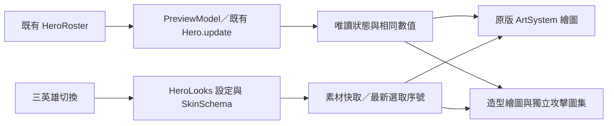

# Skin Lab 0.4.0：三英雄造型試裝

> **v0.84.7 現行商城：** 四位英雄外觀（獸人為「冥骨帝王」）與「日蝕王庭」已開放使用玩家檔案的試用水晶購買、保存與裝備；沒有真實付款。詳細規格、操作、限制、部署與測試見 [外觀上架交付](../COSMETIC_RELEASE_V0847.md)。

> v0.84.4 更新：三款造型與獸人赤燼戰酋已列入商城預覽，但尚未開放購買或正式戰鬥換裝。當前狀態見 [v0.84.4 交付](../EXPEDITION_SCORE_PROFILE_V0844.md)。下文記錄 0.4.0 當時的試裝設計。

2026-09-21，分支 `feature/shop-ui`。在獨立比較頁新增雷恩「曜陽獅心」、維菈「緋月狐影」，保留霜華之誓。可切換原版／新立繪與同步戰場動作。這是可操作的美術試作，沒有把造型裝進正式戰局或加入販售清單。

## 需求、Audit 與範圍

目前 `HeroRoster` 有三位英雄。沿用現有 Hero、HeroRoster、SpriteFrameBounds、ArtSystem 與商城 SkinSchema；不修改 Story、Unlock、Combat、Navigation、Save Core。只新增比較頁角色設定、素材與切換介面；無新資料庫、網路 API、付款、權限或持久化。

| 遊戲 ID／英雄 | 造型 | 視覺設計 | 原有 ATK／HP／射程／間隔 |
| --- | --- | --- | --- |
| arcanist／森語者・希爾芙 | 霜華之誓 | 銀白長髮、雪絨披風、霜藍銀甲 | 18／100／152／0.58s |
| hunter／守誓者・雷恩 | 曜陽獅心 | 象牙白金鎧、赤紅披風、太陽紋長弓 | 20／100／195／0.75s |
| rogue／影行者・維菈 | 緋月狐影 | 白髮狐面、緋紅戰袍、月牙雙刃 | 15／100／100／0.38s |

原版立繪保留專案現有選角圖；其武器概念和小型戰場圖未完全一致。新戰場造型按實際角色的弓／雙刃設計。hunter、rogue 第四列是倒地，原 renderer 的 cast 沿用 attack 列，因此比較頁也沿用攻擊動作，不把倒地誤作技能。霜華之誓先前的「銀葉公主」是美術概念命名，其比較頁實際目標仍是 arcanist。

## 第一次安裝與操作

1. 使用 Node.js 18+，在此分支根目錄執行 `node scripts/serve-test.js`；一般展示不需安裝套件或申請帳號。
2. 開啟 `http://127.0.0.1:4173/skin-lab.html`。若 PowerShell 設定 `$env:TD_TEST_PORT='4187'`，網址使用 4187。
3. 上方三張英雄按鈕切換造型；左為現有角色，右為造型試作。往下看同步戰場動作。
4. 選待機、移動、攻擊、施法；可暫停、轉向、改成戰場原尺寸。系統設定減少動態時預設暫停。
5. 可直接分享同站 `skin-lab.html?hero=hunter` 或 `?hero=rogue`；未知 ID 回到 arcanist。手機橫向保留並排比較，頁面可上下滑動。

重新整理不會裝備、購買或儲存任何外觀；不需要備份遊戲存檔才能試看。關閉頁面即結束比較。

## 架構與資料夾

- `src/td/skin-lab/HeroLooks.js`：三位英雄設定、SkinSchema 描述、造型圖集矩形／足點、鏡頭範圍與繪圖 adapter。
- `PreviewModel.js`：以 heroId 建立真實 Hero，推進動作並提供 snapshot。原版繪製使用 `gear: null` 的唯讀副本，避免獨立頁依賴 ArmorySystem；原 Hero 的裝備和能力不變。
- `main.js`：DOM 切換、圖片 Promise 快取、載入失敗回退、單一動畫迴圈。選取序號防止慢速舊請求覆蓋新角色。
- `skin-lab.html/css`：PC／手機排版、角色選取、狀態說明、動作操作與比較區。
- `assets/td/shop/{sun,moon}-{portrait,actions,attack}-v1.png`：兩套立繪、待機移動圖集與獨立四格攻擊圖集。素材與內建 imagegen 完整提示見 [素材清單](../../assets/td/shop/HERO_LOOKS_MANIFEST.json)。

攻擊圖集使用明確 source rectangle 和足點，不以固定四分之一切格；鏡頭按所有動作、兩種朝向的範圍留白，讓箭矢／刀光完整顯示。只為新路徑註冊 metadata，不覆寫原版 bounds／metrics。

## API 與維護設定

以下為頁內 JavaScript API，namespace `FrontierSkinLab`，沒有 HTTP 端點：

| 介面 | 用途／限制 |
| --- | --- |
| `new PreviewModel(engine, heroId = 'arcanist')` | 使用現有職業設定；未知 ID 拋錯 |
| `definitions`／`getLook(heroId)` | 凍結的三英雄設定；查不到回傳第一位 |
| `cosmetic(look, FrontierShop)` | 通過既有 Schema 的 cosmeticOnly 描述；locked、mock price 0，不販售、不寫 Store |
| `registerLook(engine, look)` | 為新造型路徑註冊圖格，不改原 metadata |
| `createLookRenderer(engine, look, image, actionImage)` | 只讀狀態繪製；動作攻擊圖使用獨立足點 |
| `lookBounds(engine, look)`／`actionLayouts` | 決定雙方向完整外觀範圍與每格取樣矩形 |

擴充角色先確認 HeroRoster ID 與動作列，再新增 definitions／素材／裁切資料與測試。不要用造型參數改變 ATK、HP、掉落、分數、排名、碰撞或攻擊時序。portrait／selectionArt／battlefieldSprite／animation 有試作素材；skillVfx、summonAppearance、voice 仍為 null。箭矢與刀光是演示圖中的視覺，不新增真實技能。

## FAQ 與例外

- **為什麼正式遊戲沒換裝？** 這是獨立呈現驗證；正式 renderer hook、所有權套用與武器分層需等 Core 契約穩定後另做。
- **為什麼雷恩、維菈施法看起來像攻擊？** 現有角色就是這樣映射，沒有假造新的技能邏輯。
- **圖片失敗怎麼辦？** 新造型／攻擊圖失敗時兩邊顯示原版並標明回退，可再選角色重試。原版圖也失敗則提示重新選取或改選其他英雄。
- **快速切換跳回前一人？** 已用選取序號防止；若修改 loader，必須保留延遲載入回歸測試。
- **有額外裝備或語音嗎？** 尚未製作裝備疊層、完整音效／語音與召喚替換。正式化還需逐格修整、倒地／復活驗收及實戰整合。

## QA 與驗收清單

執行 `npm test`、`npm run check`，以及 `node --check src/td/skin-lab/HeroLooks.js`、`node --check src/td/skin-lab/main.js`、`node --check src/td/skin-lab/PreviewModel.js`。瀏覽器 QA 需要可用的 Playwright 套件和 Edge；設定 NODE_PATH 指向 Playwright 所在 node_modules，再執行下列腳本。一般展示不需要它們。

- `node scripts/qa-hero-looks.cjs`：PC 1920×1080、iPhone 橫向 844×390，三英雄×四動作×四格；暫停／轉向／原尺寸、數值不變、localStorage 不變、無頁面橫向溢出、正常流程 Console／HTTP error 0。
- 同腳本檢查兩套攻擊圖所有格子的透明邊界，以及 PC／手機、左右方向共 64 個繪圖案例無邊緣截斷；測快速選取、直接網址、素材失敗與再切換恢復。
- `node scripts/qa-skin-lab.cjs`、`node scripts/qa-skin-clipping.cjs`：原霜華功能與施法裁切回歸。
- `tests/td-hero-looks.test.js` 新增 4 項：三角色 Schema 與素材、真實能力、無 Armory 依賴可繪製且不變更 Hero、原版 metadata 不變。

本版完整單元測試 **439／439 通過**。[瀏覽器與像素結果](../../artifacts/qa-hero-looks/results.json)、[單元測試](../../artifacts/qa-hero-looks/unit-results.txt)、[逐格攻擊檢視](../../artifacts/qa-hero-looks/attack-frames.png)。PC／手機截圖均人工檢視。手機為 Edge 觸控模擬，仍需 iPhone Safari 實機驗收。

## 部署、更新、備份還原與合併

模組版本在 `src/td/shop/version.json` 升為 0.4.0；全域遊戲 package 版本不動。靜態部署必須帶上六張新 PNG、HeroLooks.js 以及比較頁；script 順序保持 PreviewModel → HeroLooks → main。沒有資料庫 migration、Save adapter 變更或新權限。

備份目前完整版本檔案與 Git commit，再部署新版完整檔案；不要混用舊 HTML 與新 JS。上版為 `6f4926b`（0.3.1），需要回復時可在獨立 worktree 檢視／部署該版，或對本次提交建立 revert；不要 reset 另一條開發線。沒有新存檔資料需要轉換或刪除。

本分支不 merge main。文件索引可能與 P0/P1 衝突，保留雙方內容；確認三個 heroId、ArtSystem 的 drawHero 與原圖 metadata 契約後重跑測試。新增外觀只在 Skin Lab，不應自動加入正式販售或宣稱已接入戰場。完整限制見 [合併注意事項](MERGE_NOTES.md)。
